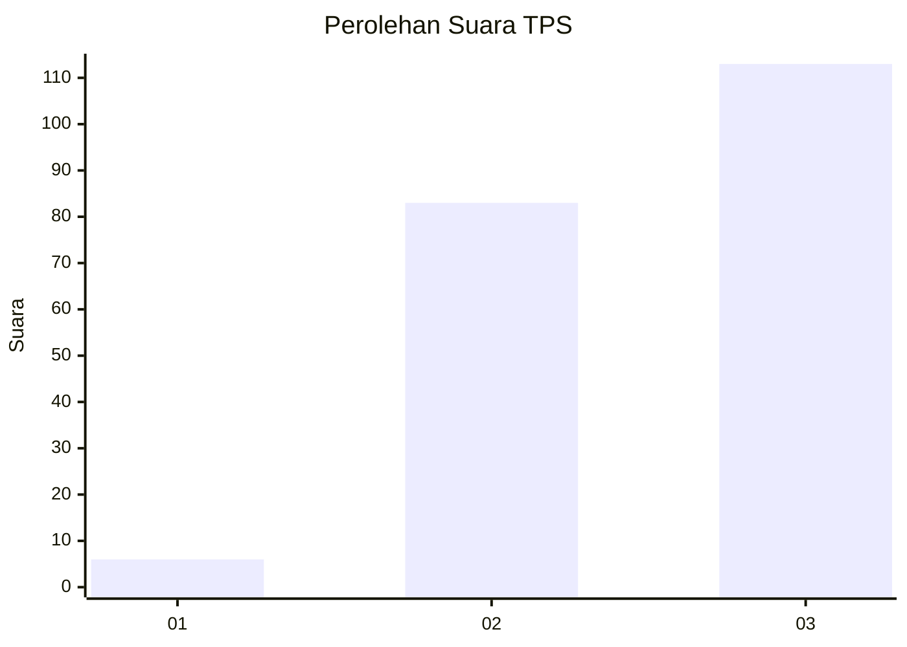
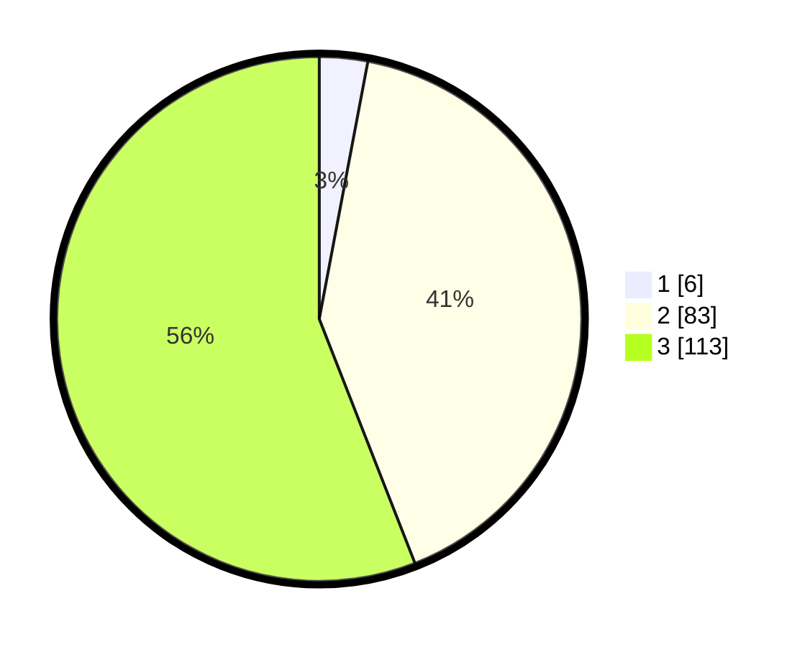

# Hasil

## Grafik

## Tabel

| No. | Nama Paslon    | Suara | Suara (raw) | Persentase |
|:--- |:-------------- | -----:| -----------:| ----------:|
| 1   | ANIES MUHAIMIN | 6     | [6][p-1]    | 2,97       |
| 2   | PRABOWO GIBRAN | 83    | [83][p-2]   | 41,09      |
| 3   | GANJAR MAHFUD  | 113   | [113][p-3]  | 55,94      |

[p-1]: https://github.com/gigit-pemilu/pemilu-2024-33-jawa-tengah/blob/main/pilpres/hitung-suara/sub/33-jawa-tengah/sub/09-boyolali/sub/09-banyudono/sub/2014-trayu/sub/007-tps/sub/paslon-1.txt
[p-2]: https://github.com/gigit-pemilu/pemilu-2024-33-jawa-tengah/blob/main/pilpres/hitung-suara/sub/33-jawa-tengah/sub/09-boyolali/sub/09-banyudono/sub/2014-trayu/sub/007-tps/sub/paslon-2.txt
[p-3]: https://github.com/gigit-pemilu/pemilu-2024-33-jawa-tengah/blob/main/pilpres/hitung-suara/sub/33-jawa-tengah/sub/09-boyolali/sub/09-banyudono/sub/2014-trayu/sub/007-tps/sub/paslon-3.txt

## Foto C Plano

https://sirekap-obj-formc.kpu.go.id/4138/pemilu/ppwp/33/09/09/20/14/3309092014007-20240214-221457--c4c29b73-017e-4b04-944d-c80f69d61c84.jpg

https://sirekap-obj-formc.kpu.go.id/4138/pemilu/ppwp/33/09/09/20/14/3309092014007-20240214-221612--0d4b7fea-edab-46fd-a64f-91d0f93673dd.jpg

https://sirekap-obj-formc.kpu.go.id/4138/pemilu/ppwp/33/09/09/20/14/3309092014007-20240214-221706--23e2737f-141d-4e80-8d45-f81596f410ec.jpg

## Metadata

| Key        | Value               |
| ---------- | ------------------- |
| Time Stamp | 2024-02-16 12:51:22 |

