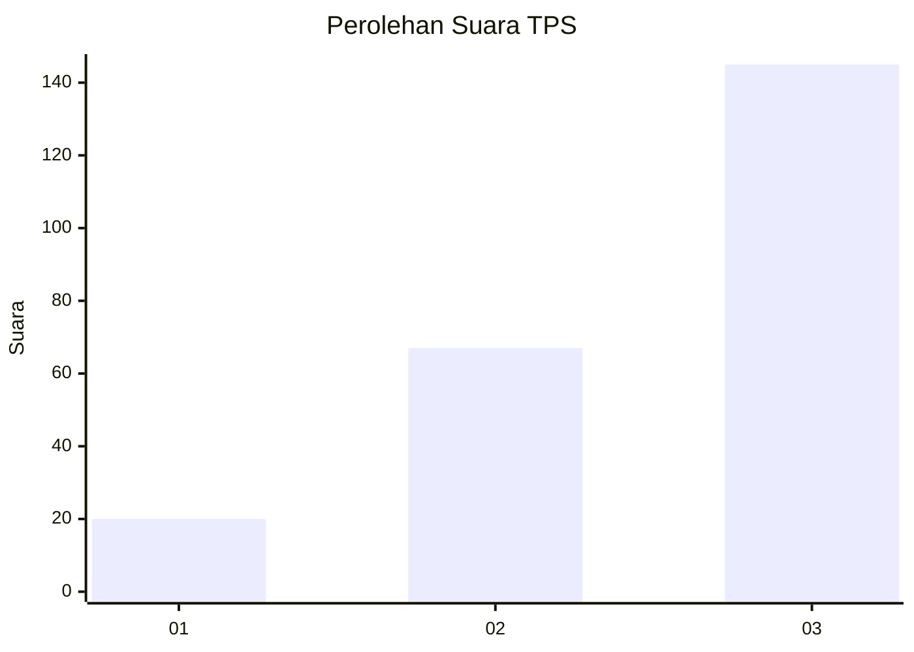
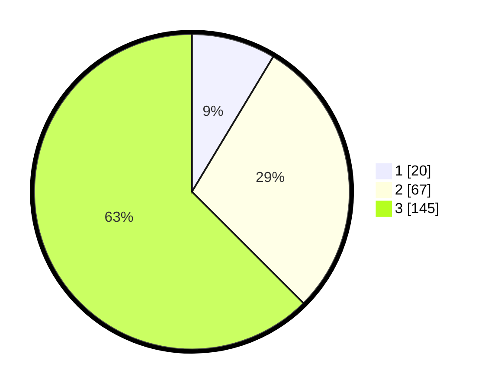

# Hasil

## Grafik

## Tabel

| No. | Nama Paslon    | Suara | Suara (raw) | Persentase |
|:--- |:-------------- | -----:| -----------:| ----------:|
| 1   | ANIES MUHAIMIN | 20    | [20][p-1]   | 8,62       |
| 2   | PRABOWO GIBRAN | 67    | [67][p-2]   | 28,88      |
| 3   | GANJAR MAHFUD  | 145   | [145][p-3]  | 62,50      |

[p-1]: https://github.com/gigit-pemilu/pemilu-2024-33-jawa-tengah/blob/main/pilpres/hitung-suara/sub/33-jawa-tengah/sub/09-boyolali/sub/09-banyudono/sub/2015-tanjungsari/sub/003-tps/sub/paslon-1.txt
[p-2]: https://github.com/gigit-pemilu/pemilu-2024-33-jawa-tengah/blob/main/pilpres/hitung-suara/sub/33-jawa-tengah/sub/09-boyolali/sub/09-banyudono/sub/2015-tanjungsari/sub/003-tps/sub/paslon-2.txt
[p-3]: https://github.com/gigit-pemilu/pemilu-2024-33-jawa-tengah/blob/main/pilpres/hitung-suara/sub/33-jawa-tengah/sub/09-boyolali/sub/09-banyudono/sub/2015-tanjungsari/sub/003-tps/sub/paslon-3.txt

## Foto C Plano

https://sirekap-obj-formc.kpu.go.id/1c83/pemilu/ppwp/33/09/09/20/15/3309092015003-20240214-194627--2413366b-aae6-49fe-960d-6c691a9a0ebf.jpg

https://sirekap-obj-formc.kpu.go.id/1c83/pemilu/ppwp/33/09/09/20/15/3309092015003-20240214-194446--0cf10abe-adcc-4c67-b674-38d34afbf2fe.jpg

https://sirekap-obj-formc.kpu.go.id/1c83/pemilu/ppwp/33/09/09/20/15/3309092015003-20240214-194109--78dbbbc6-e1f6-4b9c-bf94-860634fb7fe6.jpg

## Metadata

| Key        | Value               |
| ---------- | ------------------- |
| Time Stamp | 2024-02-16 12:51:22 |

