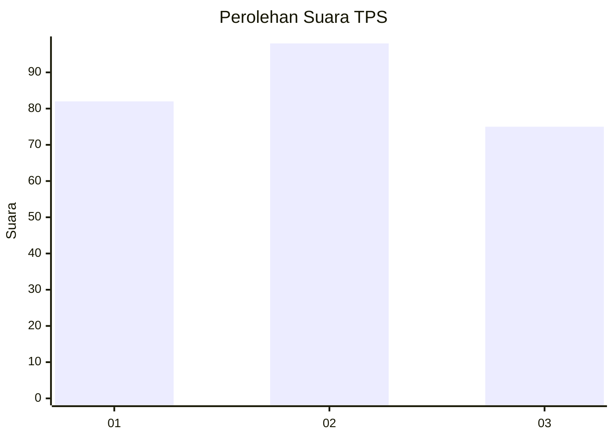
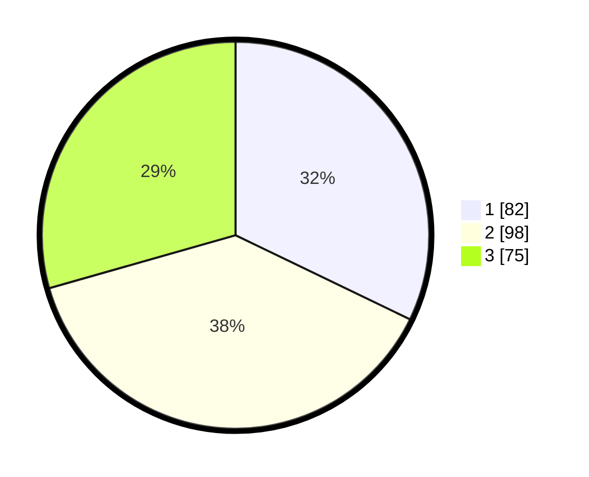

# Hasil

## Grafik

## Tabel

| No. | Nama Paslon    | Suara | Suara (raw) | Persentase |
|:--- |:-------------- | -----:| -----------:| ----------:|
| 1   | ANIES MUHAIMIN | 82    | [82][p-1]   | 32,16      |
| 2   | PRABOWO GIBRAN | 98    | [98][p-2]   | 38,43      |
| 3   | GANJAR MAHFUD  | 75    | [75][p-3]   | 29,41      |

[p-1]: https://github.com/gigit-pemilu/pemilu-2024-33-jawa-tengah/blob/main/pilpres/hitung-suara/sub/33-jawa-tengah/sub/09-boyolali/sub/10-sambi/sub/2008-sambi/sub/006-tps/sub/paslon-1.txt
[p-2]: https://github.com/gigit-pemilu/pemilu-2024-33-jawa-tengah/blob/main/pilpres/hitung-suara/sub/33-jawa-tengah/sub/09-boyolali/sub/10-sambi/sub/2008-sambi/sub/006-tps/sub/paslon-2.txt
[p-3]: https://github.com/gigit-pemilu/pemilu-2024-33-jawa-tengah/blob/main/pilpres/hitung-suara/sub/33-jawa-tengah/sub/09-boyolali/sub/10-sambi/sub/2008-sambi/sub/006-tps/sub/paslon-3.txt

## Foto C Plano

https://sirekap-obj-formc.kpu.go.id/bf35/pemilu/ppwp/33/09/10/20/08/3309102008006-20240214-185422--43c0c409-cfc6-44f7-bf35-d3b52c3ae7ab.jpg

https://sirekap-obj-formc.kpu.go.id/bf35/pemilu/ppwp/33/09/10/20/08/3309102008006-20240214-185435--42f8df27-3430-4ec1-876e-92cbccfc7b59.jpg

https://sirekap-obj-formc.kpu.go.id/bf35/pemilu/ppwp/33/09/10/20/08/3309102008006-20240216-162643--7c149b3f-bfd2-49b7-9847-12deb2b6745c.jpg

## Metadata

| Key        | Value               |
| ---------- | ------------------- |
| Time Stamp | 2024-02-16 16:30:00 |

