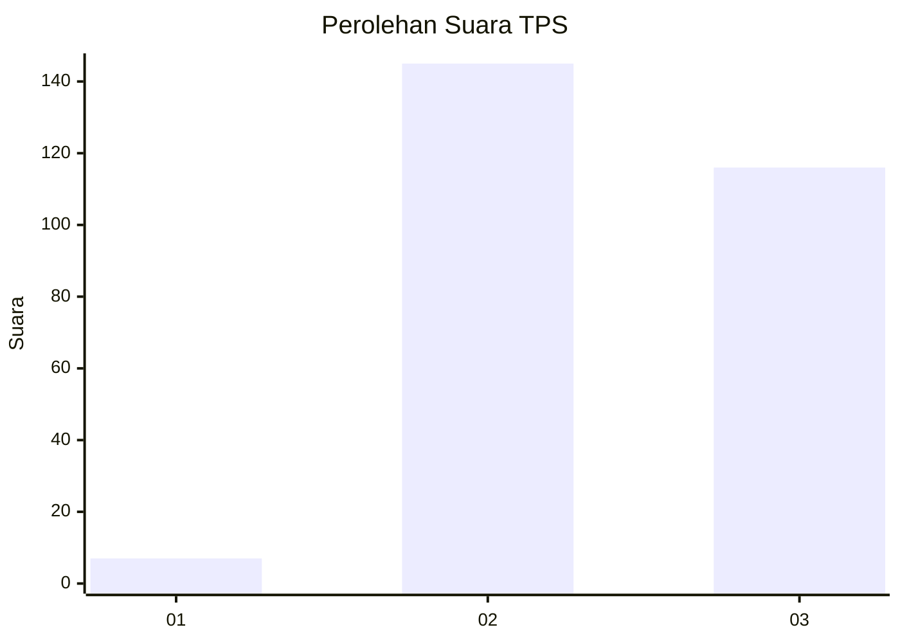
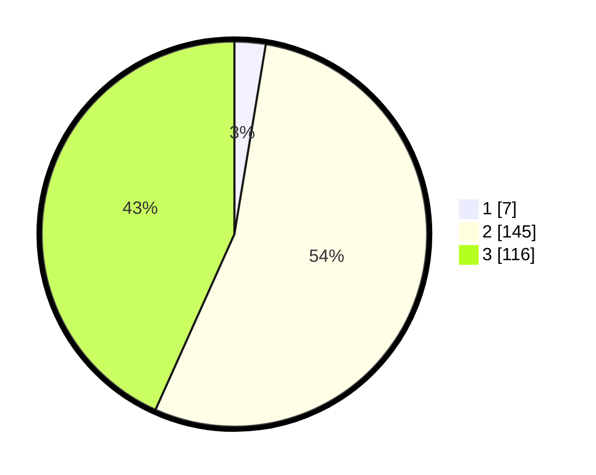

# Hasil

## Grafik

## Tabel

| No. | Nama Paslon    | Suara | Suara (raw) | Persentase |
|:--- |:-------------- | -----:| -----------:| ----------:|
| 1   | ANIES MUHAIMIN | 7     | [7][p-1]    | 2,61       |
| 2   | PRABOWO GIBRAN | 145   | [145][p-2]  | 54,10      |
| 3   | GANJAR MAHFUD  | 116   | [116][p-3]  | 43,28      |

[p-1]: https://github.com/gigit-pemilu/pemilu-2024/blob/main/pilpres/hitung-suara/sub/33-jawa-tengah/sub/09-boyolali/sub/11-ngemplak/sub/2002-sobokerto/sub/004-tps/sub/paslon-1.txt
[p-2]: https://github.com/gigit-pemilu/pemilu-2024/blob/main/pilpres/hitung-suara/sub/33-jawa-tengah/sub/09-boyolali/sub/11-ngemplak/sub/2002-sobokerto/sub/004-tps/sub/paslon-2.txt
[p-3]: https://github.com/gigit-pemilu/pemilu-2024/blob/main/pilpres/hitung-suara/sub/33-jawa-tengah/sub/09-boyolali/sub/11-ngemplak/sub/2002-sobokerto/sub/004-tps/sub/paslon-3.txt

## Foto C Plano

https://sirekap-obj-formc.kpu.go.id/b00b/pemilu/ppwp/33/09/11/20/02/3309112002004-20240214-155341--d1e76145-2f66-4259-812b-1c3da4aada0a.jpg

https://sirekap-obj-formc.kpu.go.id/b00b/pemilu/ppwp/33/09/11/20/02/3309112002004-20240214-230607--703c687a-d811-402f-ac22-a4fcc0e84db0.jpg

https://sirekap-obj-formc.kpu.go.id/b00b/pemilu/ppwp/33/09/11/20/02/3309112002004-20240214-155429--6fd95abf-7389-4d0e-910f-b6c16bffa35f.jpg

## Metadata

| Key        | Value               |
| ---------- | ------------------- |
| Time Stamp | 2024-02-15 22:00:27 |

