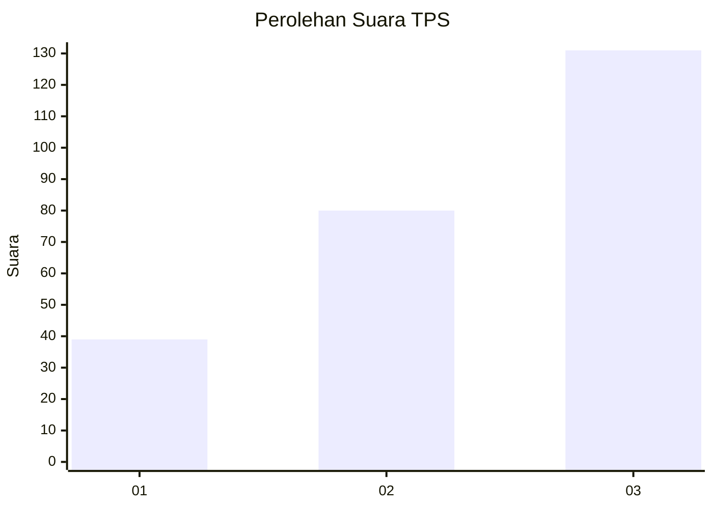
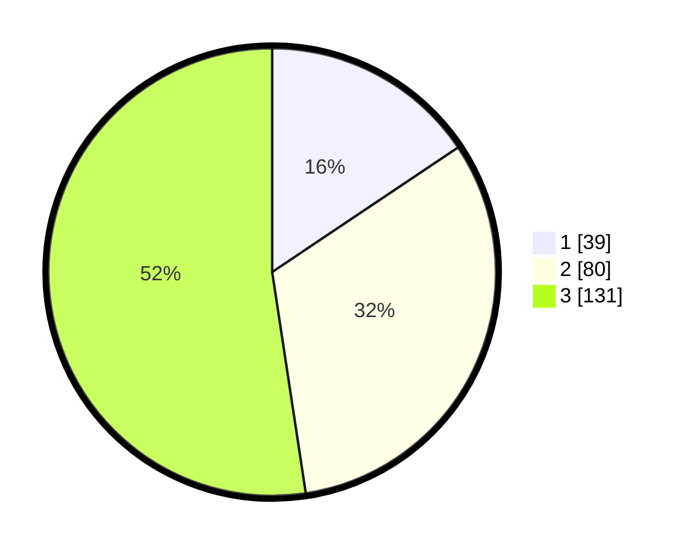

# Hasil

## Grafik

## Tabel

| No. | Nama Paslon    | Suara | Suara (raw) | Persentase |
|:--- |:-------------- | -----:| -----------:| ----------:|
| 1   | ANIES MUHAIMIN | 39    | [39][p-1]   | 15,60      |
| 2   | PRABOWO GIBRAN | 80    | [80][p-2]   | 32,00      |
| 3   | GANJAR MAHFUD  | 131   | [131][p-3]  | 52,40      |

[p-1]: https://github.com/gigit-pemilu/pemilu-2024/blob/main/pilpres/hitung-suara/sub/33-jawa-tengah/sub/09-boyolali/sub/11-ngemplak/sub/2003-ngesrep/sub/006-tps/sub/paslon-1.txt
[p-2]: https://github.com/gigit-pemilu/pemilu-2024/blob/main/pilpres/hitung-suara/sub/33-jawa-tengah/sub/09-boyolali/sub/11-ngemplak/sub/2003-ngesrep/sub/006-tps/sub/paslon-2.txt
[p-3]: https://github.com/gigit-pemilu/pemilu-2024/blob/main/pilpres/hitung-suara/sub/33-jawa-tengah/sub/09-boyolali/sub/11-ngemplak/sub/2003-ngesrep/sub/006-tps/sub/paslon-3.txt

## Foto C Plano

https://sirekap-obj-formc.kpu.go.id/b7dc/pemilu/ppwp/33/09/11/20/03/3309112003006-20240214-215753--d458259d-9bea-473c-82f5-ddab799f4db5.jpg

https://sirekap-obj-formc.kpu.go.id/b7dc/pemilu/ppwp/33/09/11/20/03/3309112003006-20240214-215808--038edcf3-14c5-4512-a3c9-8e6d11c92ba2.jpg

https://sirekap-obj-formc.kpu.go.id/b7dc/pemilu/ppwp/33/09/11/20/03/3309112003006-20240214-215825--1c73d8ee-a42f-4638-a5b6-abc9e8ed7d4f.jpg

## Metadata

| Key        | Value               |
| ---------- | ------------------- |
| Time Stamp | 2024-02-25 15:00:00 |

