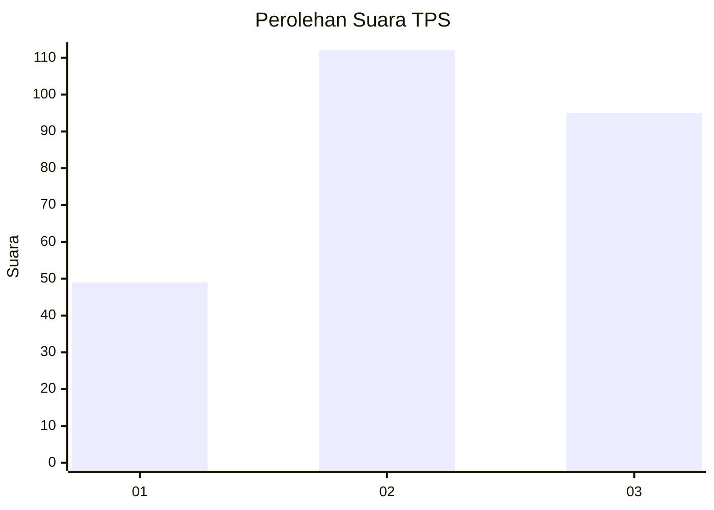
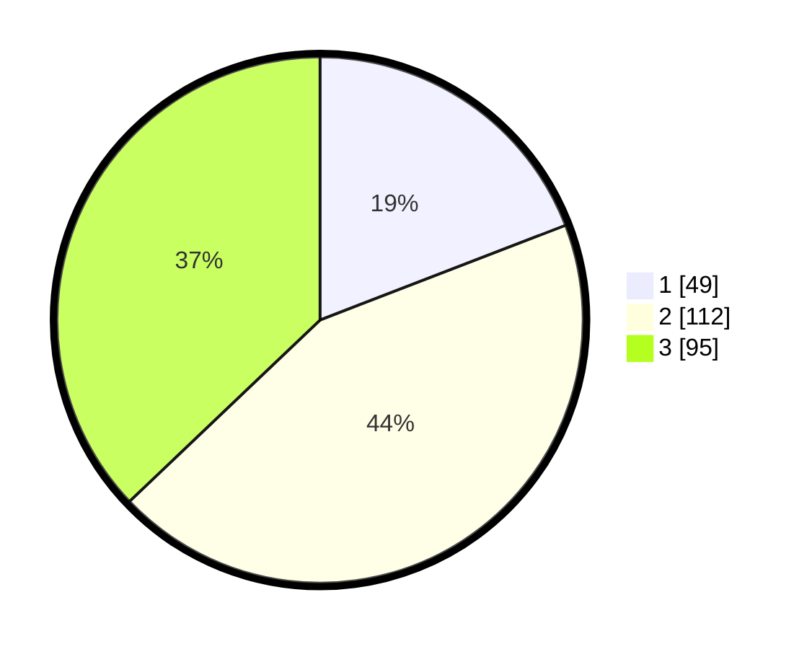

# Hasil

## Grafik

## Tabel

| No. | Nama Paslon    | Suara | Suara (raw) | Persentase |
|:--- |:-------------- | -----:| -----------:| ----------:|
| 1   | ANIES MUHAIMIN | 49    | [49][p-1]   | 19,14      |
| 2   | PRABOWO GIBRAN | 112   | [112][p-2]  | 43,75      |
| 3   | GANJAR MAHFUD  | 95    | [95][p-3]   | 37,11      |

[p-1]: https://github.com/gigit-pemilu/pemilu-2024/blob/main/pilpres/hitung-suara/sub/33-jawa-tengah/sub/09-boyolali/sub/12-nogosari/sub/2003-sembungan/sub/012-tps/sub/paslon-1.txt
[p-2]: https://github.com/gigit-pemilu/pemilu-2024/blob/main/pilpres/hitung-suara/sub/33-jawa-tengah/sub/09-boyolali/sub/12-nogosari/sub/2003-sembungan/sub/012-tps/sub/paslon-2.txt
[p-3]: https://github.com/gigit-pemilu/pemilu-2024/blob/main/pilpres/hitung-suara/sub/33-jawa-tengah/sub/09-boyolali/sub/12-nogosari/sub/2003-sembungan/sub/012-tps/sub/paslon-3.txt

## Foto C Plano

https://sirekap-obj-formc.kpu.go.id/507f/pemilu/ppwp/33/09/12/20/03/3309122003012-20240218-205556--aa907e08-70a9-45ff-9fc6-04610c495e10.jpg

https://sirekap-obj-formc.kpu.go.id/507f/pemilu/ppwp/33/09/12/20/03/3309122003012-20240215-003548--d7570a03-5e17-4c71-bf1a-a6818d4fa67a.jpg

https://sirekap-obj-formc.kpu.go.id/507f/pemilu/ppwp/33/09/12/20/03/3309122003012-20240215-003656--27f3fc05-2451-47a4-a061-1d2fe3061f3c.jpg

## Metadata

| Key        | Value               |
| ---------- | ------------------- |
| Time Stamp | 2024-02-19 06:16:00 |

