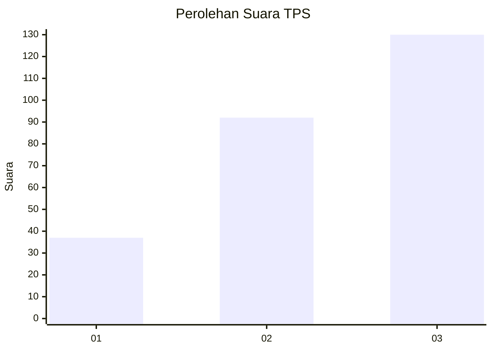
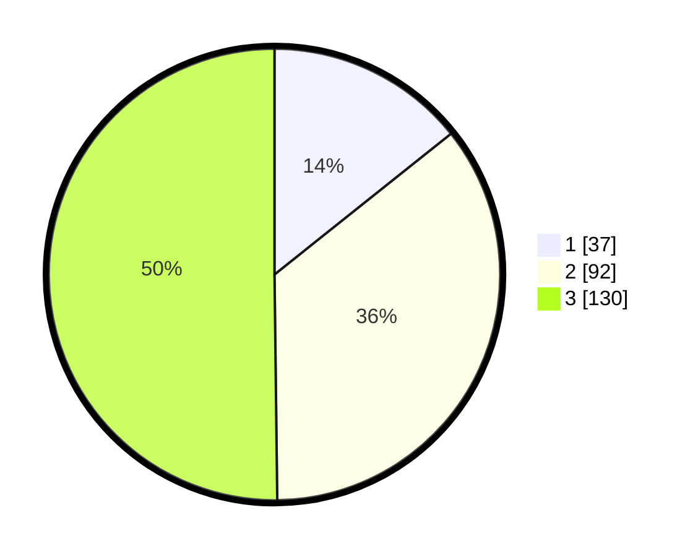

# Hasil

## Grafik

## Tabel

| No. | Nama Paslon    | Suara | Suara (raw) | Persentase |
|:--- |:-------------- | -----:| -----------:| ----------:|
| 1   | ANIES MUHAIMIN | 37    | [37][p-1]   | 14,29      |
| 2   | PRABOWO GIBRAN | 92    | [92][p-2]   | 35,52      |
| 3   | GANJAR MAHFUD  | 130   | [130][p-3]  | 50,19      |

[p-1]: https://github.com/gigit-pemilu/pemilu-2024/blob/main/pilpres/hitung-suara/sub/33-jawa-tengah/sub/09-boyolali/sub/12-nogosari/sub/2003-sembungan/sub/013-tps/sub/paslon-1.txt
[p-2]: https://github.com/gigit-pemilu/pemilu-2024/blob/main/pilpres/hitung-suara/sub/33-jawa-tengah/sub/09-boyolali/sub/12-nogosari/sub/2003-sembungan/sub/013-tps/sub/paslon-2.txt
[p-3]: https://github.com/gigit-pemilu/pemilu-2024/blob/main/pilpres/hitung-suara/sub/33-jawa-tengah/sub/09-boyolali/sub/12-nogosari/sub/2003-sembungan/sub/013-tps/sub/paslon-3.txt

## Foto C Plano

https://sirekap-obj-formc.kpu.go.id/90a6/pemilu/ppwp/33/09/12/20/03/3309122003013-20240214-230126--9b06b871-0dfe-483b-98c7-8ba12b180bee.jpg

https://sirekap-obj-formc.kpu.go.id/90a6/pemilu/ppwp/33/09/12/20/03/3309122003013-20240214-230414--2598cd12-209f-439a-a37f-31bd200e01f8.jpg

https://sirekap-obj-formc.kpu.go.id/90a6/pemilu/ppwp/33/09/12/20/03/3309122003013-20240214-230536--e06f0ef6-56dd-4bc7-a7d3-c2822ae75b59.jpg

## Metadata

| Key        | Value               |
| ---------- | ------------------- |
| Time Stamp | 2024-02-15 22:00:27 |

