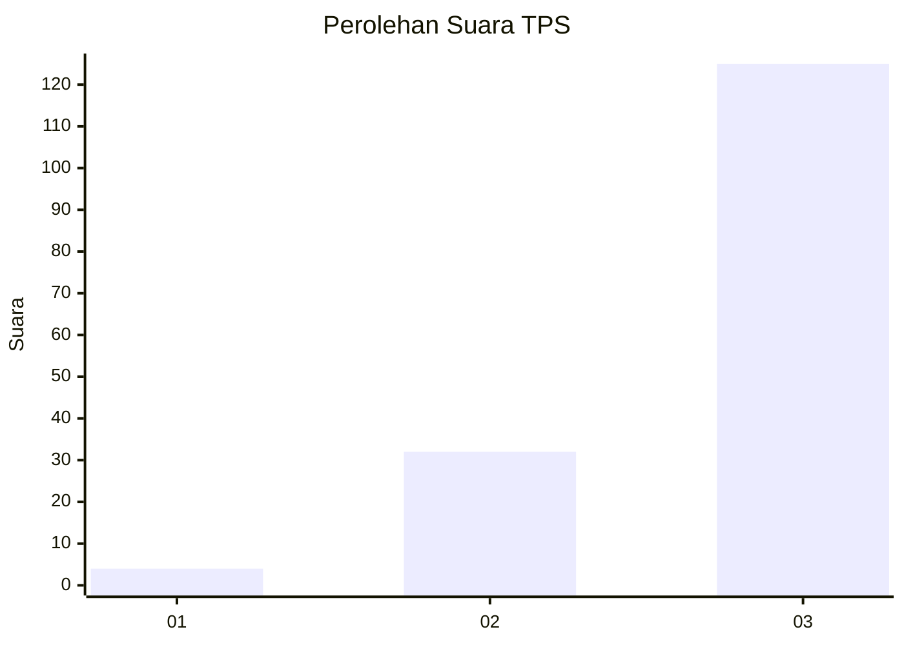
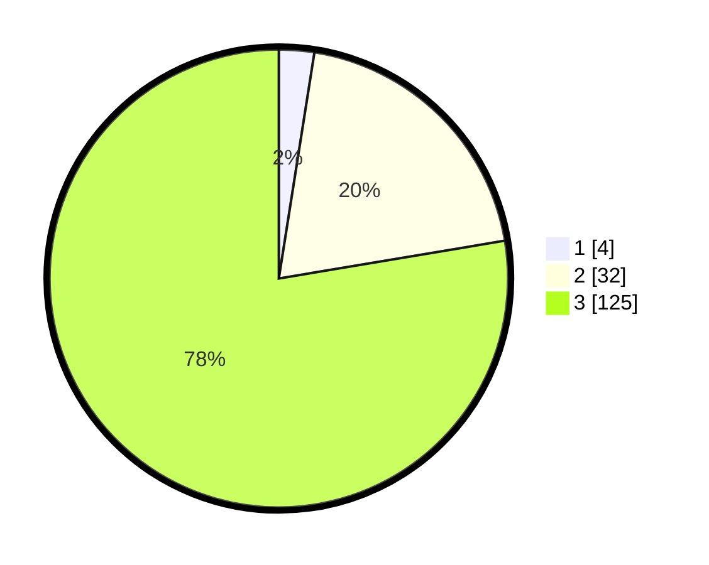

# Hasil

## Grafik

## Tabel

| No. | Nama Paslon    | Suara | Suara (raw) | Persentase |
|:--- |:-------------- | -----:| -----------:| ----------:|
| 1   | ANIES MUHAIMIN | 4     | [4][p-1]    | 2,48       |
| 2   | PRABOWO GIBRAN | 32    | [32][p-2]   | 19,88      |
| 3   | GANJAR MAHFUD  | 125   | [125][p-3]  | 77,64      |

[p-1]: https://github.com/gigit-pemilu/pemilu-2024-33-jawa-tengah/blob/main/pilpres/hitung-suara/sub/33-jawa-tengah/sub/09-boyolali/sub/12-nogosari/sub/2003-sembungan/sub/014-tps/sub/paslon-1.txt
[p-2]: https://github.com/gigit-pemilu/pemilu-2024-33-jawa-tengah/blob/main/pilpres/hitung-suara/sub/33-jawa-tengah/sub/09-boyolali/sub/12-nogosari/sub/2003-sembungan/sub/014-tps/sub/paslon-2.txt
[p-3]: https://github.com/gigit-pemilu/pemilu-2024-33-jawa-tengah/blob/main/pilpres/hitung-suara/sub/33-jawa-tengah/sub/09-boyolali/sub/12-nogosari/sub/2003-sembungan/sub/014-tps/sub/paslon-3.txt

## Foto C Plano

https://sirekap-obj-formc.kpu.go.id/ac7a/pemilu/ppwp/33/09/12/20/03/3309122003014-20240214-141303--0fb9cd6d-7d5f-41da-b8d2-493126376193.jpg

https://sirekap-obj-formc.kpu.go.id/ac7a/pemilu/ppwp/33/09/12/20/03/3309122003014-20240214-141408--4456f7c4-ff4c-48fc-a0b0-e065b9623aab.jpg

https://sirekap-obj-formc.kpu.go.id/ac7a/pemilu/ppwp/33/09/12/20/03/3309122003014-20240214-141812--26c49e20-b174-465d-93f5-64c1e846cba8.jpg

## Metadata

| Key        | Value               |
| ---------- | ------------------- |
| Time Stamp | 2024-02-15 21:01:18 |

