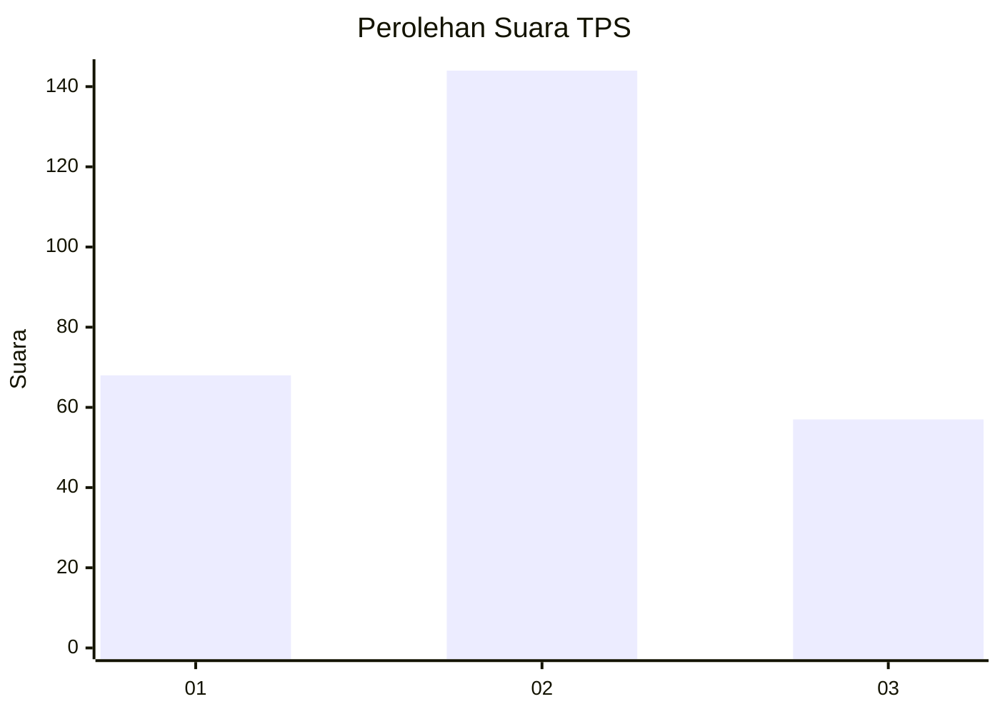
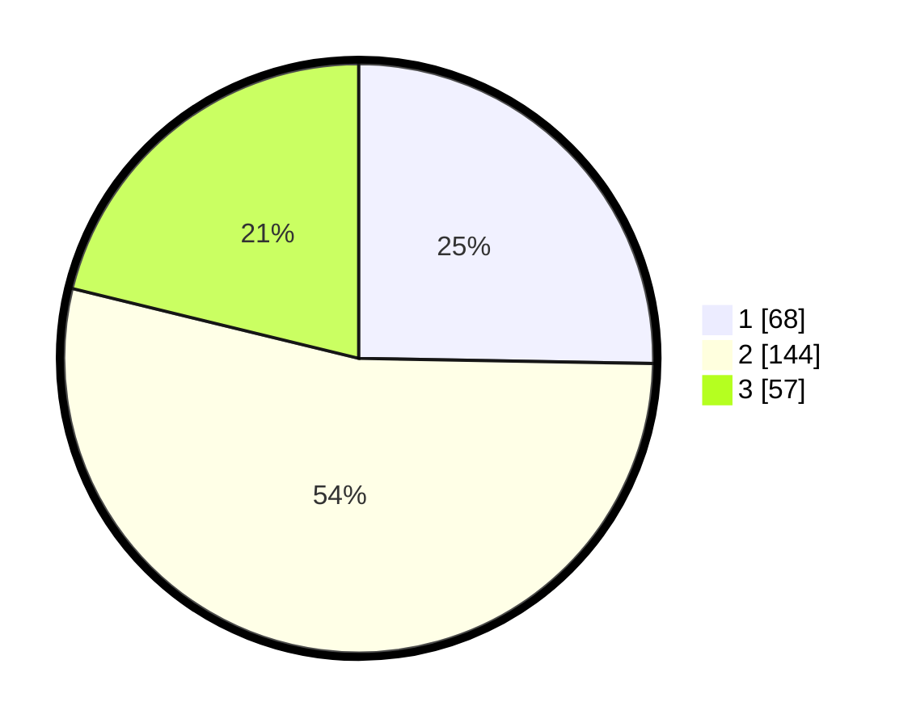

# Hasil

## Grafik

## Tabel

| No. | Nama Paslon    | Suara | Suara (raw) | Persentase |
|:--- |:-------------- | -----:| -----------:| ----------:|
| 1   | ANIES MUHAIMIN | 68    | [68][p-1]   | 25,28      |
| 2   | PRABOWO GIBRAN | 144   | [144][p-2]  | 53,53      |
| 3   | GANJAR MAHFUD  | 57    | [57][p-3]   | 21,19      |

[p-1]: https://github.com/gigit-pemilu/pemilu-2024-33-jawa-tengah/blob/main/pilpres/hitung-suara/sub/33-jawa-tengah/sub/09-boyolali/sub/12-nogosari/sub/2005-ketitang/sub/020-tps/sub/paslon-1.txt
[p-2]: https://github.com/gigit-pemilu/pemilu-2024-33-jawa-tengah/blob/main/pilpres/hitung-suara/sub/33-jawa-tengah/sub/09-boyolali/sub/12-nogosari/sub/2005-ketitang/sub/020-tps/sub/paslon-2.txt
[p-3]: https://github.com/gigit-pemilu/pemilu-2024-33-jawa-tengah/blob/main/pilpres/hitung-suara/sub/33-jawa-tengah/sub/09-boyolali/sub/12-nogosari/sub/2005-ketitang/sub/020-tps/sub/paslon-3.txt

## Foto C Plano

https://sirekap-obj-formc.kpu.go.id/cb0f/pemilu/ppwp/33/09/12/20/05/3309122005020-20240217-173952--e83c0a3c-54ba-4930-b497-21e7c3e43795.jpg

https://sirekap-obj-formc.kpu.go.id/cb0f/pemilu/ppwp/33/09/12/20/05/3309122005020-20240217-174818--e32797c0-9d8c-4513-b1ef-e4a0371f2ab6.jpg

https://sirekap-obj-formc.kpu.go.id/cb0f/pemilu/ppwp/33/09/12/20/05/3309122005020-20240217-175032--0600f2eb-d3cb-4b0a-8a86-edfd845f31df.jpg

## Metadata

| Key        | Value               |
| ---------- | ------------------- |
| Time Stamp | 2024-02-24 22:31:28 |

