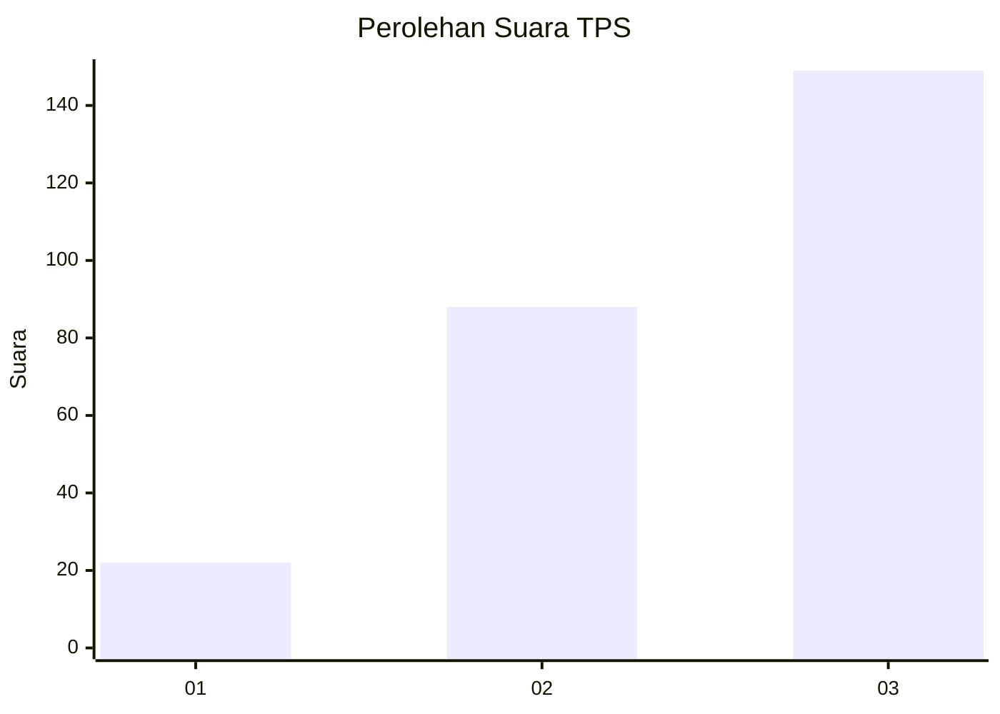
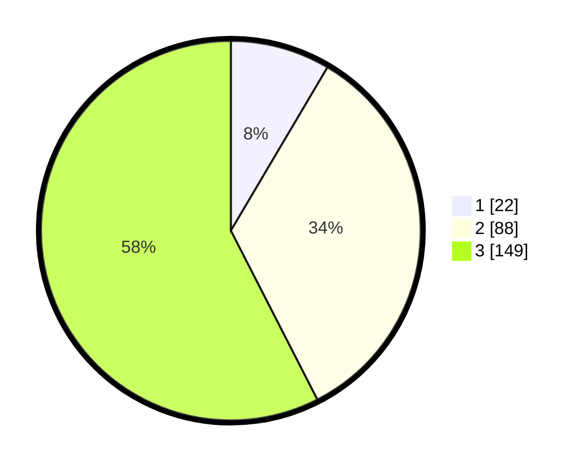

# Hasil

## Grafik

## Tabel

| No. | Nama Paslon    | Suara | Suara (raw) | Persentase |
|:--- |:-------------- | -----:| -----------:| ----------:|
| 1   | ANIES MUHAIMIN | 22    | [22][p-1]   | 8,49       |
| 2   | PRABOWO GIBRAN | 88    | [88][p-2]   | 33,98      |
| 3   | GANJAR MAHFUD  | 149   | [149][p-3]  | 57,53      |

[p-1]: https://github.com/gigit-pemilu/pemilu-2024/blob/main/pilpres/hitung-suara/sub/33-jawa-tengah/sub/09-boyolali/sub/12-nogosari/sub/2010-keyongan/sub/006-tps/sub/paslon-1.txt
[p-2]: https://github.com/gigit-pemilu/pemilu-2024/blob/main/pilpres/hitung-suara/sub/33-jawa-tengah/sub/09-boyolali/sub/12-nogosari/sub/2010-keyongan/sub/006-tps/sub/paslon-2.txt
[p-3]: https://github.com/gigit-pemilu/pemilu-2024/blob/main/pilpres/hitung-suara/sub/33-jawa-tengah/sub/09-boyolali/sub/12-nogosari/sub/2010-keyongan/sub/006-tps/sub/paslon-3.txt

## Foto C Plano

https://sirekap-obj-formc.kpu.go.id/d02f/pemilu/ppwp/33/09/12/20/10/3309122010006-20240214-235900--d0fac0ad-7b1f-4f0e-85af-e662bc3ccb97.jpg

https://sirekap-obj-formc.kpu.go.id/d02f/pemilu/ppwp/33/09/12/20/10/3309122010006-20240215-000020--2e7d74ea-41c4-4dd9-a59a-2fa2fbd6f893.jpg

https://sirekap-obj-formc.kpu.go.id/d02f/pemilu/ppwp/33/09/12/20/10/3309122010006-20240215-000154--c2f1be29-1bea-4df2-97fe-3a79fc85e2aa.jpg

## Metadata

| Key        | Value               |
| ---------- | ------------------- |
| Time Stamp | 2024-02-16 10:00:28 |

