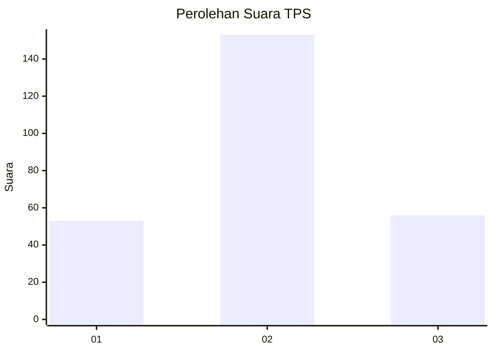
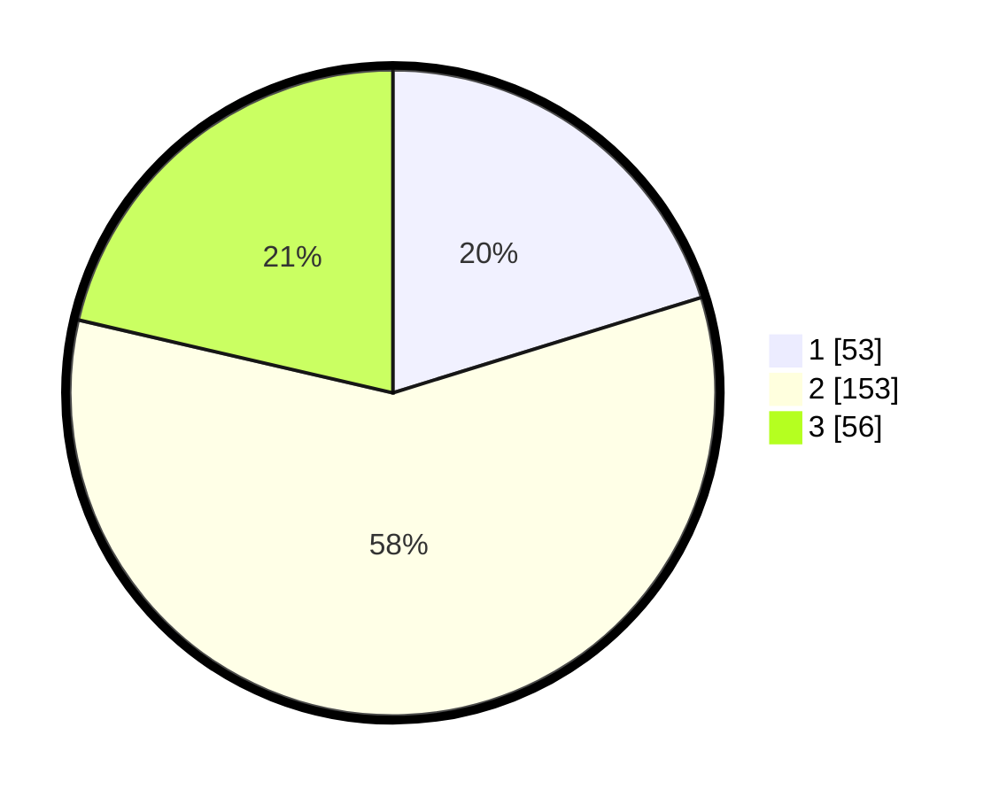

# Hasil

## Grafik

## Tabel

| No. | Nama Paslon    | Suara | Suara (raw) | Persentase |
|:--- |:-------------- | -----:| -----------:| ----------:|
| 1   | ANIES MUHAIMIN | 53    | [53][p-1]   | 20,23      |
| 2   | PRABOWO GIBRAN | 153   | [153][p-2]  | 58,40      |
| 3   | GANJAR MAHFUD  | 56    | [56][p-3]   | 21,37      |

[p-1]: https://github.com/gigit-pemilu/pemilu-2024-33-jawa-tengah/blob/main/pilpres/hitung-suara/sub/33-jawa-tengah/sub/09-boyolali/sub/12-nogosari/sub/2012-glonggong/sub/007-tps/sub/paslon-1.txt
[p-2]: https://github.com/gigit-pemilu/pemilu-2024-33-jawa-tengah/blob/main/pilpres/hitung-suara/sub/33-jawa-tengah/sub/09-boyolali/sub/12-nogosari/sub/2012-glonggong/sub/007-tps/sub/paslon-2.txt
[p-3]: https://github.com/gigit-pemilu/pemilu-2024-33-jawa-tengah/blob/main/pilpres/hitung-suara/sub/33-jawa-tengah/sub/09-boyolali/sub/12-nogosari/sub/2012-glonggong/sub/007-tps/sub/paslon-3.txt

## Foto C Plano

https://sirekap-obj-formc.kpu.go.id/0493/pemilu/ppwp/33/09/12/20/12/3309122012007-20240214-210330--9f65ac37-31c5-474b-8777-605aca151683.jpg

https://sirekap-obj-formc.kpu.go.id/0493/pemilu/ppwp/33/09/12/20/12/3309122012007-20240214-210709--5a73e67b-f7c1-4400-9b48-31e00add253c.jpg

https://sirekap-obj-formc.kpu.go.id/0493/pemilu/ppwp/33/09/12/20/12/3309122012007-20240214-210935--9b64951d-36ab-4f53-bfb9-4c5cbddf8c1f.jpg

## Metadata

| Key        | Value               |
| ---------- | ------------------- |
| Time Stamp | 2024-02-16 16:25:10 |

