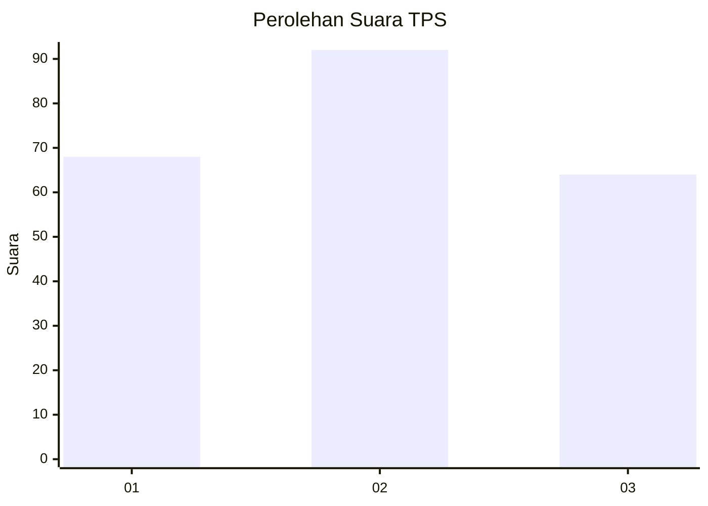
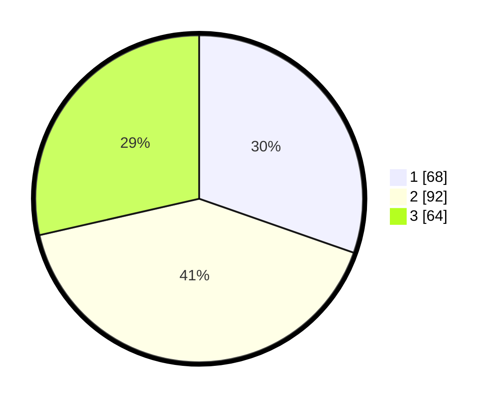

# Hasil

## Grafik

## Tabel

| No. | Nama Paslon    | Suara | Suara (raw) | Persentase |
|:--- |:-------------- | -----:| -----------:| ----------:|
| 1   | ANIES MUHAIMIN | 68    | [68][p-1]   | 30,36      |
| 2   | PRABOWO GIBRAN | 92    | [92][p-2]   | 41,07      |
| 3   | GANJAR MAHFUD  | 64    | [64][p-3]   | 28,57      |

[p-1]: https://github.com/gigit-pemilu/pemilu-2024/blob/main/pilpres/hitung-suara/sub/33-jawa-tengah/sub/09-boyolali/sub/13-simo/sub/2001-pelem/sub/004-tps/sub/paslon-1.txt
[p-2]: https://github.com/gigit-pemilu/pemilu-2024/blob/main/pilpres/hitung-suara/sub/33-jawa-tengah/sub/09-boyolali/sub/13-simo/sub/2001-pelem/sub/004-tps/sub/paslon-2.txt
[p-3]: https://github.com/gigit-pemilu/pemilu-2024/blob/main/pilpres/hitung-suara/sub/33-jawa-tengah/sub/09-boyolali/sub/13-simo/sub/2001-pelem/sub/004-tps/sub/paslon-3.txt

## Foto C Plano

https://sirekap-obj-formc.kpu.go.id/fe04/pemilu/ppwp/33/09/13/20/01/3309132001004-20240214-234220--575fc035-f282-4d08-ac6e-4497ba7e65ce.jpg

https://sirekap-obj-formc.kpu.go.id/fe04/pemilu/ppwp/33/09/13/20/01/3309132001004-20240216-145728--3aa55307-1ee5-4bc7-8425-28d9d107c4eb.jpg

https://sirekap-obj-formc.kpu.go.id/fe04/pemilu/ppwp/33/09/13/20/01/3309132001004-20240216-145728--3ed1f549-e40c-4ac5-b835-15c909885fe7.jpg

## Metadata

| Key        | Value               |
| ---------- | ------------------- |
| Time Stamp | 2024-02-16 16:25:10 |

