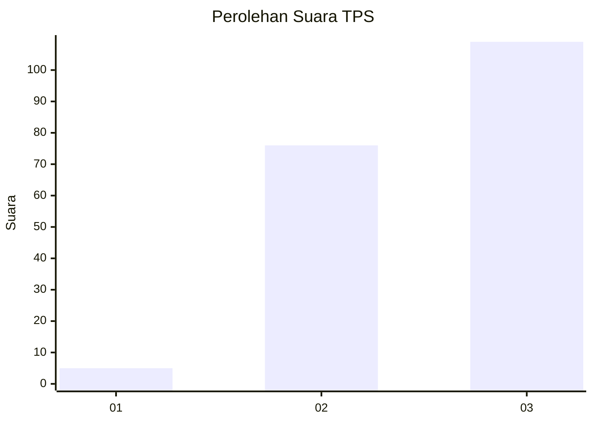
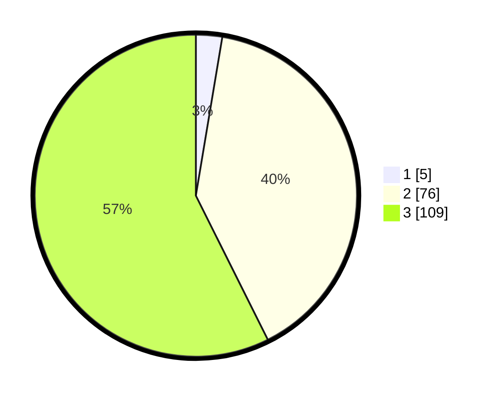

# Hasil

## Grafik

## Tabel

| No. | Nama Paslon    | Suara | Suara (raw) | Persentase |
|:--- |:-------------- | -----:| -----------:| ----------:|
| 1   | ANIES MUHAIMIN | 5     | [5][p-1]    | 2,63       |
| 2   | PRABOWO GIBRAN | 76    | [76][p-2]   | 40,00      |
| 3   | GANJAR MAHFUD  | 109   | [109][p-3]  | 57,37      |

[p-1]: https://github.com/gigit-pemilu/pemilu-2024-33-jawa-tengah/blob/main/pilpres/hitung-suara/sub/33-jawa-tengah/sub/09-boyolali/sub/13-simo/sub/2004-teter/sub/011-tps/sub/paslon-1.txt
[p-2]: https://github.com/gigit-pemilu/pemilu-2024-33-jawa-tengah/blob/main/pilpres/hitung-suara/sub/33-jawa-tengah/sub/09-boyolali/sub/13-simo/sub/2004-teter/sub/011-tps/sub/paslon-2.txt
[p-3]: https://github.com/gigit-pemilu/pemilu-2024-33-jawa-tengah/blob/main/pilpres/hitung-suara/sub/33-jawa-tengah/sub/09-boyolali/sub/13-simo/sub/2004-teter/sub/011-tps/sub/paslon-3.txt

## Foto C Plano

https://sirekap-obj-formc.kpu.go.id/141a/pemilu/ppwp/33/09/13/20/04/3309132004011-20240214-215744--57c27eec-2466-4495-9893-c82710ffa70e.jpg

https://sirekap-obj-formc.kpu.go.id/141a/pemilu/ppwp/33/09/13/20/04/3309132004011-20240215-212327--b6c814a6-9e45-4e62-958c-fa672ffa413b.jpg

https://sirekap-obj-formc.kpu.go.id/141a/pemilu/ppwp/33/09/13/20/04/3309132004011-20240218-000406--894cf328-9188-45aa-85d0-bf44c584258d.jpg

## Metadata

| Key        | Value               |
| ---------- | ------------------- |
| Time Stamp | 2024-02-19 06:16:00 |

