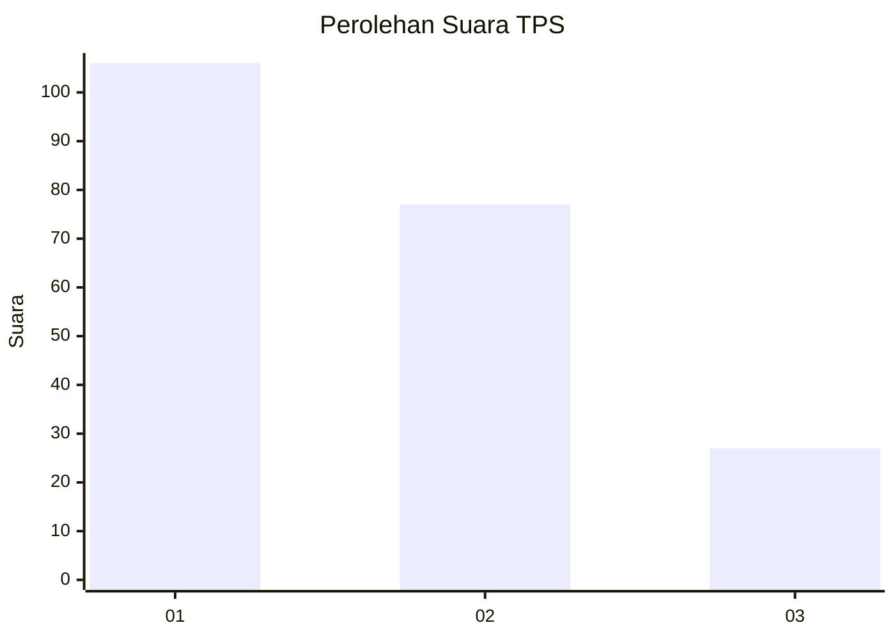
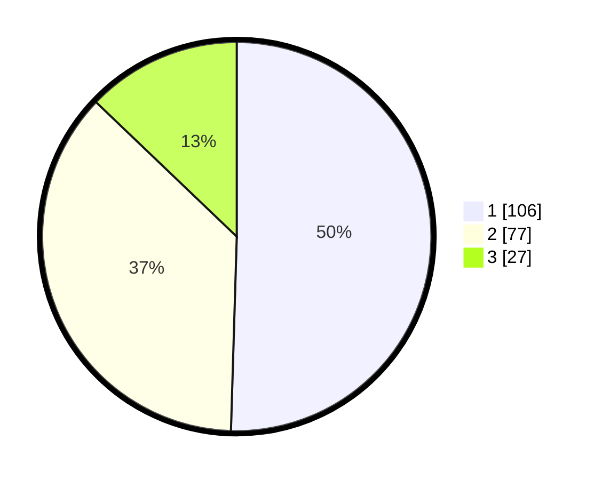

# Hasil

## Grafik

## Tabel

| No. | Nama Paslon    | Suara | Suara (raw) | Persentase |
|:--- |:-------------- | -----:| -----------:| ----------:|
| 1   | ANIES MUHAIMIN | 106   | [106][p-1]  | 50,48      |
| 2   | PRABOWO GIBRAN | 77    | [77][p-2]   | 36,67      |
| 3   | GANJAR MAHFUD  | 27    | [27][p-3]   | 12,86      |

[p-1]: https://github.com/gigit-pemilu/pemilu-2024/blob/main/pilpres/hitung-suara/sub/33-jawa-tengah/sub/09-boyolali/sub/13-simo/sub/2006-walen/sub/001-tps/sub/paslon-1.txt
[p-2]: https://github.com/gigit-pemilu/pemilu-2024/blob/main/pilpres/hitung-suara/sub/33-jawa-tengah/sub/09-boyolali/sub/13-simo/sub/2006-walen/sub/001-tps/sub/paslon-2.txt
[p-3]: https://github.com/gigit-pemilu/pemilu-2024/blob/main/pilpres/hitung-suara/sub/33-jawa-tengah/sub/09-boyolali/sub/13-simo/sub/2006-walen/sub/001-tps/sub/paslon-3.txt

## Foto C Plano

https://sirekap-obj-formc.kpu.go.id/9b8c/pemilu/ppwp/33/09/13/20/06/3309132006001-20240214-223223--5b7b0fca-684f-44d3-936f-4659ca0a4788.jpg

https://sirekap-obj-formc.kpu.go.id/9b8c/pemilu/ppwp/33/09/13/20/06/3309132006001-20240214-223431--3583484c-8d2f-49d6-84dd-3d3805a878a8.jpg

https://sirekap-obj-formc.kpu.go.id/9b8c/pemilu/ppwp/33/09/13/20/06/3309132006001-20240214-223600--59c30eb8-cc05-49ee-a81f-2935da49cd90.jpg

## Metadata

| Key        | Value               |
| ---------- | ------------------- |
| Time Stamp | 2024-02-15 22:00:27 |

