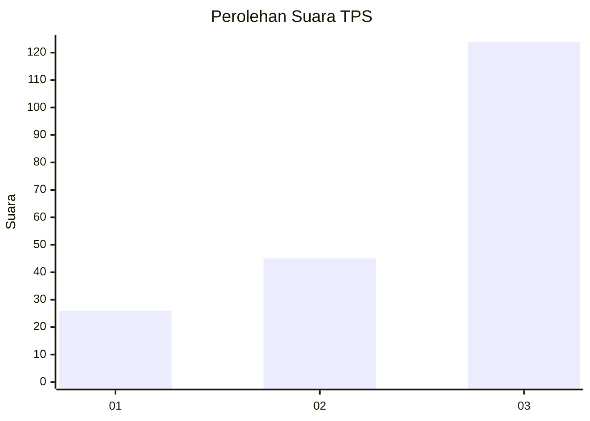
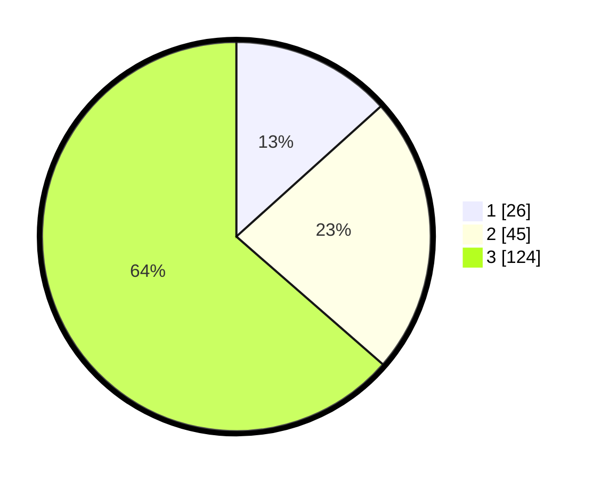

# Hasil

## Grafik

## Tabel

| No. | Nama Paslon    | Suara | Suara (raw) | Persentase |
|:--- |:-------------- | -----:| -----------:| ----------:|
| 1   | ANIES MUHAIMIN | 26    | [26][p-1]   | 13,33      |
| 2   | PRABOWO GIBRAN | 45    | [45][p-2]   | 23,08      |
| 3   | GANJAR MAHFUD  | 124   | [124][p-3]  | 63,59      |

[p-1]: https://github.com/gigit-pemilu/pemilu-2024/blob/main/pilpres/hitung-suara/sub/33-jawa-tengah/sub/09-boyolali/sub/14-karanggede/sub/2001-manyaran/sub/014-tps/sub/paslon-1.txt
[p-2]: https://github.com/gigit-pemilu/pemilu-2024/blob/main/pilpres/hitung-suara/sub/33-jawa-tengah/sub/09-boyolali/sub/14-karanggede/sub/2001-manyaran/sub/014-tps/sub/paslon-2.txt
[p-3]: https://github.com/gigit-pemilu/pemilu-2024/blob/main/pilpres/hitung-suara/sub/33-jawa-tengah/sub/09-boyolali/sub/14-karanggede/sub/2001-manyaran/sub/014-tps/sub/paslon-3.txt

## Foto C Plano

https://sirekap-obj-formc.kpu.go.id/276f/pemilu/ppwp/33/09/14/20/01/3309142001014-20240214-232943--ea71ab95-d461-4377-b373-ccf8cc91f154.jpg

https://sirekap-obj-formc.kpu.go.id/276f/pemilu/ppwp/33/09/14/20/01/3309142001014-20240214-233258--e128ae77-b968-45d4-a31b-020e4647353e.jpg

https://sirekap-obj-formc.kpu.go.id/276f/pemilu/ppwp/33/09/14/20/01/3309142001014-20240214-233443--4fe63953-9a6e-4645-b4f2-edd562115d88.jpg

## Metadata

| Key        | Value               |
| ---------- | ------------------- |
| Time Stamp | 2024-02-24 22:31:28 |

