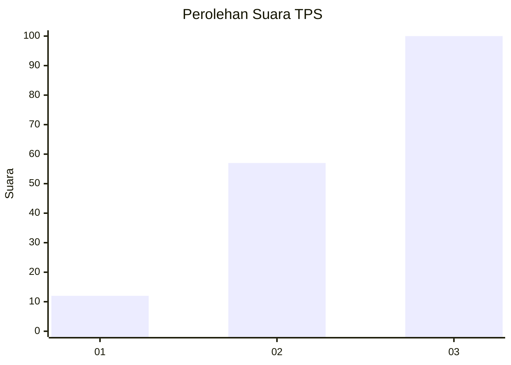
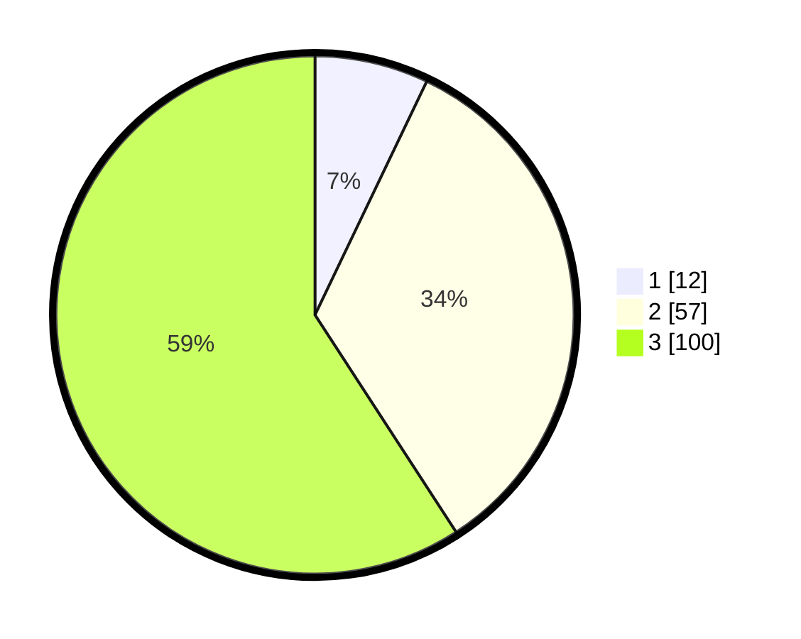

# Hasil

## Grafik

## Tabel

| No. | Nama Paslon    | Suara | Suara (raw) | Persentase |
|:--- |:-------------- | -----:| -----------:| ----------:|
| 1   | ANIES MUHAIMIN | 12    | [12][p-1]   | 7,10       |
| 2   | PRABOWO GIBRAN | 57    | [57][p-2]   | 33,73      |
| 3   | GANJAR MAHFUD  | 100   | [100][p-3]  | 59,17      |

[p-1]: https://github.com/gigit-pemilu/pemilu-2024-33-jawa-tengah/blob/main/pilpres/hitung-suara/sub/33-jawa-tengah/sub/09-boyolali/sub/14-karanggede/sub/2008-grogolan/sub/001-tps/sub/paslon-1.txt
[p-2]: https://github.com/gigit-pemilu/pemilu-2024-33-jawa-tengah/blob/main/pilpres/hitung-suara/sub/33-jawa-tengah/sub/09-boyolali/sub/14-karanggede/sub/2008-grogolan/sub/001-tps/sub/paslon-2.txt
[p-3]: https://github.com/gigit-pemilu/pemilu-2024-33-jawa-tengah/blob/main/pilpres/hitung-suara/sub/33-jawa-tengah/sub/09-boyolali/sub/14-karanggede/sub/2008-grogolan/sub/001-tps/sub/paslon-3.txt

## Foto C Plano

https://sirekap-obj-formc.kpu.go.id/dc24/pemilu/ppwp/33/09/14/20/08/3309142008001-20240214-234702--0b8ee5e1-5574-497d-9f1b-4c81375fe5c8.jpg

https://sirekap-obj-formc.kpu.go.id/dc24/pemilu/ppwp/33/09/14/20/08/3309142008001-20240215-194827--7355b8c7-17e3-4abd-9cae-48db9bb179b2.jpg

https://sirekap-obj-formc.kpu.go.id/dc24/pemilu/ppwp/33/09/14/20/08/3309142008001-20240214-203433--38e175fa-4a82-4fa1-a880-6c51cf1e2849.jpg

## Metadata

| Key        | Value               |
| ---------- | ------------------- |
| Time Stamp | 2024-02-24 22:31:28 |

