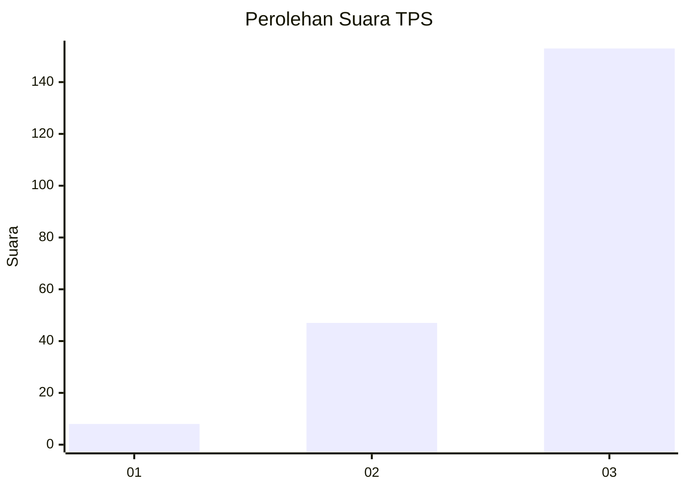
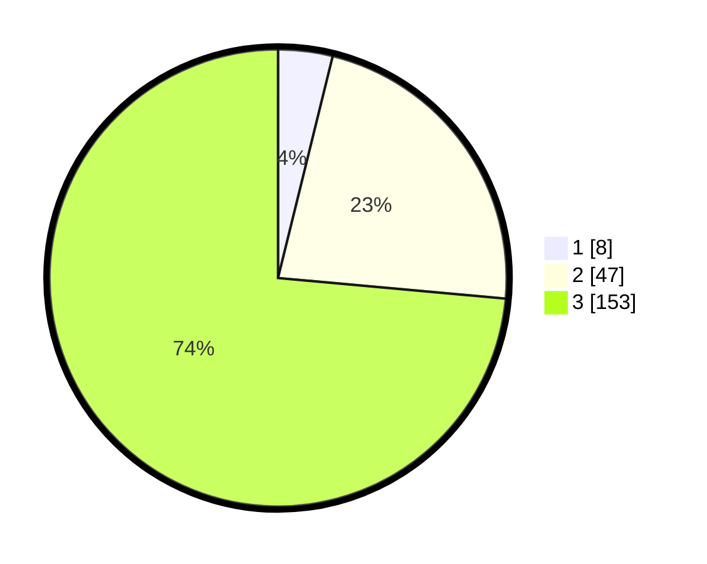

# Hasil

## Grafik

## Tabel

| No. | Nama Paslon    | Suara | Suara (raw) | Persentase |
|:--- |:-------------- | -----:| -----------:| ----------:|
| 1   | ANIES MUHAIMIN | 8     | [8][p-1]    | 3,85       |
| 2   | PRABOWO GIBRAN | 47    | [47][p-2]   | 22,60      |
| 3   | GANJAR MAHFUD  | 153   | [153][p-3]  | 73,56      |

[p-1]: https://github.com/gigit-pemilu/pemilu-2024-33-jawa-tengah/blob/main/pilpres/hitung-suara/sub/33-jawa-tengah/sub/09-boyolali/sub/14-karanggede/sub/2010-pengkol/sub/011-tps/sub/paslon-1.txt
[p-2]: https://github.com/gigit-pemilu/pemilu-2024-33-jawa-tengah/blob/main/pilpres/hitung-suara/sub/33-jawa-tengah/sub/09-boyolali/sub/14-karanggede/sub/2010-pengkol/sub/011-tps/sub/paslon-2.txt
[p-3]: https://github.com/gigit-pemilu/pemilu-2024-33-jawa-tengah/blob/main/pilpres/hitung-suara/sub/33-jawa-tengah/sub/09-boyolali/sub/14-karanggede/sub/2010-pengkol/sub/011-tps/sub/paslon-3.txt

## Foto C Plano

https://sirekap-obj-formc.kpu.go.id/1452/pemilu/ppwp/33/09/14/20/10/3309142010011-20240214-185545--379ab271-cc87-4c26-801f-5d4a9e725c72.jpg

https://sirekap-obj-formc.kpu.go.id/1452/pemilu/ppwp/33/09/14/20/10/3309142010011-20240215-043037--f2c8ca61-7b54-4716-831a-cc62342afe21.jpg

https://sirekap-obj-formc.kpu.go.id/1452/pemilu/ppwp/33/09/14/20/10/3309142010011-20240214-185711--de999126-9542-48f4-8cea-d396ca76d22d.jpg

## Metadata

| Key        | Value               |
| ---------- | ------------------- |
| Time Stamp | 2024-02-25 16:00:00 |

