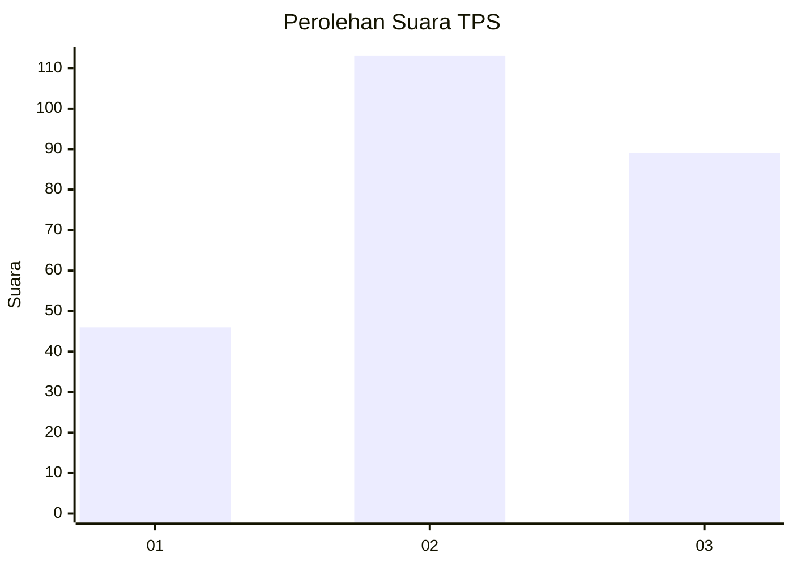
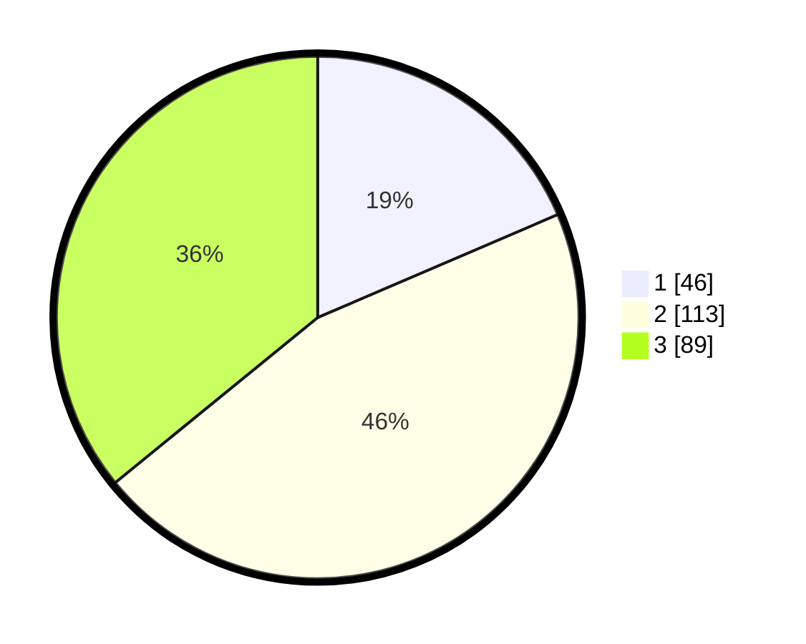

# Hasil

## Grafik

## Tabel

| No. | Nama Paslon    | Suara | Suara (raw) | Persentase |
|:--- |:-------------- | -----:| -----------:| ----------:|
| 1   | ANIES MUHAIMIN | 46    | [46][p-1]   | 18,55      |
| 2   | PRABOWO GIBRAN | 113   | [113][p-2]  | 45,56      |
| 3   | GANJAR MAHFUD  | 89    | [89][p-3]   | 35,89      |

[p-1]: https://github.com/gigit-pemilu/pemilu-2024/blob/main/pilpres/hitung-suara/sub/33-jawa-tengah/sub/09-boyolali/sub/14-karanggede/sub/2012-sendang/sub/012-tps/sub/paslon-1.txt
[p-2]: https://github.com/gigit-pemilu/pemilu-2024/blob/main/pilpres/hitung-suara/sub/33-jawa-tengah/sub/09-boyolali/sub/14-karanggede/sub/2012-sendang/sub/012-tps/sub/paslon-2.txt
[p-3]: https://github.com/gigit-pemilu/pemilu-2024/blob/main/pilpres/hitung-suara/sub/33-jawa-tengah/sub/09-boyolali/sub/14-karanggede/sub/2012-sendang/sub/012-tps/sub/paslon-3.txt

## Foto C Plano

https://sirekap-obj-formc.kpu.go.id/7d4a/pemilu/ppwp/33/09/14/20/12/3309142012012-20240214-233058--37d14cc1-0be2-4fb6-8913-9d1e03eff939.jpg

https://sirekap-obj-formc.kpu.go.id/7d4a/pemilu/ppwp/33/09/14/20/12/3309142012012-20240214-233147--bfe8ce16-4cb8-4b05-b094-737379f4610a.jpg

https://sirekap-obj-formc.kpu.go.id/7d4a/pemilu/ppwp/33/09/14/20/12/3309142012012-20240214-233328--52f12d94-17c5-420f-a703-67312d4264b4.jpg

## Metadata

| Key        | Value               |
| ---------- | ------------------- |
| Time Stamp | 2024-02-24 22:31:28 |

