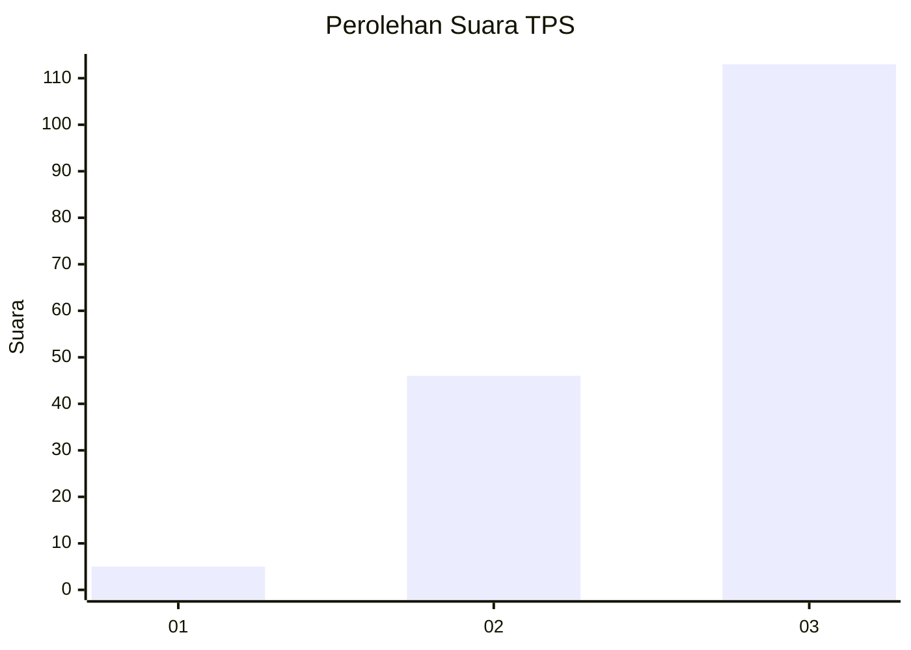
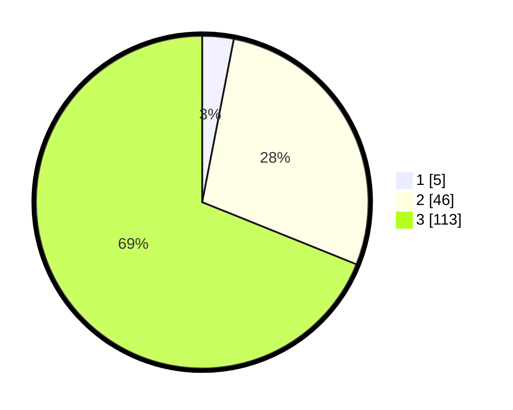

# Hasil

## Grafik

## Tabel

| No. | Nama Paslon    | Suara | Suara (raw) | Persentase |
|:--- |:-------------- | -----:| -----------:| ----------:|
| 1   | ANIES MUHAIMIN | 5     | [5][p-1]    | 3,05       |
| 2   | PRABOWO GIBRAN | 46    | [46][p-2]   | 28,05      |
| 3   | GANJAR MAHFUD  | 113   | [113][p-3]  | 68,90      |

[p-1]: https://github.com/gigit-pemilu/pemilu-2024/blob/main/pilpres/hitung-suara/sub/33-jawa-tengah/sub/09-boyolali/sub/14-karanggede/sub/2016-dologan/sub/003-tps/sub/paslon-1.txt
[p-2]: https://github.com/gigit-pemilu/pemilu-2024/blob/main/pilpres/hitung-suara/sub/33-jawa-tengah/sub/09-boyolali/sub/14-karanggede/sub/2016-dologan/sub/003-tps/sub/paslon-2.txt
[p-3]: https://github.com/gigit-pemilu/pemilu-2024/blob/main/pilpres/hitung-suara/sub/33-jawa-tengah/sub/09-boyolali/sub/14-karanggede/sub/2016-dologan/sub/003-tps/sub/paslon-3.txt

## Foto C Plano

https://sirekap-obj-formc.kpu.go.id/baea/pemilu/ppwp/33/09/14/20/16/3309142016003-20240214-224525--94ca4bf4-f006-4635-adde-8b25fcbcc9fa.jpg

https://sirekap-obj-formc.kpu.go.id/baea/pemilu/ppwp/33/09/14/20/16/3309142016003-20240214-220701--9615c869-1d98-41dd-83e1-246405b94b78.jpg

https://sirekap-obj-formc.kpu.go.id/baea/pemilu/ppwp/33/09/14/20/16/3309142016003-20240214-224719--075ff501-19b2-4670-a5d8-d3c933d67f0d.jpg

## Metadata

| Key        | Value               |
| ---------- | ------------------- |
| Time Stamp | 2024-02-25 11:00:00 |

