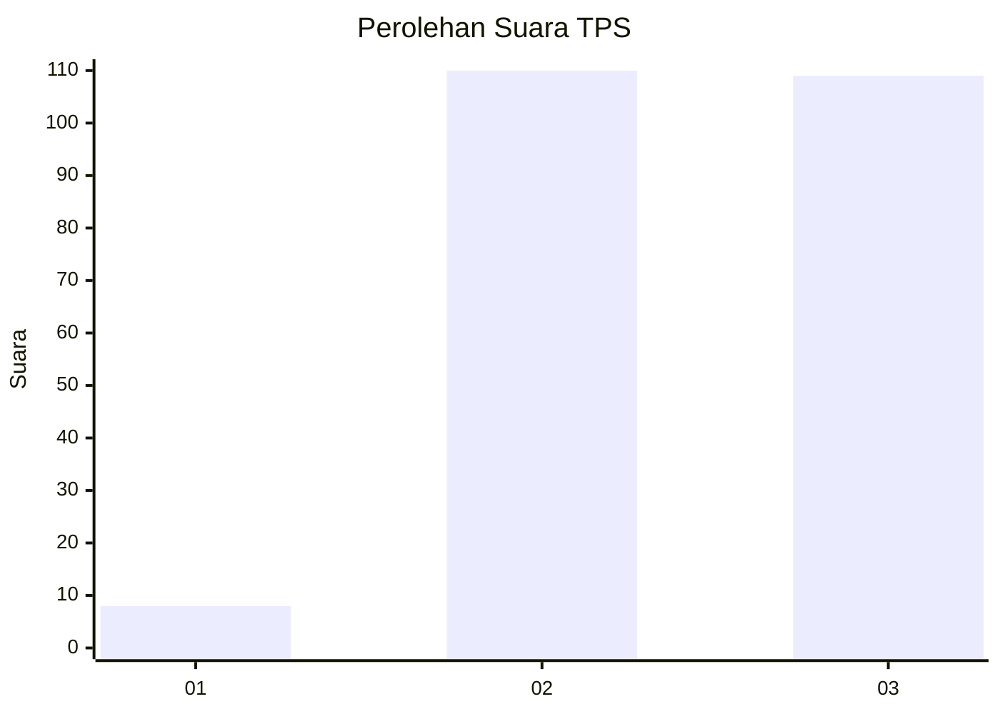
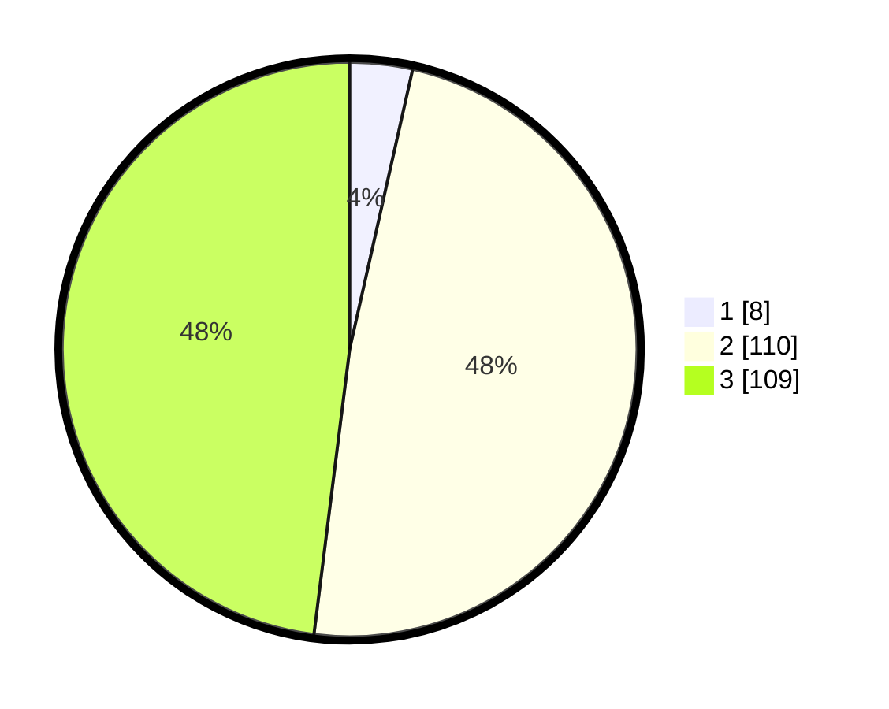

# Hasil

## Grafik

## Tabel

| No. | Nama Paslon    | Suara | Suara (raw) | Persentase |
|:--- |:-------------- | -----:| -----------:| ----------:|
| 1   | ANIES MUHAIMIN | 8     | [8][p-1]    | 3,52       |
| 2   | PRABOWO GIBRAN | 110   | [110][p-2]  | 48,46      |
| 3   | GANJAR MAHFUD  | 109   | [109][p-3]  | 48,02      |

[p-1]: https://github.com/gigit-pemilu/pemilu-2024/blob/main/pilpres/hitung-suara/sub/33-jawa-tengah/sub/09-boyolali/sub/15-klego/sub/2002-sendangrejo/sub/002-tps/sub/paslon-1.txt
[p-2]: https://github.com/gigit-pemilu/pemilu-2024/blob/main/pilpres/hitung-suara/sub/33-jawa-tengah/sub/09-boyolali/sub/15-klego/sub/2002-sendangrejo/sub/002-tps/sub/paslon-2.txt
[p-3]: https://github.com/gigit-pemilu/pemilu-2024/blob/main/pilpres/hitung-suara/sub/33-jawa-tengah/sub/09-boyolali/sub/15-klego/sub/2002-sendangrejo/sub/002-tps/sub/paslon-3.txt

## Foto C Plano

https://sirekap-obj-formc.kpu.go.id/299c/pemilu/ppwp/33/09/15/20/02/3309152002002-20240214-191823--2ed86a0c-8263-4a60-80bd-bd24b4501f05.jpg

https://sirekap-obj-formc.kpu.go.id/299c/pemilu/ppwp/33/09/15/20/02/3309152002002-20240214-192036--5aeb2346-b6a4-42d2-bb8e-c3ae92073166.jpg

https://sirekap-obj-formc.kpu.go.id/299c/pemilu/ppwp/33/09/15/20/02/3309152002002-20240214-192153--6795ec50-b97c-4e0a-8c14-4073decc53be.jpg

## Metadata

| Key        | Value               |
| ---------- | ------------------- |
| Time Stamp | 2024-02-15 12:00:28 |

