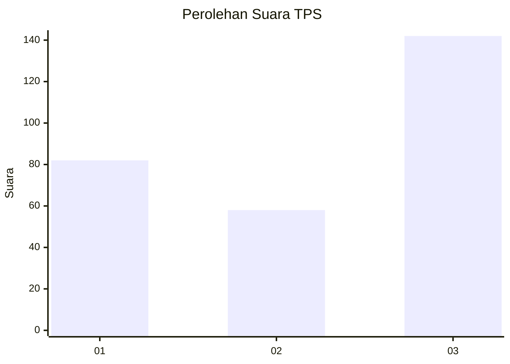
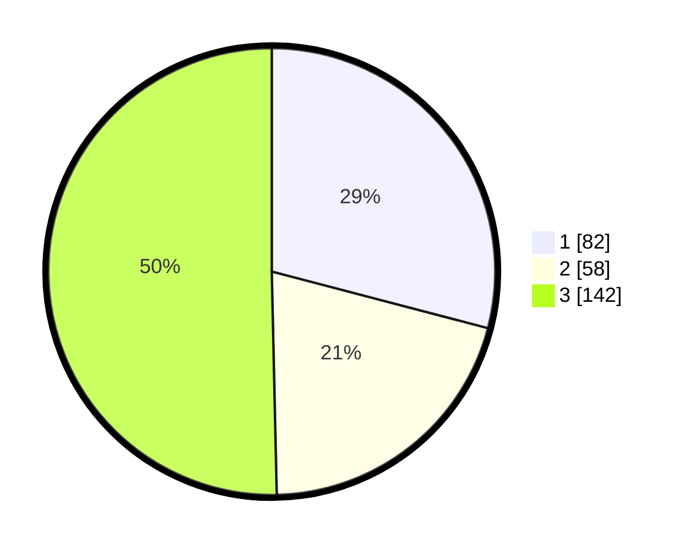

# Hasil

## Grafik

## Tabel

| No. | Nama Paslon    | Suara | Suara (raw) | Persentase |
|:--- |:-------------- | -----:| -----------:| ----------:|
| 1   | ANIES MUHAIMIN | 82    | [82][p-1]   | 29,08      |
| 2   | PRABOWO GIBRAN | 58    | [58][p-2]   | 20,57      |
| 3   | GANJAR MAHFUD  | 142   | [142][p-3]  | 50,35      |

[p-1]: https://github.com/gigit-pemilu/pemilu-2024-33-jawa-tengah/blob/main/pilpres/hitung-suara/sub/33-jawa-tengah/sub/09-boyolali/sub/15-klego/sub/2003-tanjung/sub/012-tps/sub/paslon-1.txt
[p-2]: https://github.com/gigit-pemilu/pemilu-2024-33-jawa-tengah/blob/main/pilpres/hitung-suara/sub/33-jawa-tengah/sub/09-boyolali/sub/15-klego/sub/2003-tanjung/sub/012-tps/sub/paslon-2.txt
[p-3]: https://github.com/gigit-pemilu/pemilu-2024-33-jawa-tengah/blob/main/pilpres/hitung-suara/sub/33-jawa-tengah/sub/09-boyolali/sub/15-klego/sub/2003-tanjung/sub/012-tps/sub/paslon-3.txt

## Foto C Plano

https://sirekap-obj-formc.kpu.go.id/6a7c/pemilu/ppwp/33/09/15/20/03/3309152003012-20240218-204225--232324ce-b410-4752-b5f2-31e416cd80e4.jpg

https://sirekap-obj-formc.kpu.go.id/6a7c/pemilu/ppwp/33/09/15/20/03/3309152003012-20240219-192353--66400354-c93c-4546-b9f9-c6cfa1afbbe4.jpg

https://sirekap-obj-formc.kpu.go.id/6a7c/pemilu/ppwp/33/09/15/20/03/3309152003012-20240219-192846--b5e29ad8-0b62-4bd5-ac6f-538eaad99a60.jpg

## Metadata

| Key        | Value               |
| ---------- | ------------------- |
| Time Stamp | 2024-02-19 20:00:00 |

