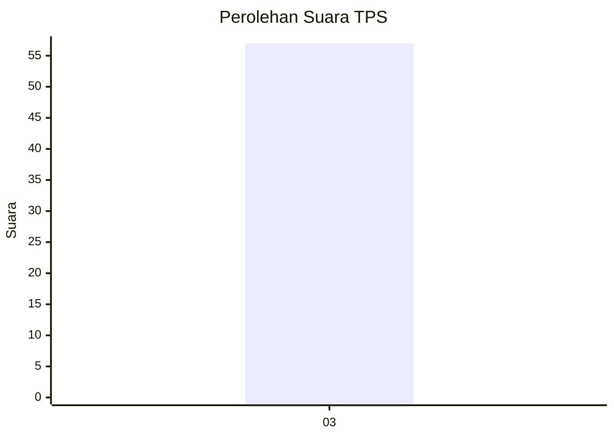
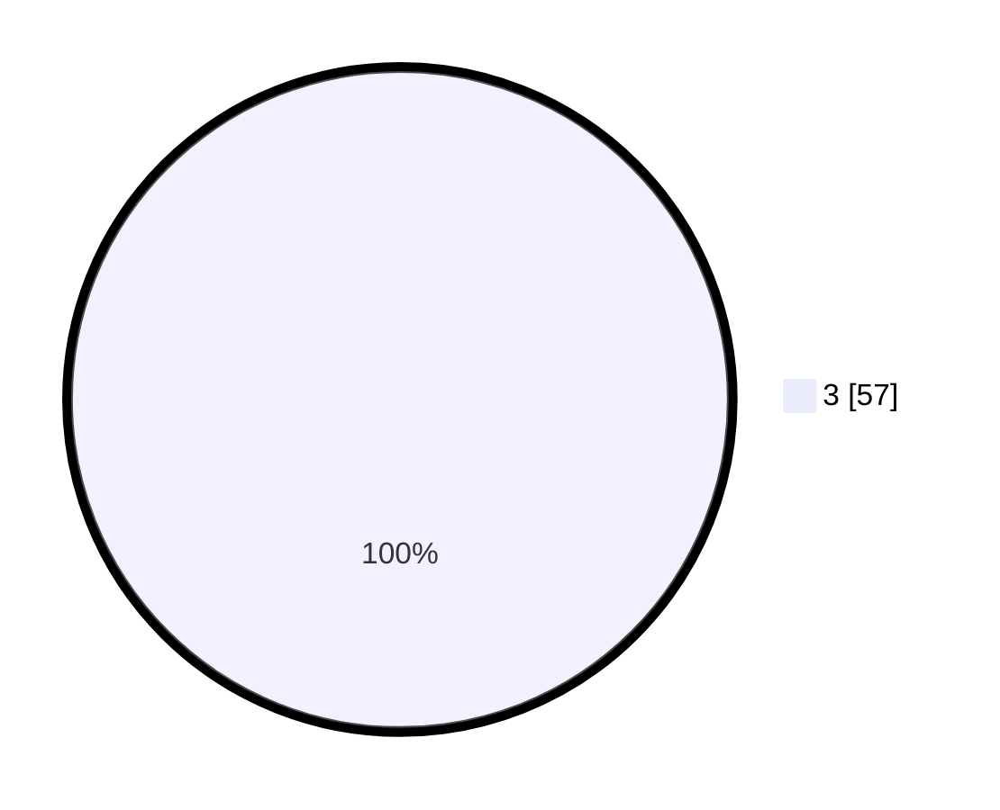

# Hasil

## Grafik

## Tabel

| No. | Nama Paslon   | Suara | Suara (raw) | Persentase |
|:--- |:------------- | -----:| -----------:| ----------:|
| 3   | GANJAR MAHFUD | 57    | [57][p-3]   | 100,00     |

[p-1]: https://github.com/gigit-pemilu/pemilu-2024/blob/main/pilpres/hitung-suara/sub/33-jawa-tengah/sub/09-boyolali/sub/15-klego/sub/2003-tanjung/sub/014-tps/sub/paslon-1.txt
[p-2]: https://github.com/gigit-pemilu/pemilu-2024/blob/main/pilpres/hitung-suara/sub/33-jawa-tengah/sub/09-boyolali/sub/15-klego/sub/2003-tanjung/sub/014-tps/sub/paslon-2.txt
[p-3]: https://github.com/gigit-pemilu/pemilu-2024/blob/main/pilpres/hitung-suara/sub/33-jawa-tengah/sub/09-boyolali/sub/15-klego/sub/2003-tanjung/sub/014-tps/sub/paslon-3.txt

## Foto C Plano

https://sirekap-obj-formc.kpu.go.id/ed86/pemilu/ppwp/33/09/15/20/03/3309152003014-20240216-220722--50a1122d-43c4-444c-8ee5-bce27d2a7524.jpg

https://sirekap-obj-formc.kpu.go.id/ed86/pemilu/ppwp/33/09/15/20/03/3309152003014-20240217-174424--b01a3246-ff19-498a-aae2-1a7b58c4abbb.jpg

https://sirekap-obj-formc.kpu.go.id/ed86/pemilu/ppwp/33/09/15/20/03/3309152003014-20240216-220740--3d866b42-c298-439e-a42d-388775bdcdff.jpg

## Metadata

| Key        | Value               |
| ---------- | ------------------- |
| Time Stamp | 2024-02-25 14:00:00 |

## DATA PEMILIH TETAP

Jumlah pemilih dalam DPT: **285**.
 * L: **147**.
 * P: **138**.

## DATA PENGGUNA HAK PILIH

Jumlah pengguna hak pilih dalam DPT: **222**.
 * L: **104**.
 * P: **118**.

Jumlah pengguna hak pilih dalam DPTb: **3**.
 * L: **1**.
 * P: **2**.

Jumlah pengguna hak pilih dalam DPK: **1**.
 * L: **1**.
 * P: **0**.

Jumlah pengguna hak pilih: **226**.
 * L: **106**.
 * P: **120**.

## JUMLAH SUARA SAH DAN TIDAK SAH

JUMLAH SELURUH SUARA SAH: **218**.

JUMLAH SUARA TIDAK SAH: **8**.

JUMLAH SELURUH SUARA SAH DAN SUARA TIDAK SAH: **226**.

