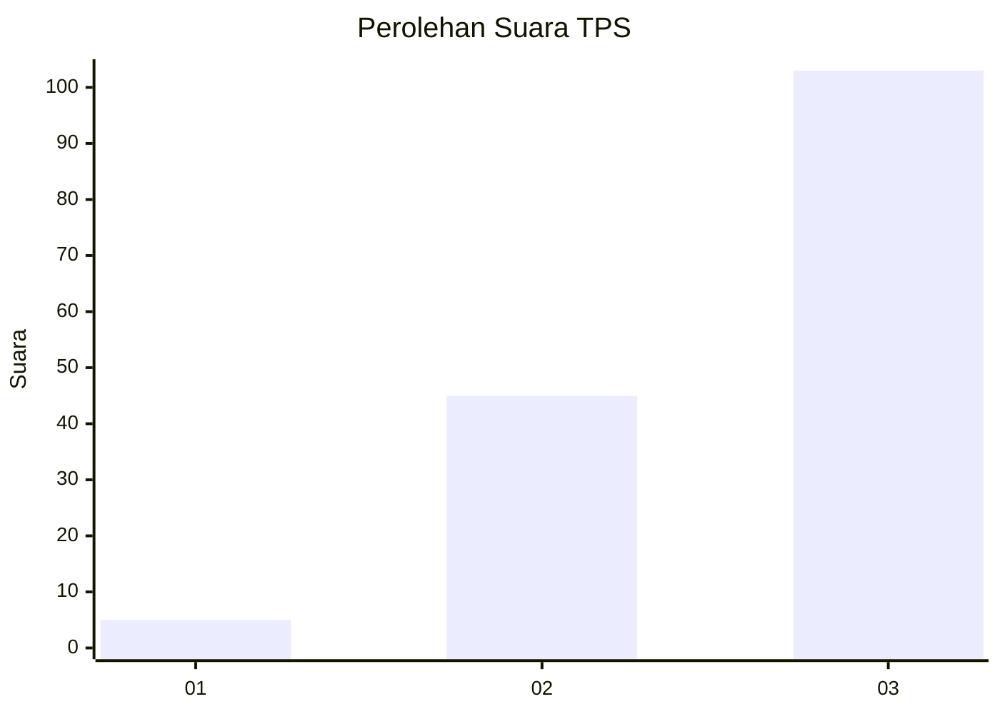
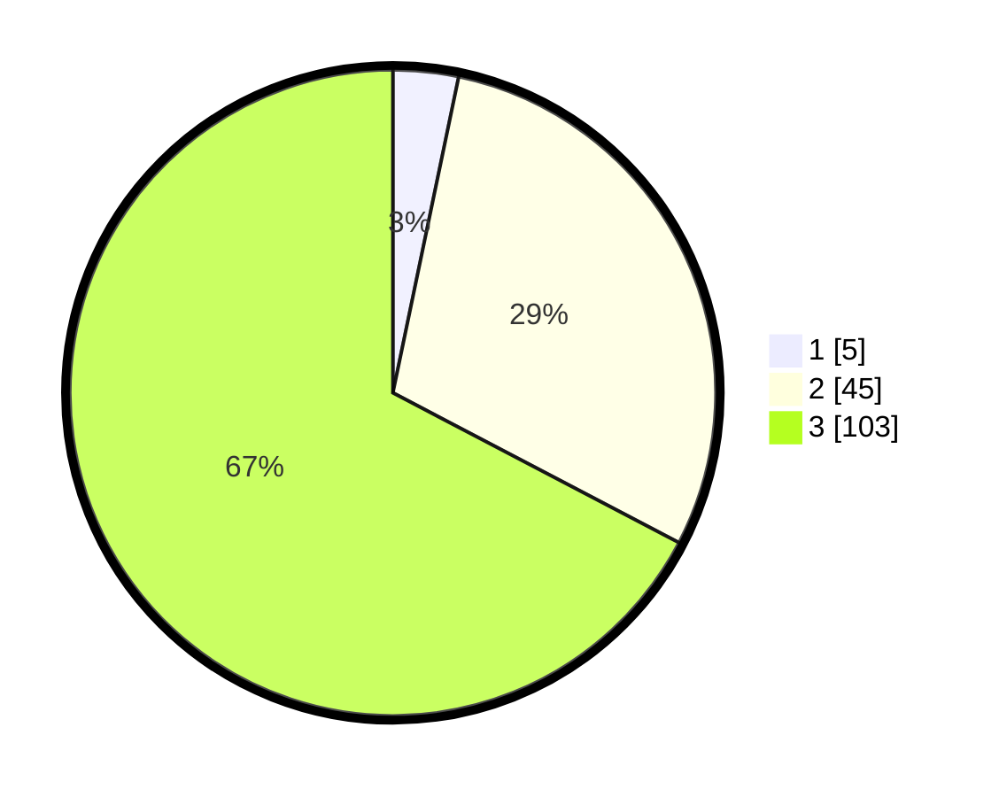

# Hasil

## Grafik

## Tabel

| No. | Nama Paslon    | Suara | Suara (raw) | Persentase |
|:--- |:-------------- | -----:| -----------:| ----------:|
| 1   | ANIES MUHAIMIN | 5     | [5][p-1]    | 3,27       |
| 2   | PRABOWO GIBRAN | 45    | [45][p-2]   | 29,41      |
| 3   | GANJAR MAHFUD  | 103   | [103][p-3]  | 67,32      |

[p-1]: https://github.com/gigit-pemilu/pemilu-2024/blob/main/pilpres/hitung-suara/sub/33-jawa-tengah/sub/09-boyolali/sub/15-klego/sub/2005-blumbang/sub/004-tps/sub/paslon-1.txt
[p-2]: https://github.com/gigit-pemilu/pemilu-2024/blob/main/pilpres/hitung-suara/sub/33-jawa-tengah/sub/09-boyolali/sub/15-klego/sub/2005-blumbang/sub/004-tps/sub/paslon-2.txt
[p-3]: https://github.com/gigit-pemilu/pemilu-2024/blob/main/pilpres/hitung-suara/sub/33-jawa-tengah/sub/09-boyolali/sub/15-klego/sub/2005-blumbang/sub/004-tps/sub/paslon-3.txt

## Foto C Plano

https://sirekap-obj-formc.kpu.go.id/4ecf/pemilu/ppwp/33/09/15/20/05/3309152005004-20240214-212331--a62f11cb-cfd6-4030-9228-7242ca79fb61.jpg

https://sirekap-obj-formc.kpu.go.id/4ecf/pemilu/ppwp/33/09/15/20/05/3309152005004-20240214-212647--f645e4d9-07c2-4441-b93b-e7ece9e7f206.jpg

https://sirekap-obj-formc.kpu.go.id/4ecf/pemilu/ppwp/33/09/15/20/05/3309152005004-20240219-182311--e70792ee-5dd0-44e4-8fa7-a495869b285e.jpg

## Metadata

| Key        | Value               |
| ---------- | ------------------- |
| Time Stamp | 2024-02-19 19:00:00 |

