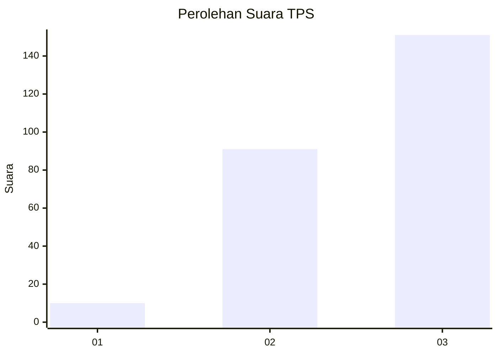
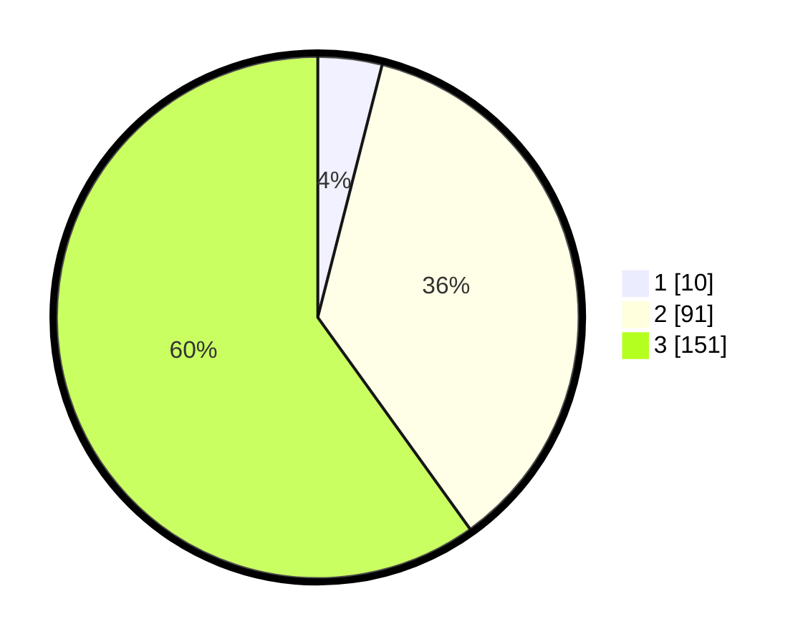

# Hasil

## Grafik

## Tabel

| No. | Nama Paslon    | Suara | Suara (raw) | Persentase |
|:--- |:-------------- | -----:| -----------:| ----------:|
| 1   | ANIES MUHAIMIN | 10    | [10][p-1]   | 3,97       |
| 2   | PRABOWO GIBRAN | 91    | [91][p-2]   | 36,11      |
| 3   | GANJAR MAHFUD  | 151   | [151][p-3]  | 59,92      |

[p-1]: https://github.com/gigit-pemilu/pemilu-2024/blob/main/pilpres/hitung-suara/sub/33-jawa-tengah/sub/09-boyolali/sub/15-klego/sub/2009-klego/sub/006-tps/sub/paslon-1.txt
[p-2]: https://github.com/gigit-pemilu/pemilu-2024/blob/main/pilpres/hitung-suara/sub/33-jawa-tengah/sub/09-boyolali/sub/15-klego/sub/2009-klego/sub/006-tps/sub/paslon-2.txt
[p-3]: https://github.com/gigit-pemilu/pemilu-2024/blob/main/pilpres/hitung-suara/sub/33-jawa-tengah/sub/09-boyolali/sub/15-klego/sub/2009-klego/sub/006-tps/sub/paslon-3.txt

## Foto C Plano

https://sirekap-obj-formc.kpu.go.id/a459/pemilu/ppwp/33/09/15/20/09/3309152009006-20240215-122622--7b070b76-ca1f-45b1-961f-9c3ea730f61f.jpg

https://sirekap-obj-formc.kpu.go.id/a459/pemilu/ppwp/33/09/15/20/09/3309152009006-20240214-233631--9ed60860-93d7-47fa-ab65-eb5dd5bb781b.jpg

https://sirekap-obj-formc.kpu.go.id/a459/pemilu/ppwp/33/09/15/20/09/3309152009006-20240214-233636--d04ab300-6a70-43ce-93af-26707053304f.jpg

## Metadata

| Key        | Value               |
| ---------- | ------------------- |
| Time Stamp | 2024-02-15 21:30:27 |

