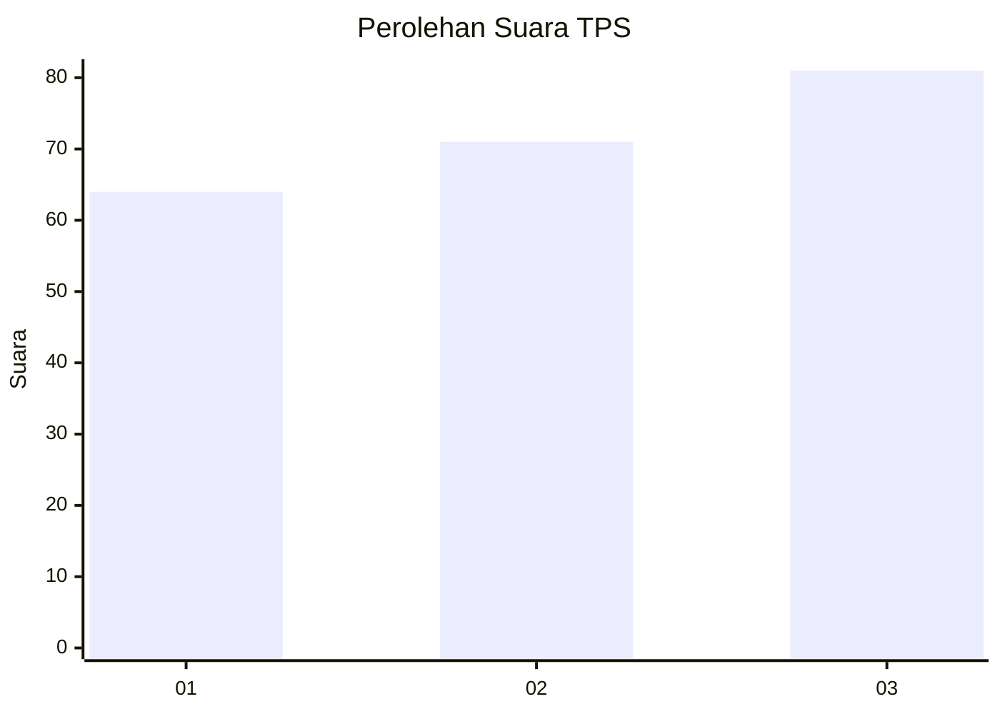
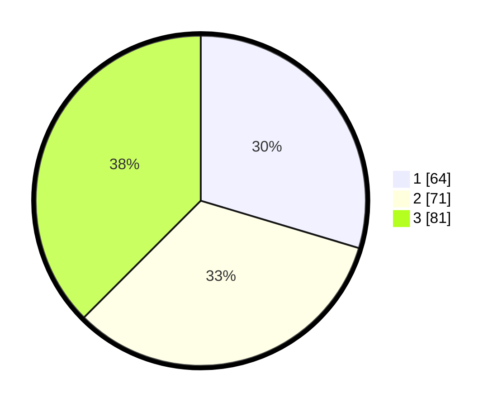

# Hasil

## Grafik

## Tabel

| No. | Nama Paslon    | Suara | Suara (raw) | Persentase |
|:--- |:-------------- | -----:| -----------:| ----------:|
| 1   | ANIES MUHAIMIN | 64    | [64][p-1]   | 29,63      |
| 2   | PRABOWO GIBRAN | 71    | [71][p-2]   | 32,87      |
| 3   | GANJAR MAHFUD  | 81    | [81][p-3]   | 37,50      |

[p-1]: https://github.com/gigit-pemilu/pemilu-2024-33-jawa-tengah/blob/main/pilpres/hitung-suara/sub/33-jawa-tengah/sub/09-boyolali/sub/15-klego/sub/2009-klego/sub/010-tps/sub/paslon-1.txt
[p-2]: https://github.com/gigit-pemilu/pemilu-2024-33-jawa-tengah/blob/main/pilpres/hitung-suara/sub/33-jawa-tengah/sub/09-boyolali/sub/15-klego/sub/2009-klego/sub/010-tps/sub/paslon-2.txt
[p-3]: https://github.com/gigit-pemilu/pemilu-2024-33-jawa-tengah/blob/main/pilpres/hitung-suara/sub/33-jawa-tengah/sub/09-boyolali/sub/15-klego/sub/2009-klego/sub/010-tps/sub/paslon-3.txt

## Foto C Plano

https://sirekap-obj-formc.kpu.go.id/c890/pemilu/ppwp/33/09/15/20/09/3309152009010-20240219-140938--a49e3dbd-a932-40ae-abd1-ab41001adc32.jpg

https://sirekap-obj-formc.kpu.go.id/c890/pemilu/ppwp/33/09/15/20/09/3309152009010-20240219-141213--954d5dd9-fc3e-4c9e-b3e3-e7b59bfac51e.jpg

https://sirekap-obj-formc.kpu.go.id/c890/pemilu/ppwp/33/09/15/20/09/3309152009010-20240215-001150--9df66201-9061-4d3f-ad92-7324571c2704.jpg

## Metadata

| Key        | Value               |
| ---------- | ------------------- |
| Time Stamp | 2024-02-24 22:31:28 |

