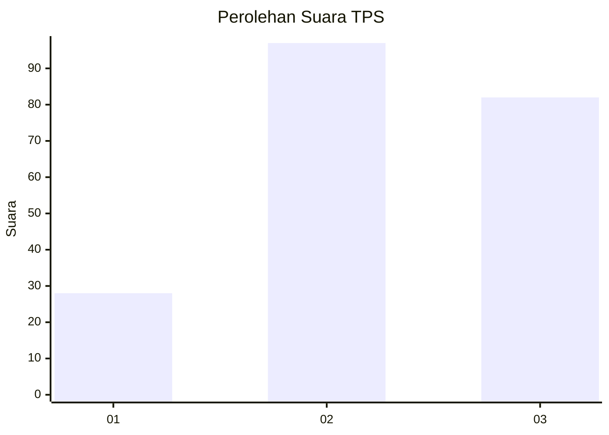
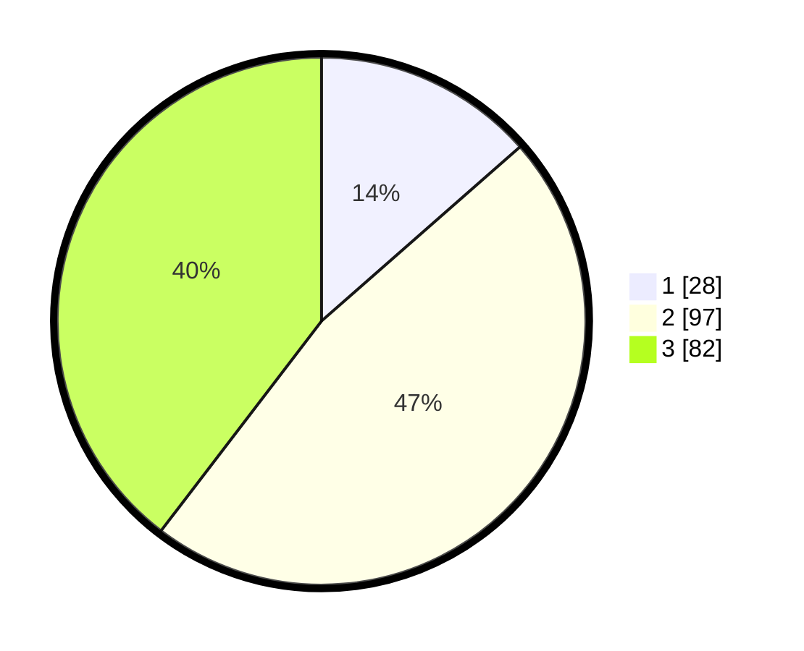

# Hasil

## Grafik

## Tabel

| No. | Nama Paslon    | Suara | Suara (raw) | Persentase |
|:--- |:-------------- | -----:| -----------:| ----------:|
| 1   | ANIES MUHAIMIN | 28    | [28][p-1]   | 13,53      |
| 2   | PRABOWO GIBRAN | 97    | [97][p-2]   | 46,86      |
| 3   | GANJAR MAHFUD  | 82    | [82][p-3]   | 39,61      |

[p-1]: https://github.com/gigit-pemilu/pemilu-2024/blob/main/pilpres/hitung-suara/sub/33-jawa-tengah/sub/09-boyolali/sub/16-andong/sub/2001-pakel/sub/003-tps/sub/paslon-1.txt
[p-2]: https://github.com/gigit-pemilu/pemilu-2024/blob/main/pilpres/hitung-suara/sub/33-jawa-tengah/sub/09-boyolali/sub/16-andong/sub/2001-pakel/sub/003-tps/sub/paslon-2.txt
[p-3]: https://github.com/gigit-pemilu/pemilu-2024/blob/main/pilpres/hitung-suara/sub/33-jawa-tengah/sub/09-boyolali/sub/16-andong/sub/2001-pakel/sub/003-tps/sub/paslon-3.txt

## Foto C Plano

https://sirekap-obj-formc.kpu.go.id/789b/pemilu/ppwp/33/09/16/20/01/3309162001003-20240214-212650--2ebd34bd-3dec-41af-bcf8-fc6d278a700c.jpg

https://sirekap-obj-formc.kpu.go.id/789b/pemilu/ppwp/33/09/16/20/01/3309162001003-20240214-212757--e2803e41-1e7e-44cd-8cf1-8b7853f7f73c.jpg

https://sirekap-obj-formc.kpu.go.id/789b/pemilu/ppwp/33/09/16/20/01/3309162001003-20240214-212902--29f6ec3e-c057-475e-83b8-88b645843458.jpg

## Metadata

| Key        | Value               |
| ---------- | ------------------- |
| Time Stamp | 2024-02-15 15:00:29 |

