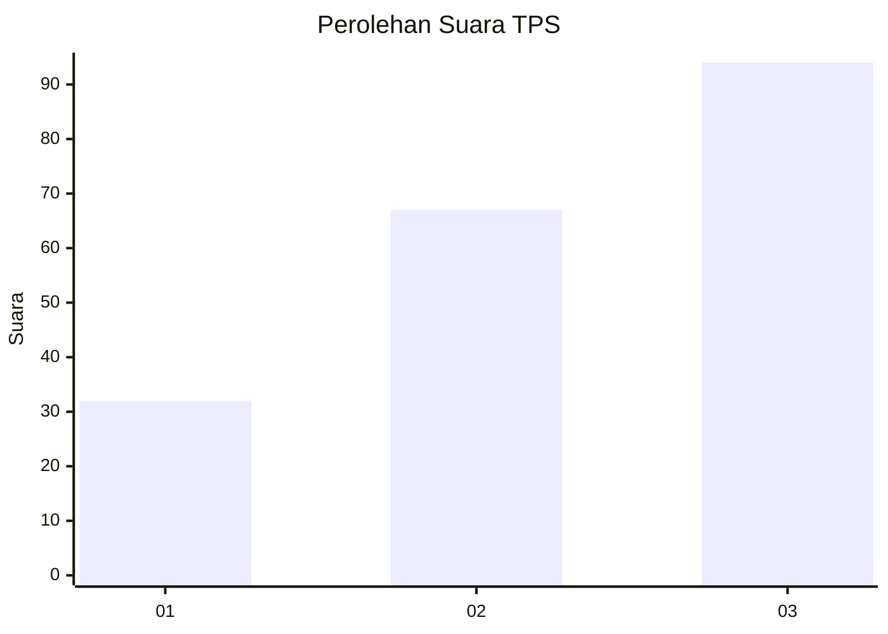
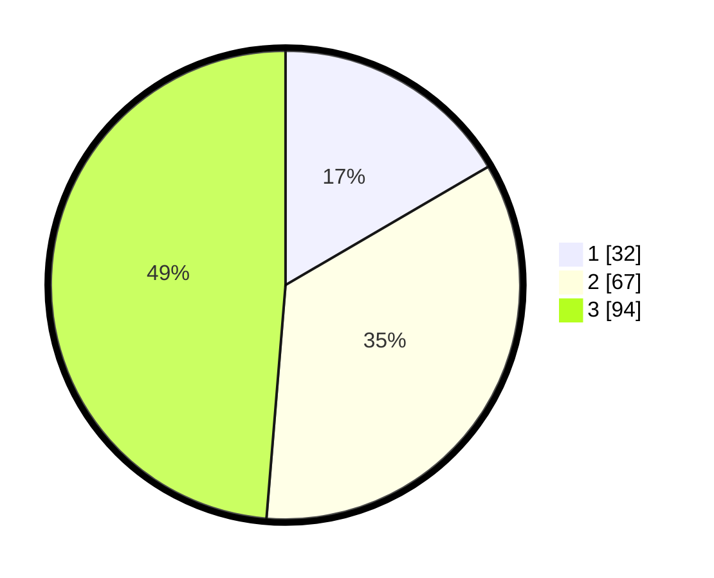

# Hasil

## Grafik

## Tabel

| No. | Nama Paslon    | Suara | Suara (raw) | Persentase |
|:--- |:-------------- | -----:| -----------:| ----------:|
| 1   | ANIES MUHAIMIN | 32    | [32][p-1]   | 16,58      |
| 2   | PRABOWO GIBRAN | 67    | [67][p-2]   | 34,72      |
| 3   | GANJAR MAHFUD  | 94    | [94][p-3]   | 48,70      |

[p-1]: https://github.com/gigit-pemilu/pemilu-2024/blob/main/pilpres/hitung-suara/sub/33-jawa-tengah/sub/09-boyolali/sub/16-andong/sub/2001-pakel/sub/005-tps/sub/paslon-1.txt
[p-2]: https://github.com/gigit-pemilu/pemilu-2024/blob/main/pilpres/hitung-suara/sub/33-jawa-tengah/sub/09-boyolali/sub/16-andong/sub/2001-pakel/sub/005-tps/sub/paslon-2.txt
[p-3]: https://github.com/gigit-pemilu/pemilu-2024/blob/main/pilpres/hitung-suara/sub/33-jawa-tengah/sub/09-boyolali/sub/16-andong/sub/2001-pakel/sub/005-tps/sub/paslon-3.txt

## Foto C Plano

https://sirekap-obj-formc.kpu.go.id/ccc0/pemilu/ppwp/33/09/16/20/01/3309162001005-20240215-005757--df1f7940-cda8-4c36-85c4-34fa1cbc7c89.jpg

https://sirekap-obj-formc.kpu.go.id/ccc0/pemilu/ppwp/33/09/16/20/01/3309162001005-20240215-010015--afb8ee5d-9229-4ad9-9e30-8464af11f7a8.jpg

https://sirekap-obj-formc.kpu.go.id/ccc0/pemilu/ppwp/33/09/16/20/01/3309162001005-20240215-010101--42cc8d8f-8d34-4df8-8054-3255fe4c6dc9.jpg

## Metadata

| Key        | Value               |
| ---------- | ------------------- |
| Time Stamp | 2024-02-15 21:01:18 |

