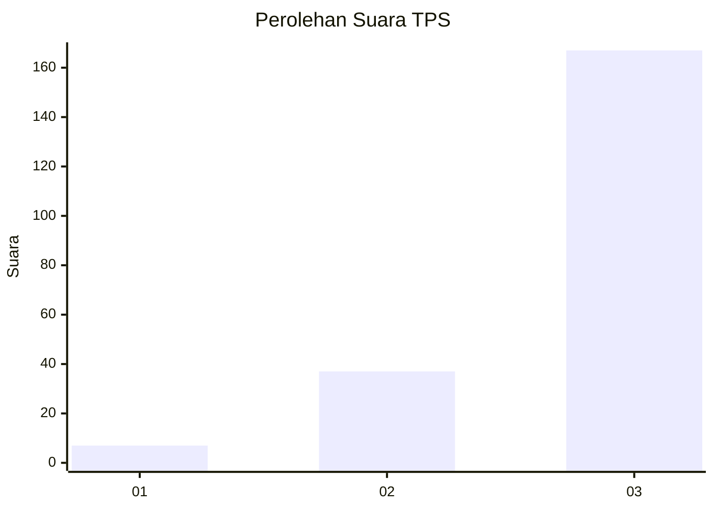
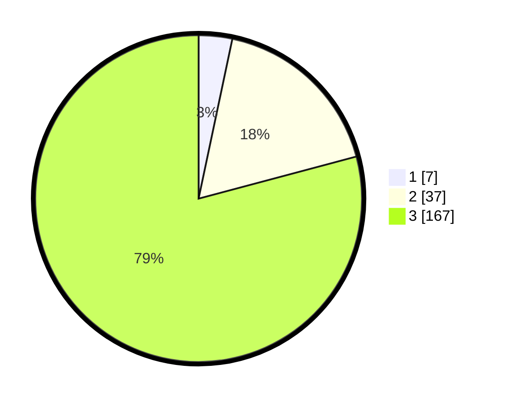

# Hasil

## Grafik

## Tabel

| No. | Nama Paslon    | Suara | Suara (raw) | Persentase |
|:--- |:-------------- | -----:| -----------:| ----------:|
| 1   | ANIES MUHAIMIN | 7     | [7][p-1]    | 3,32       |
| 2   | PRABOWO GIBRAN | 37    | [37][p-2]   | 17,54      |
| 3   | GANJAR MAHFUD  | 167   | [167][p-3]  | 79,15      |

[p-1]: https://github.com/gigit-pemilu/pemilu-2024/blob/main/pilpres/hitung-suara/sub/33-jawa-tengah/sub/09-boyolali/sub/16-andong/sub/2001-pakel/sub/008-tps/sub/paslon-1.txt
[p-2]: https://github.com/gigit-pemilu/pemilu-2024/blob/main/pilpres/hitung-suara/sub/33-jawa-tengah/sub/09-boyolali/sub/16-andong/sub/2001-pakel/sub/008-tps/sub/paslon-2.txt
[p-3]: https://github.com/gigit-pemilu/pemilu-2024/blob/main/pilpres/hitung-suara/sub/33-jawa-tengah/sub/09-boyolali/sub/16-andong/sub/2001-pakel/sub/008-tps/sub/paslon-3.txt

## Foto C Plano

https://sirekap-obj-formc.kpu.go.id/fd8e/pemilu/ppwp/33/09/16/20/01/3309162001008-20240214-234229--04ad40b9-8636-469f-882c-b6784086d482.jpg

https://sirekap-obj-formc.kpu.go.id/fd8e/pemilu/ppwp/33/09/16/20/01/3309162001008-20240214-225519--cb7122cf-f51f-47d2-9c3e-2648213e4ee2.jpg

https://sirekap-obj-formc.kpu.go.id/fd8e/pemilu/ppwp/33/09/16/20/01/3309162001008-20240214-225904--47669a53-649f-4aba-b599-0bf42f52e8c6.jpg

## Metadata

| Key        | Value               |
| ---------- | ------------------- |
| Time Stamp | 2024-02-24 22:31:28 |

