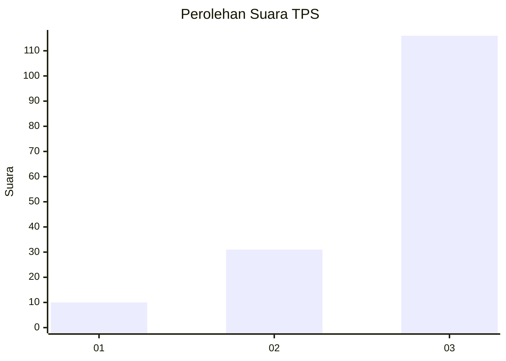
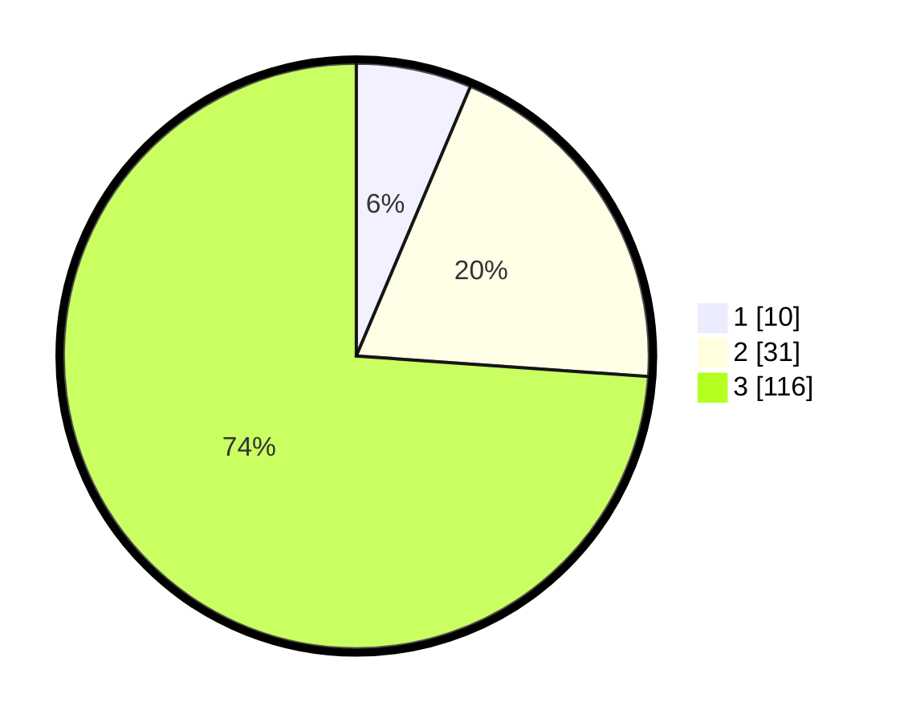

# Hasil

## Grafik

## Tabel

| No. | Nama Paslon    | Suara | Suara (raw) | Persentase |
|:--- |:-------------- | -----:| -----------:| ----------:|
| 1   | ANIES MUHAIMIN | 10    | [10][p-1]   | 6,37       |
| 2   | PRABOWO GIBRAN | 31    | [31][p-2]   | 19,75      |
| 3   | GANJAR MAHFUD  | 116   | [116][p-3]  | 73,89      |

[p-1]: https://github.com/gigit-pemilu/pemilu-2024/blob/main/pilpres/hitung-suara/sub/33-jawa-tengah/sub/09-boyolali/sub/16-andong/sub/2003-sempu/sub/005-tps/sub/paslon-1.txt
[p-2]: https://github.com/gigit-pemilu/pemilu-2024/blob/main/pilpres/hitung-suara/sub/33-jawa-tengah/sub/09-boyolali/sub/16-andong/sub/2003-sempu/sub/005-tps/sub/paslon-2.txt
[p-3]: https://github.com/gigit-pemilu/pemilu-2024/blob/main/pilpres/hitung-suara/sub/33-jawa-tengah/sub/09-boyolali/sub/16-andong/sub/2003-sempu/sub/005-tps/sub/paslon-3.txt

## Foto C Plano

https://sirekap-obj-formc.kpu.go.id/2f87/pemilu/ppwp/33/09/16/20/03/3309162003005-20240214-210859--61172bf2-94d0-48f8-8fa4-dd0dd9970cc5.jpg

https://sirekap-obj-formc.kpu.go.id/2f87/pemilu/ppwp/33/09/16/20/03/3309162003005-20240214-204215--1846efdc-f4d9-4c9f-9453-0011a563d5cc.jpg

https://sirekap-obj-formc.kpu.go.id/2f87/pemilu/ppwp/33/09/16/20/03/3309162003005-20240214-204424--f8cd7e77-0dcf-41a4-aba3-3c1af2e5a0e3.jpg

## Metadata

| Key        | Value               |
| ---------- | ------------------- |
| Time Stamp | 2024-02-15 12:00:28 |

