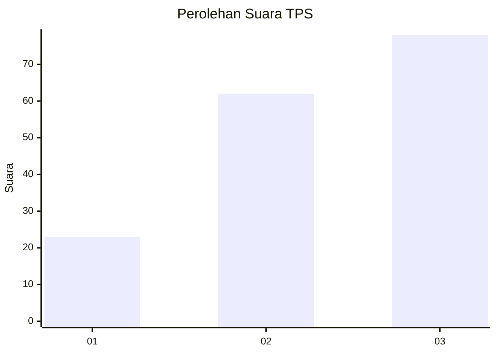
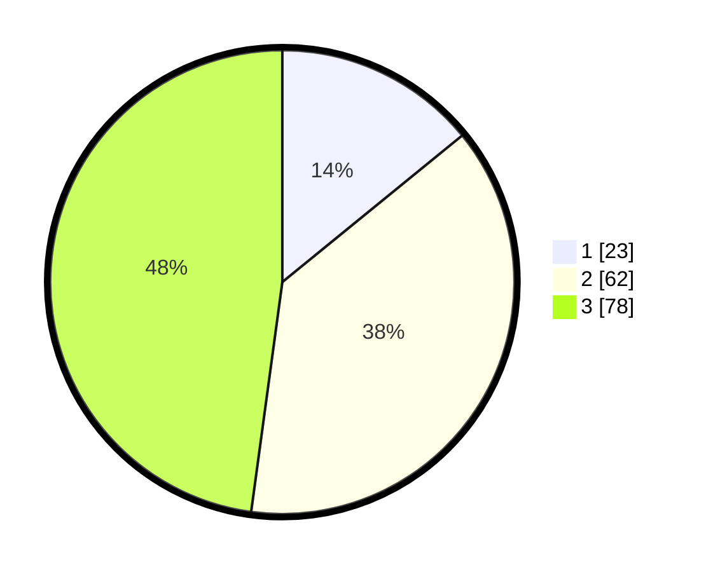

# Hasil

## Grafik

## Tabel

| No. | Nama Paslon    | Suara | Suara (raw) | Persentase |
|:--- |:-------------- | -----:| -----------:| ----------:|
| 1   | ANIES MUHAIMIN | 23    | [23][p-1]   | 14,11      |
| 2   | PRABOWO GIBRAN | 62    | [62][p-2]   | 38,04      |
| 3   | GANJAR MAHFUD  | 78    | [78][p-3]   | 47,85      |

[p-1]: https://github.com/gigit-pemilu/pemilu-2024-33-jawa-tengah/blob/main/pilpres/hitung-suara/sub/33-jawa-tengah/sub/09-boyolali/sub/16-andong/sub/2003-sempu/sub/014-tps/sub/paslon-1.txt
[p-2]: https://github.com/gigit-pemilu/pemilu-2024-33-jawa-tengah/blob/main/pilpres/hitung-suara/sub/33-jawa-tengah/sub/09-boyolali/sub/16-andong/sub/2003-sempu/sub/014-tps/sub/paslon-2.txt
[p-3]: https://github.com/gigit-pemilu/pemilu-2024-33-jawa-tengah/blob/main/pilpres/hitung-suara/sub/33-jawa-tengah/sub/09-boyolali/sub/16-andong/sub/2003-sempu/sub/014-tps/sub/paslon-3.txt

## Foto C Plano

https://sirekap-obj-formc.kpu.go.id/59c0/pemilu/ppwp/33/09/16/20/03/3309162003014-20240214-230236--8aeb16df-ae33-4478-a8d1-df33ac7d9a13.jpg

https://sirekap-obj-formc.kpu.go.id/59c0/pemilu/ppwp/33/09/16/20/03/3309162003014-20240214-230442--a36eed17-a6d1-4aac-8090-0c7d3d1afa9d.jpg

https://sirekap-obj-formc.kpu.go.id/59c0/pemilu/ppwp/33/09/16/20/03/3309162003014-20240214-230552--42ffff2e-1f73-4a23-ad1b-02bc3f3ee254.jpg

## Metadata

| Key        | Value               |
| ---------- | ------------------- |
| Time Stamp | 2024-02-24 22:31:28 |

