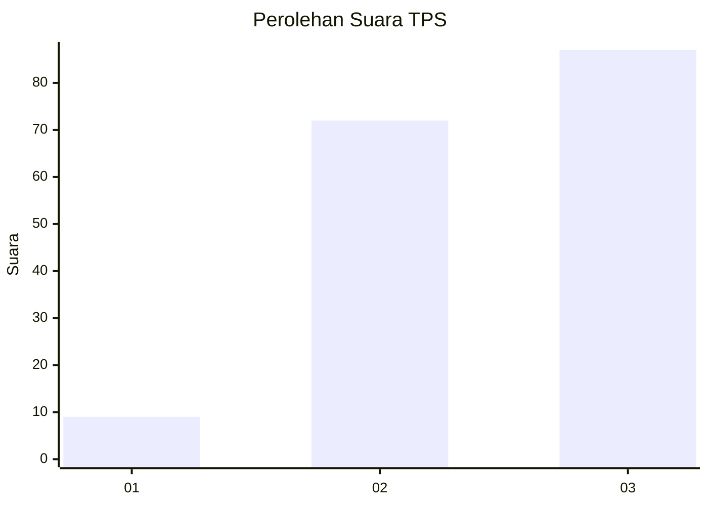
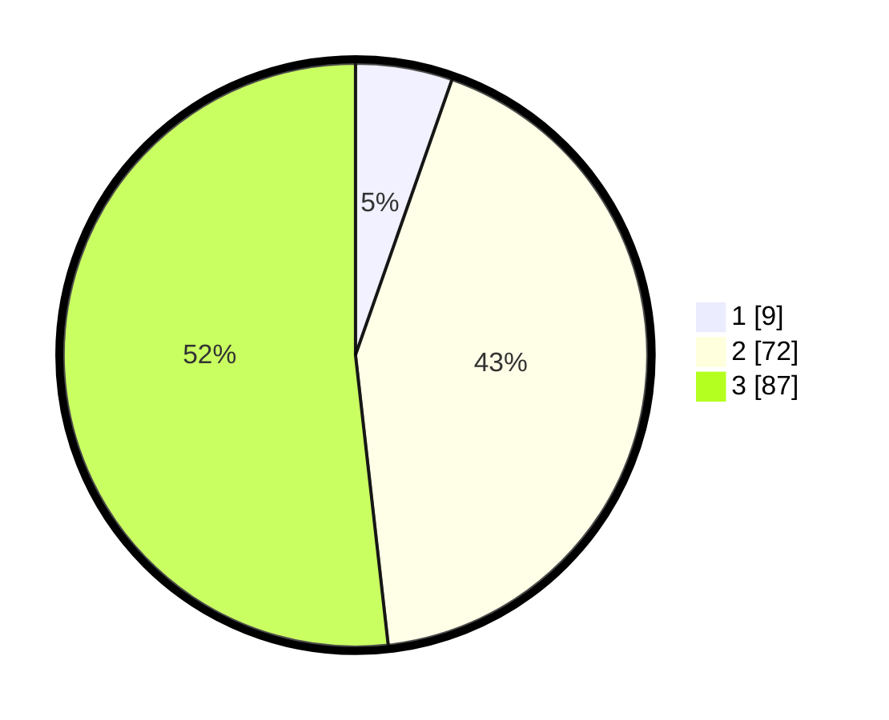

# Hasil

## Grafik

## Tabel

| No. | Nama Paslon    | Suara | Suara (raw) | Persentase |
|:--- |:-------------- | -----:| -----------:| ----------:|
| 1   | ANIES MUHAIMIN | 9     | [9][p-1]    | 5,36       |
| 2   | PRABOWO GIBRAN | 72    | [72][p-2]   | 42,86      |
| 3   | GANJAR MAHFUD  | 87    | [87][p-3]   | 51,79      |

[p-1]: https://github.com/gigit-pemilu/pemilu-2024/blob/main/pilpres/hitung-suara/sub/33-jawa-tengah/sub/09-boyolali/sub/16-andong/sub/2005-mojo/sub/010-tps/sub/paslon-1.txt
[p-2]: https://github.com/gigit-pemilu/pemilu-2024/blob/main/pilpres/hitung-suara/sub/33-jawa-tengah/sub/09-boyolali/sub/16-andong/sub/2005-mojo/sub/010-tps/sub/paslon-2.txt
[p-3]: https://github.com/gigit-pemilu/pemilu-2024/blob/main/pilpres/hitung-suara/sub/33-jawa-tengah/sub/09-boyolali/sub/16-andong/sub/2005-mojo/sub/010-tps/sub/paslon-3.txt

## Foto C Plano

https://sirekap-obj-formc.kpu.go.id/5a63/pemilu/ppwp/33/09/16/20/05/3309162005010-20240214-202209--2bf620b7-8b61-469e-97c5-4ea00ea338eb.jpg

https://sirekap-obj-formc.kpu.go.id/5a63/pemilu/ppwp/33/09/16/20/05/3309162005010-20240214-202218--db1b2c1f-2c0e-4b3a-b129-fd8be73e8758.jpg

https://sirekap-obj-formc.kpu.go.id/5a63/pemilu/ppwp/33/09/16/20/05/3309162005010-20240214-202225--6f2a7871-4e21-40d5-bfdb-742a4af5946e.jpg

## Metadata

| Key        | Value               |
| ---------- | ------------------- |
| Time Stamp | 2024-02-25 12:00:00 |

