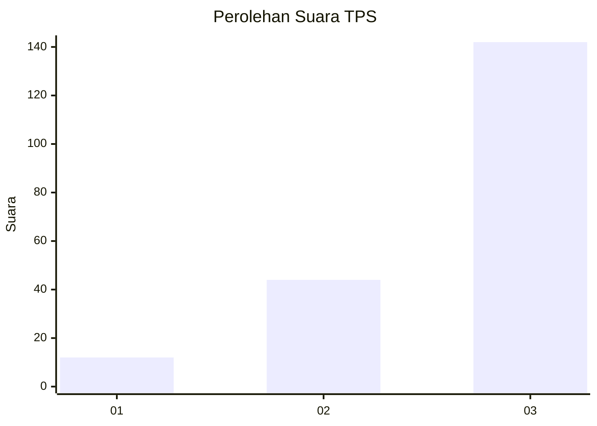
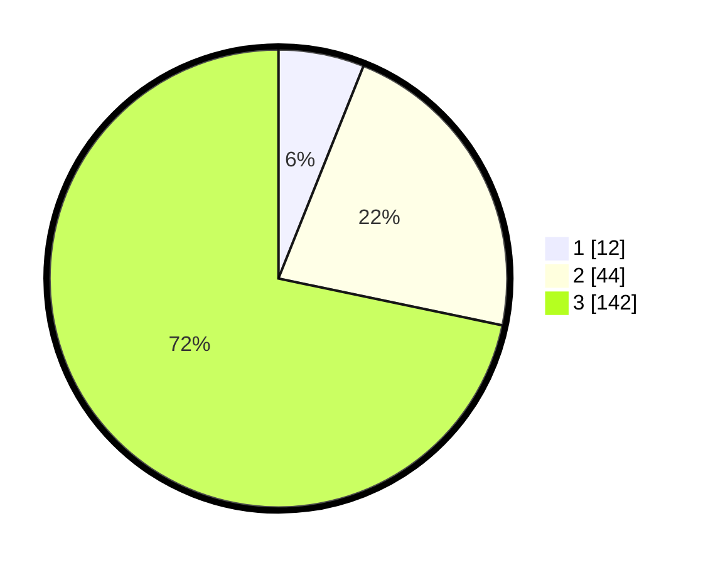

# Hasil

## Grafik

## Tabel

| No. | Nama Paslon    | Suara | Suara (raw) | Persentase |
|:--- |:-------------- | -----:| -----------:| ----------:|
| 1   | ANIES MUHAIMIN | 12    | [12][p-1]   | 6,06       |
| 2   | PRABOWO GIBRAN | 44    | [44][p-2]   | 22,22      |
| 3   | GANJAR MAHFUD  | 142   | [142][p-3]  | 71,72      |

[p-1]: https://github.com/gigit-pemilu/pemilu-2024/blob/main/pilpres/hitung-suara/sub/33-jawa-tengah/sub/09-boyolali/sub/16-andong/sub/2006-senggrong/sub/005-tps/sub/paslon-1.txt
[p-2]: https://github.com/gigit-pemilu/pemilu-2024/blob/main/pilpres/hitung-suara/sub/33-jawa-tengah/sub/09-boyolali/sub/16-andong/sub/2006-senggrong/sub/005-tps/sub/paslon-2.txt
[p-3]: https://github.com/gigit-pemilu/pemilu-2024/blob/main/pilpres/hitung-suara/sub/33-jawa-tengah/sub/09-boyolali/sub/16-andong/sub/2006-senggrong/sub/005-tps/sub/paslon-3.txt

## Foto C Plano

https://sirekap-obj-formc.kpu.go.id/0f9f/pemilu/ppwp/33/09/16/20/06/3309162006005-20240215-000821--2fef3499-db5e-4e10-98ba-66b574e96ad1.jpg

https://sirekap-obj-formc.kpu.go.id/0f9f/pemilu/ppwp/33/09/16/20/06/3309162006005-20240215-000528--1843d3ad-dc01-4225-bb8f-9148a5dbf88f.jpg

https://sirekap-obj-formc.kpu.go.id/0f9f/pemilu/ppwp/33/09/16/20/06/3309162006005-20240215-000723--6b31c3db-10a6-4706-bc76-e58e6c4dd517.jpg

## Metadata

| Key        | Value               |
| ---------- | ------------------- |
| Time Stamp | 2024-02-25 12:00:00 |

