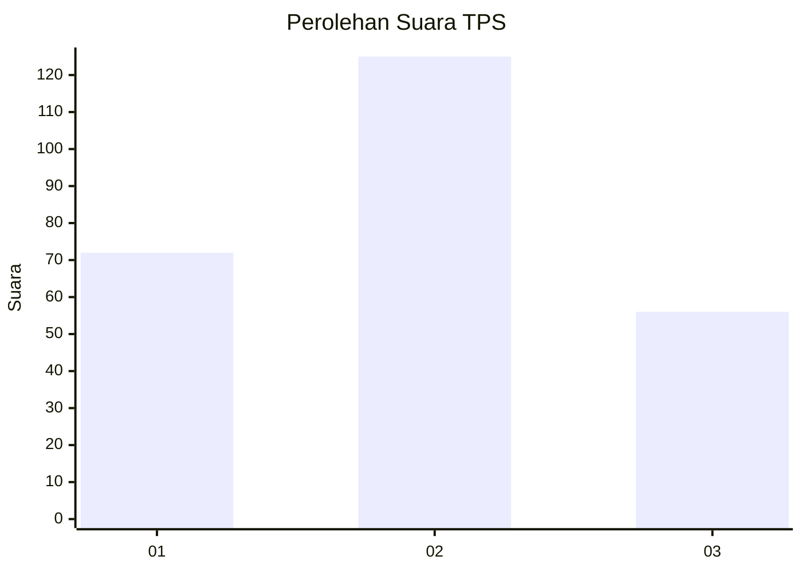
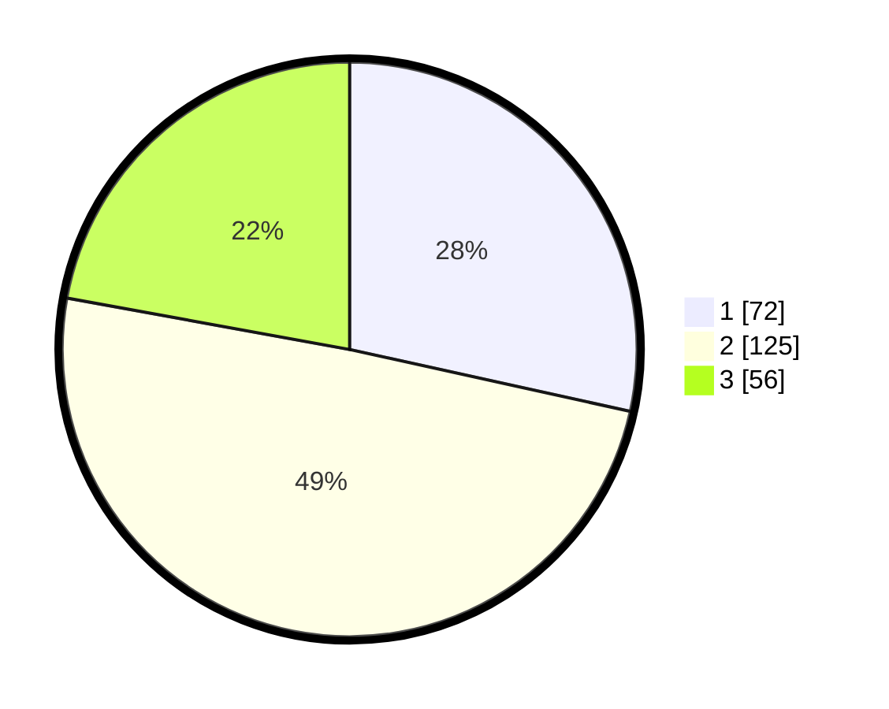

# Hasil

## Grafik

## Tabel

| No. | Nama Paslon    | Suara | Suara (raw) | Persentase |
|:--- |:-------------- | -----:| -----------:| ----------:|
| 1   | ANIES MUHAIMIN | 72    | [72][p-1]   | 28,46      |
| 2   | PRABOWO GIBRAN | 125   | [125][p-2]  | 49,41      |
| 3   | GANJAR MAHFUD  | 56    | [56][p-3]   | 22,13      |

[p-1]: https://github.com/gigit-pemilu/pemilu-2024/blob/main/pilpres/hitung-suara/sub/33-jawa-tengah/sub/09-boyolali/sub/16-andong/sub/2008-kacangan/sub/003-tps/sub/paslon-1.txt
[p-2]: https://github.com/gigit-pemilu/pemilu-2024/blob/main/pilpres/hitung-suara/sub/33-jawa-tengah/sub/09-boyolali/sub/16-andong/sub/2008-kacangan/sub/003-tps/sub/paslon-2.txt
[p-3]: https://github.com/gigit-pemilu/pemilu-2024/blob/main/pilpres/hitung-suara/sub/33-jawa-tengah/sub/09-boyolali/sub/16-andong/sub/2008-kacangan/sub/003-tps/sub/paslon-3.txt

## Foto C Plano

https://sirekap-obj-formc.kpu.go.id/f5f5/pemilu/ppwp/33/09/16/20/08/3309162008003-20240215-013504--82dc1138-7721-4e64-910f-6e652a434bcf.jpg

https://sirekap-obj-formc.kpu.go.id/f5f5/pemilu/ppwp/33/09/16/20/08/3309162008003-20240215-013625--aa8a9ca9-ff52-4347-8c19-4fe9d793c871.jpg

https://sirekap-obj-formc.kpu.go.id/f5f5/pemilu/ppwp/33/09/16/20/08/3309162008003-20240215-025415--4b297e48-abd6-47c3-b4e2-99cd4050c682.jpg

## Metadata

| Key        | Value               |
| ---------- | ------------------- |
| Time Stamp | 2024-02-24 22:31:28 |

