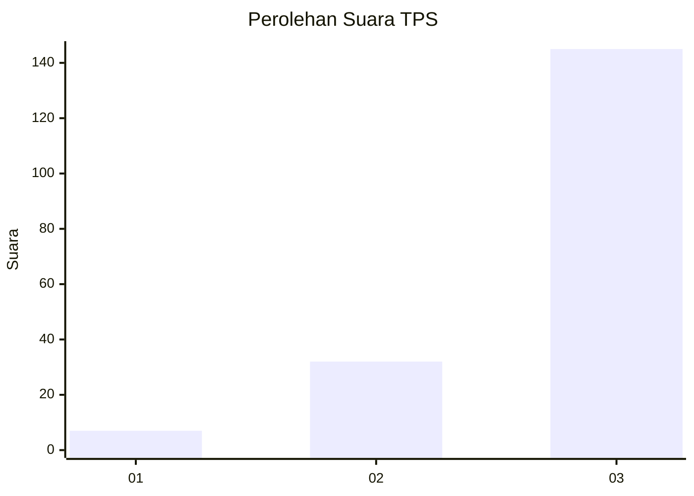
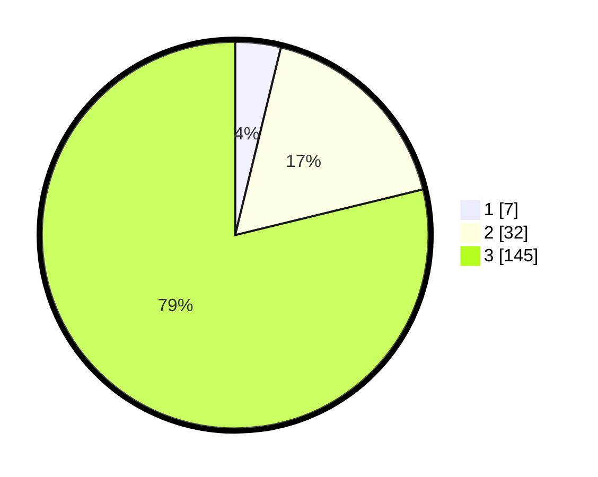

# Hasil

## Grafik

## Tabel

| No. | Nama Paslon    | Suara | Suara (raw) | Persentase |
|:--- |:-------------- | -----:| -----------:| ----------:|
| 1   | ANIES MUHAIMIN | 7     | [7][p-1]    | 3,80       |
| 2   | PRABOWO GIBRAN | 32    | [32][p-2]   | 17,39      |
| 3   | GANJAR MAHFUD  | 145   | [145][p-3]  | 78,80      |

[p-1]: https://github.com/gigit-pemilu/pemilu-2024-33-jawa-tengah/blob/main/pilpres/hitung-suara/sub/33-jawa-tengah/sub/09-boyolali/sub/16-andong/sub/2008-kacangan/sub/006-tps/sub/paslon-1.txt
[p-2]: https://github.com/gigit-pemilu/pemilu-2024-33-jawa-tengah/blob/main/pilpres/hitung-suara/sub/33-jawa-tengah/sub/09-boyolali/sub/16-andong/sub/2008-kacangan/sub/006-tps/sub/paslon-2.txt
[p-3]: https://github.com/gigit-pemilu/pemilu-2024-33-jawa-tengah/blob/main/pilpres/hitung-suara/sub/33-jawa-tengah/sub/09-boyolali/sub/16-andong/sub/2008-kacangan/sub/006-tps/sub/paslon-3.txt

## Foto C Plano

https://sirekap-obj-formc.kpu.go.id/6fbf/pemilu/ppwp/33/09/16/20/08/3309162008006-20240214-221630--b678e68f-4f20-42d2-970e-10671924ca29.jpg

https://sirekap-obj-formc.kpu.go.id/6fbf/pemilu/ppwp/33/09/16/20/08/3309162008006-20240214-202608--906b474a-eae9-44f2-8329-e81cdee4773a.jpg

https://sirekap-obj-formc.kpu.go.id/6fbf/pemilu/ppwp/33/09/16/20/08/3309162008006-20240214-221904--e6e4885f-6b18-47dc-b50d-8648fc3f509a.jpg

## Metadata

| Key        | Value               |
| ---------- | ------------------- |
| Time Stamp | 2024-02-25 12:00:00 |

