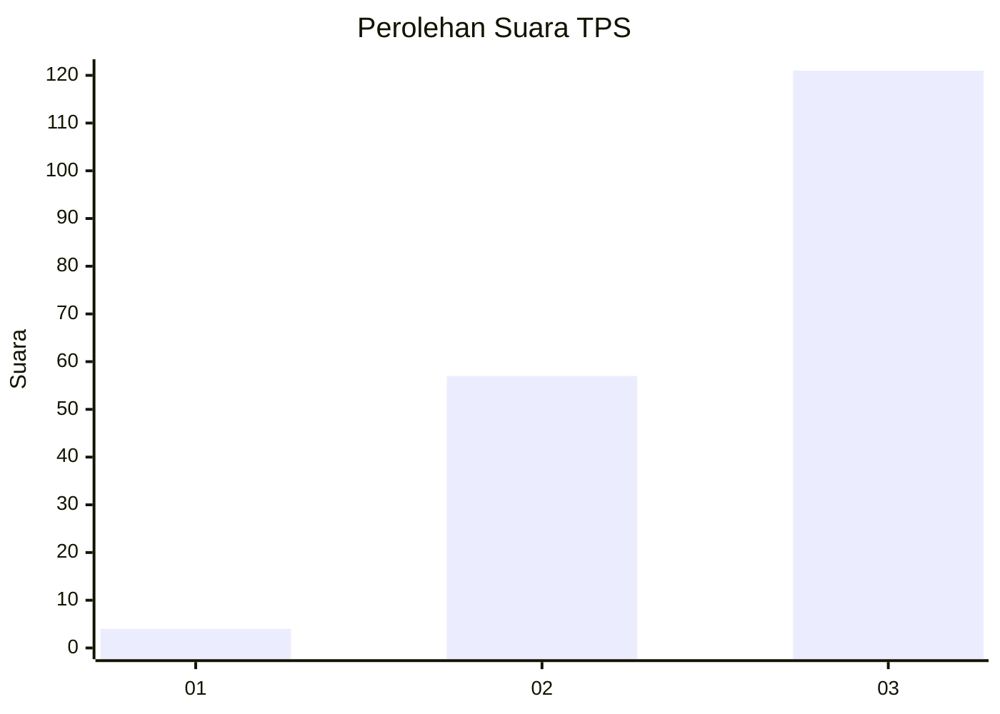
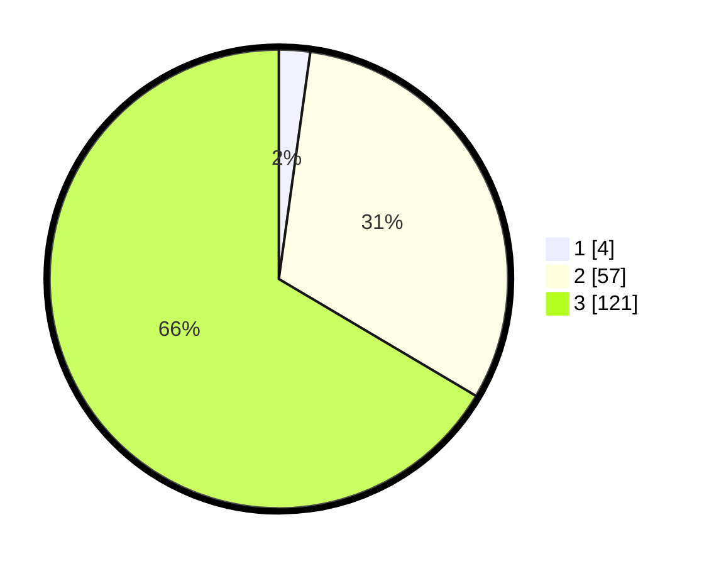

# Hasil

## Grafik

## Tabel

| No. | Nama Paslon    | Suara | Suara (raw) | Persentase |
|:--- |:-------------- | -----:| -----------:| ----------:|
| 1   | ANIES MUHAIMIN | 4     | [4][p-1]    | 2,20       |
| 2   | PRABOWO GIBRAN | 57    | [57][p-2]   | 31,32      |
| 3   | GANJAR MAHFUD  | 121   | [121][p-3]  | 66,48      |

[p-1]: https://github.com/gigit-pemilu/pemilu-2024-33-jawa-tengah/blob/main/pilpres/hitung-suara/sub/33-jawa-tengah/sub/09-boyolali/sub/16-andong/sub/2010-munggur/sub/002-tps/sub/paslon-1.txt
[p-2]: https://github.com/gigit-pemilu/pemilu-2024-33-jawa-tengah/blob/main/pilpres/hitung-suara/sub/33-jawa-tengah/sub/09-boyolali/sub/16-andong/sub/2010-munggur/sub/002-tps/sub/paslon-2.txt
[p-3]: https://github.com/gigit-pemilu/pemilu-2024-33-jawa-tengah/blob/main/pilpres/hitung-suara/sub/33-jawa-tengah/sub/09-boyolali/sub/16-andong/sub/2010-munggur/sub/002-tps/sub/paslon-3.txt

## Foto C Plano

https://sirekap-obj-formc.kpu.go.id/36d8/pemilu/ppwp/33/09/16/20/10/3309162010002-20240215-010515--37ac70f0-a2d9-42c8-9d51-76d3ae3ed086.jpg

https://sirekap-obj-formc.kpu.go.id/36d8/pemilu/ppwp/33/09/16/20/10/3309162010002-20240215-010807--f8fb6d74-109a-4d6b-bdb6-e3a8ae548efb.jpg

https://sirekap-obj-formc.kpu.go.id/36d8/pemilu/ppwp/33/09/16/20/10/3309162010002-20240215-010934--37366682-e7b2-4eae-9784-bfaa3841879c.jpg

## Metadata

| Key        | Value               |
| ---------- | ------------------- |
| Time Stamp | 2024-02-24 22:31:28 |

