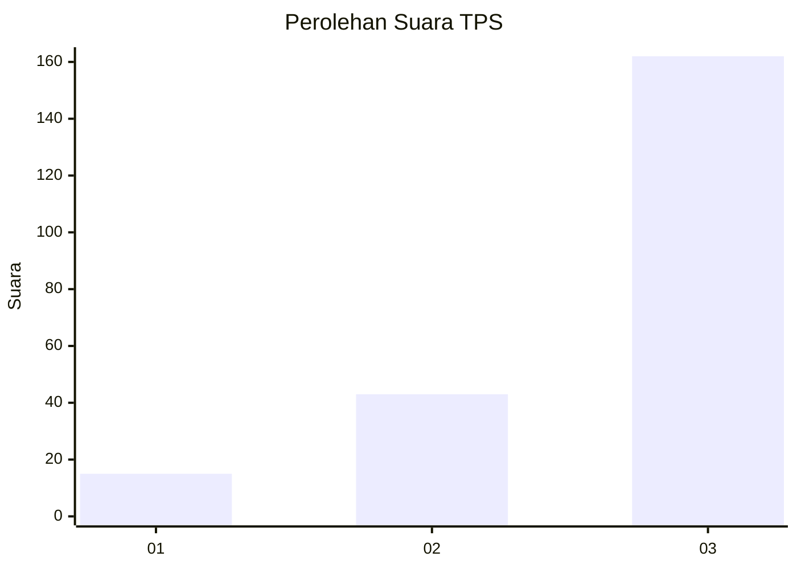
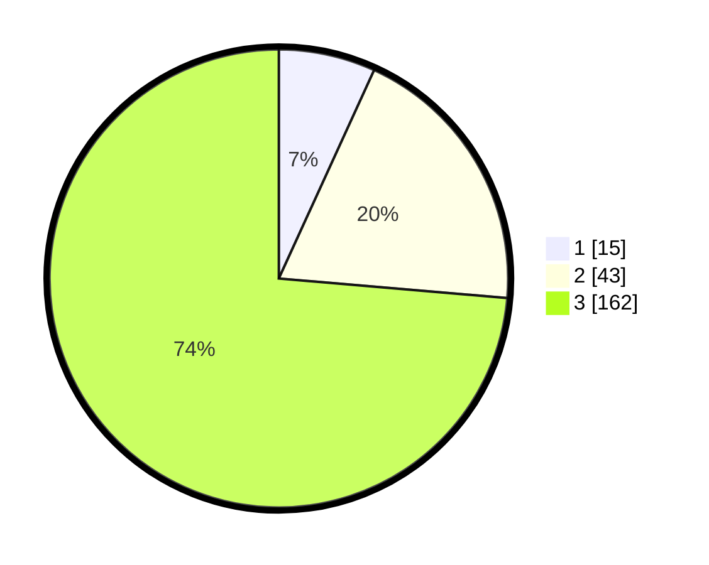

# Hasil

## Grafik

## Tabel

| No. | Nama Paslon    | Suara | Suara (raw) | Persentase |
|:--- |:-------------- | -----:| -----------:| ----------:|
| 1   | ANIES MUHAIMIN | 15    | [15][p-1]   | 6,82       |
| 2   | PRABOWO GIBRAN | 43    | [43][p-2]   | 19,55      |
| 3   | GANJAR MAHFUD  | 162   | [162][p-3]  | 73,64      |

[p-1]: https://github.com/gigit-pemilu/pemilu-2024-33-jawa-tengah/blob/main/pilpres/hitung-suara/sub/33-jawa-tengah/sub/09-boyolali/sub/16-andong/sub/2013-kunti/sub/001-tps/sub/paslon-1.txt
[p-2]: https://github.com/gigit-pemilu/pemilu-2024-33-jawa-tengah/blob/main/pilpres/hitung-suara/sub/33-jawa-tengah/sub/09-boyolali/sub/16-andong/sub/2013-kunti/sub/001-tps/sub/paslon-2.txt
[p-3]: https://github.com/gigit-pemilu/pemilu-2024-33-jawa-tengah/blob/main/pilpres/hitung-suara/sub/33-jawa-tengah/sub/09-boyolali/sub/16-andong/sub/2013-kunti/sub/001-tps/sub/paslon-3.txt

## Foto C Plano

https://sirekap-obj-formc.kpu.go.id/fcd1/pemilu/ppwp/33/09/16/20/13/3309162013001-20240215-002332--33ea71d3-ac94-4e7e-a1b7-7065f3324a7e.jpg

https://sirekap-obj-formc.kpu.go.id/fcd1/pemilu/ppwp/33/09/16/20/13/3309162013001-20240215-002503--f169f0c6-6fa3-43a2-b1cf-04631bab1ded.jpg

https://sirekap-obj-formc.kpu.go.id/fcd1/pemilu/ppwp/33/09/16/20/13/3309162013001-20240215-002753--55de79de-3208-4ea7-ae54-4920a48addb1.jpg

## Metadata

| Key        | Value               |
| ---------- | ------------------- |
| Time Stamp | 2024-02-15 16:30:25 |

