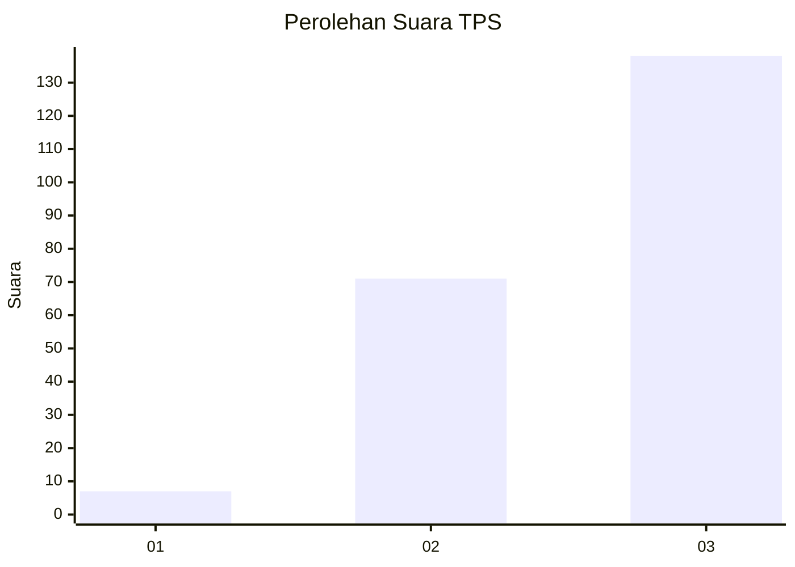
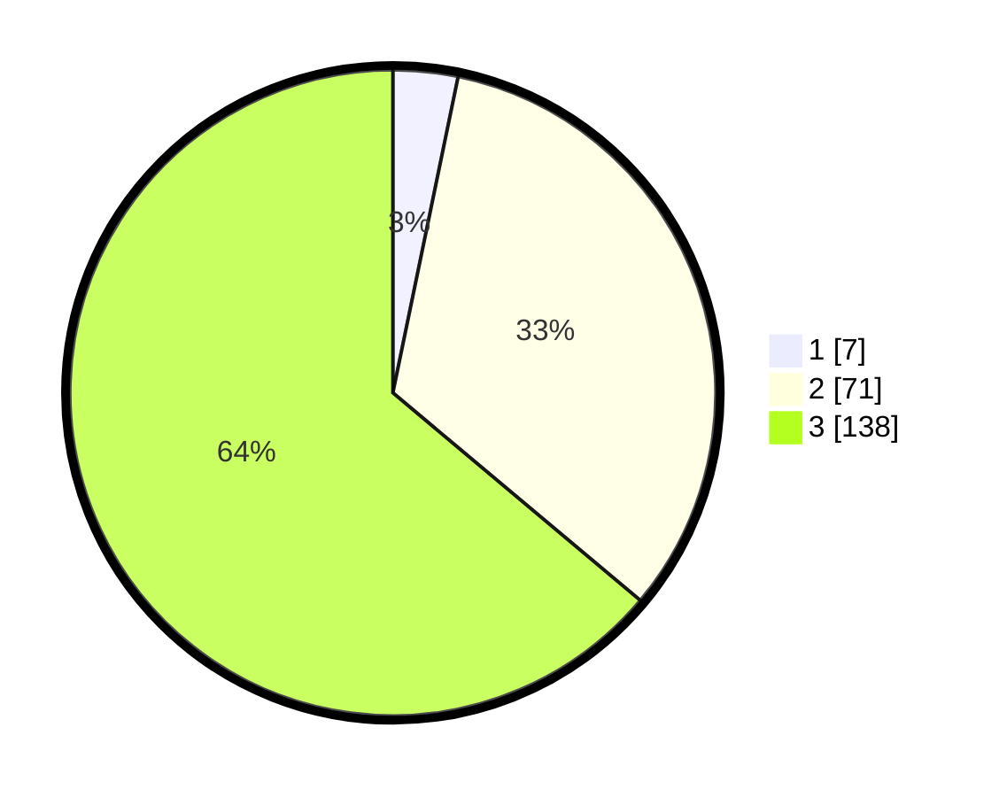

# Hasil

## Grafik

## Tabel

| No. | Nama Paslon    | Suara | Suara (raw) | Persentase |
|:--- |:-------------- | -----:| -----------:| ----------:|
| 1   | ANIES MUHAIMIN | 7     | [7][p-1]    | 3,24       |
| 2   | PRABOWO GIBRAN | 71    | [71][p-2]   | 32,87      |
| 3   | GANJAR MAHFUD  | 138   | [138][p-3]  | 63,89      |

[p-1]: https://github.com/gigit-pemilu/pemilu-2024-33-jawa-tengah/blob/main/pilpres/hitung-suara/sub/33-jawa-tengah/sub/09-boyolali/sub/16-andong/sub/2014-pelemrejo/sub/002-tps/sub/paslon-1.txt
[p-2]: https://github.com/gigit-pemilu/pemilu-2024-33-jawa-tengah/blob/main/pilpres/hitung-suara/sub/33-jawa-tengah/sub/09-boyolali/sub/16-andong/sub/2014-pelemrejo/sub/002-tps/sub/paslon-2.txt
[p-3]: https://github.com/gigit-pemilu/pemilu-2024-33-jawa-tengah/blob/main/pilpres/hitung-suara/sub/33-jawa-tengah/sub/09-boyolali/sub/16-andong/sub/2014-pelemrejo/sub/002-tps/sub/paslon-3.txt

## Foto C Plano

https://sirekap-obj-formc.kpu.go.id/8bf9/pemilu/ppwp/33/09/16/20/14/3309162014002-20240215-023941--e7c6afd7-a070-423d-804e-40bda2fadc6e.jpg

https://sirekap-obj-formc.kpu.go.id/8bf9/pemilu/ppwp/33/09/16/20/14/3309162014002-20240215-024134--ebf9354a-82a4-43ef-a081-72f5d042c88e.jpg

https://sirekap-obj-formc.kpu.go.id/8bf9/pemilu/ppwp/33/09/16/20/14/3309162014002-20240215-024313--330f81d6-58fb-471b-b4c9-165bef5e2ed1.jpg

## Metadata

| Key        | Value               |
| ---------- | ------------------- |
| Time Stamp | 2024-02-25 12:00:00 |

