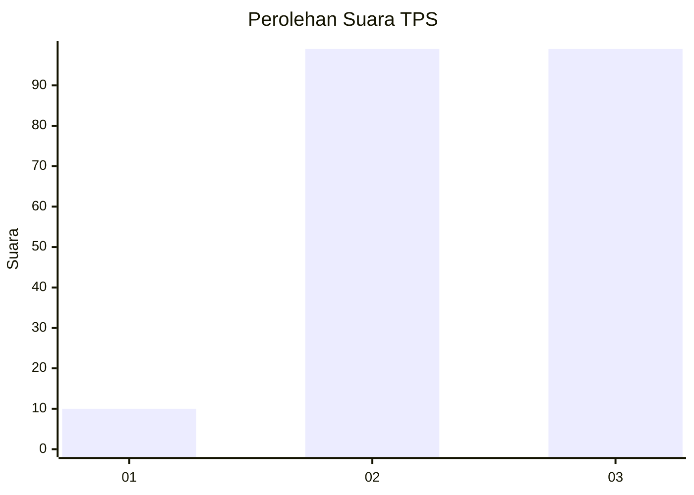
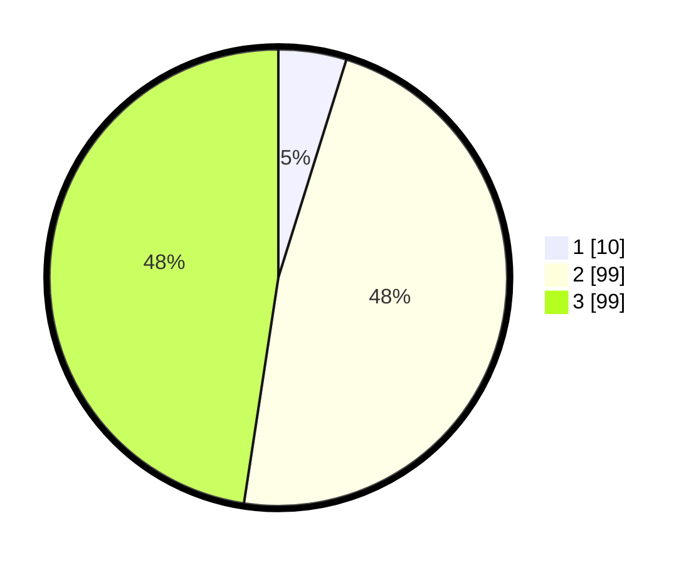

# Hasil

## Grafik

## Tabel

| No. | Nama Paslon    | Suara | Suara (raw) | Persentase |
|:--- |:-------------- | -----:| -----------:| ----------:|
| 1   | ANIES MUHAIMIN | 10    | [10][p-1]   | 4,81       |
| 2   | PRABOWO GIBRAN | 99    | [99][p-2]   | 47,60      |
| 3   | GANJAR MAHFUD  | 99    | [99][p-3]   | 47,60      |

[p-1]: https://github.com/gigit-pemilu/pemilu-2024-33-jawa-tengah/blob/main/pilpres/hitung-suara/sub/33-jawa-tengah/sub/09-boyolali/sub/16-andong/sub/2014-pelemrejo/sub/004-tps/sub/paslon-1.txt
[p-2]: https://github.com/gigit-pemilu/pemilu-2024-33-jawa-tengah/blob/main/pilpres/hitung-suara/sub/33-jawa-tengah/sub/09-boyolali/sub/16-andong/sub/2014-pelemrejo/sub/004-tps/sub/paslon-2.txt
[p-3]: https://github.com/gigit-pemilu/pemilu-2024-33-jawa-tengah/blob/main/pilpres/hitung-suara/sub/33-jawa-tengah/sub/09-boyolali/sub/16-andong/sub/2014-pelemrejo/sub/004-tps/sub/paslon-3.txt

## Foto C Plano

https://sirekap-obj-formc.kpu.go.id/04af/pemilu/ppwp/33/09/16/20/14/3309162014004-20240214-224802--00d2f34c-b832-4db8-a50b-4f12e6e49bc2.jpg

https://sirekap-obj-formc.kpu.go.id/04af/pemilu/ppwp/33/09/16/20/14/3309162014004-20240214-224855--af723998-053c-4152-a0bb-2eb65c80b0ef.jpg

https://sirekap-obj-formc.kpu.go.id/04af/pemilu/ppwp/33/09/16/20/14/3309162014004-20240214-224932--10a3c7ea-3da0-4ccd-aec4-e7c1dfe279b7.jpg

## Metadata

| Key        | Value               |
| ---------- | ------------------- |
| Time Stamp | 2024-02-16 14:00:34 |

