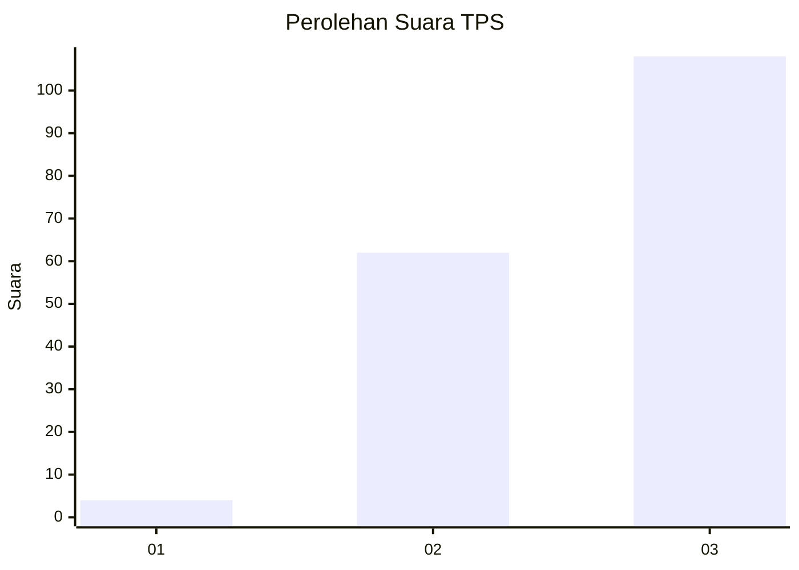
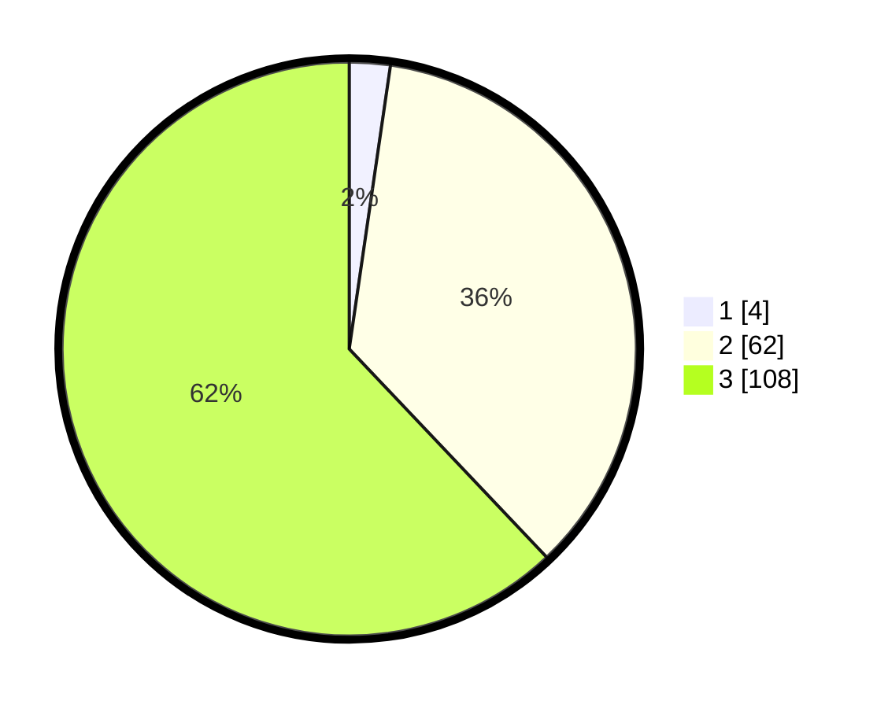

# Hasil

## Grafik

## Tabel

| No. | Nama Paslon    | Suara | Suara (raw) | Persentase |
|:--- |:-------------- | -----:| -----------:| ----------:|
| 1   | ANIES MUHAIMIN | 4     | [4][p-1]    | 2,30       |
| 2   | PRABOWO GIBRAN | 62    | [62][p-2]   | 35,63      |
| 3   | GANJAR MAHFUD  | 108   | [108][p-3]  | 62,07      |

[p-1]: https://github.com/gigit-pemilu/pemilu-2024-33-jawa-tengah/blob/main/pilpres/hitung-suara/sub/33-jawa-tengah/sub/09-boyolali/sub/16-andong/sub/2015-semawung/sub/001-tps/sub/paslon-1.txt
[p-2]: https://github.com/gigit-pemilu/pemilu-2024-33-jawa-tengah/blob/main/pilpres/hitung-suara/sub/33-jawa-tengah/sub/09-boyolali/sub/16-andong/sub/2015-semawung/sub/001-tps/sub/paslon-2.txt
[p-3]: https://github.com/gigit-pemilu/pemilu-2024-33-jawa-tengah/blob/main/pilpres/hitung-suara/sub/33-jawa-tengah/sub/09-boyolali/sub/16-andong/sub/2015-semawung/sub/001-tps/sub/paslon-3.txt

## Foto C Plano

https://sirekap-obj-formc.kpu.go.id/5c1f/pemilu/ppwp/33/09/16/20/15/3309162015001-20240214-230542--bf266db9-b7ad-4d77-8fe6-2bbfe1ab3d36.jpg

https://sirekap-obj-formc.kpu.go.id/5c1f/pemilu/ppwp/33/09/16/20/15/3309162015001-20240214-213019--051b0ce6-501a-47b1-9c0e-80b426088ae1.jpg

https://sirekap-obj-formc.kpu.go.id/5c1f/pemilu/ppwp/33/09/16/20/15/3309162015001-20240214-230726--f461fc52-9c38-4d89-9068-d78c2e765bec.jpg

## Metadata

| Key        | Value               |
| ---------- | ------------------- |
| Time Stamp | 2024-02-24 22:31:28 |

