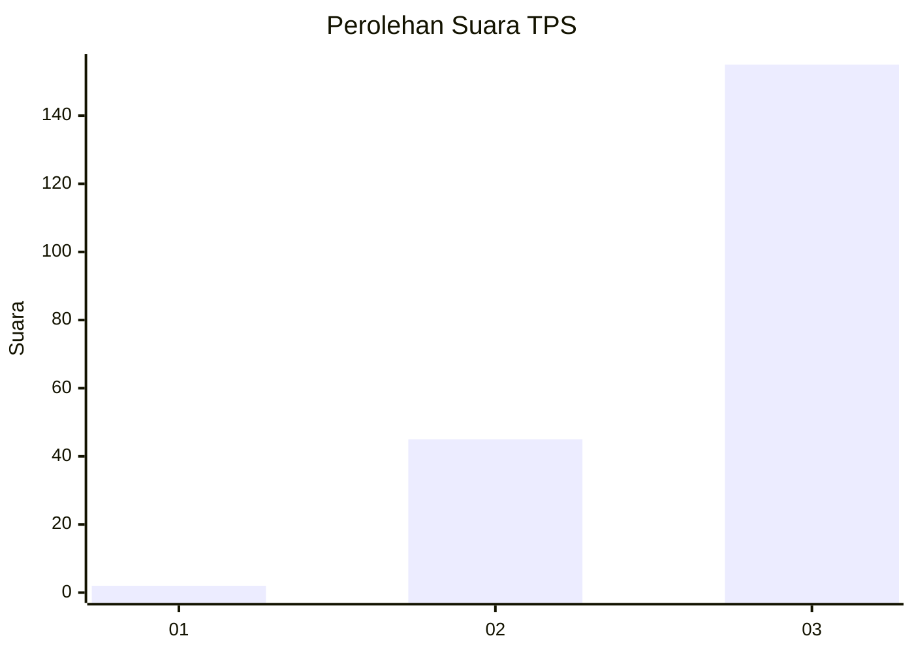
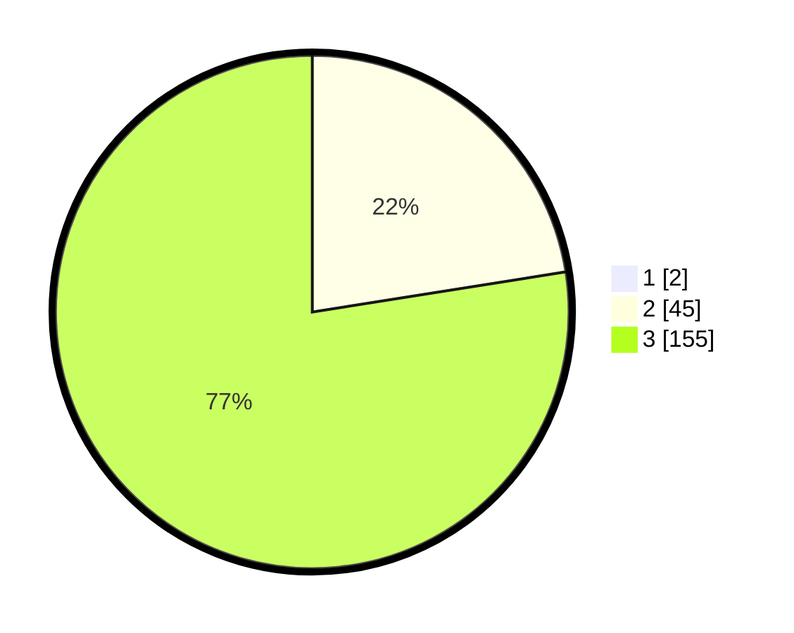

# Hasil

## Grafik

## Tabel

| No. | Nama Paslon    | Suara | Suara (raw) | Persentase |
|:--- |:-------------- | -----:| -----------:| ----------:|
| 1   | ANIES MUHAIMIN | 2     | [2][p-1]    | 0,99       |
| 2   | PRABOWO GIBRAN | 45    | [45][p-2]   | 22,28      |
| 3   | GANJAR MAHFUD  | 155   | [155][p-3]  | 76,73      |

[p-1]: https://github.com/gigit-pemilu/pemilu-2024-33-jawa-tengah/blob/main/pilpres/hitung-suara/sub/33-jawa-tengah/sub/09-boyolali/sub/16-andong/sub/2015-semawung/sub/003-tps/sub/paslon-1.txt
[p-2]: https://github.com/gigit-pemilu/pemilu-2024-33-jawa-tengah/blob/main/pilpres/hitung-suara/sub/33-jawa-tengah/sub/09-boyolali/sub/16-andong/sub/2015-semawung/sub/003-tps/sub/paslon-2.txt
[p-3]: https://github.com/gigit-pemilu/pemilu-2024-33-jawa-tengah/blob/main/pilpres/hitung-suara/sub/33-jawa-tengah/sub/09-boyolali/sub/16-andong/sub/2015-semawung/sub/003-tps/sub/paslon-3.txt

## Foto C Plano

https://sirekap-obj-formc.kpu.go.id/9ec8/pemilu/ppwp/33/09/16/20/15/3309162015003-20240214-155916--afa84f0b-e1bd-409e-b670-bb790d91e7a9.jpg

https://sirekap-obj-formc.kpu.go.id/9ec8/pemilu/ppwp/33/09/16/20/15/3309162015003-20240214-155919--f777e16d-f688-410d-a059-08cf5da6cfc2.jpg

https://sirekap-obj-formc.kpu.go.id/9ec8/pemilu/ppwp/33/09/16/20/15/3309162015003-20240214-155927--19a00674-3679-4973-9371-9348878e5940.jpg

## Metadata

| Key        | Value               |
| ---------- | ------------------- |
| Time Stamp | 2024-02-24 22:31:28 |

