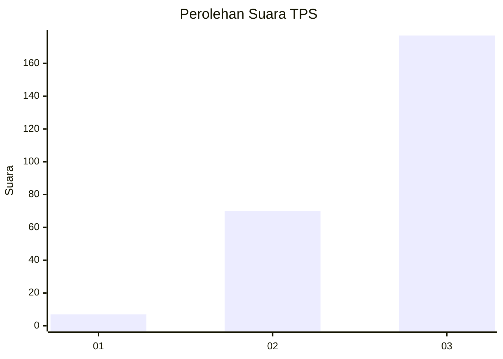
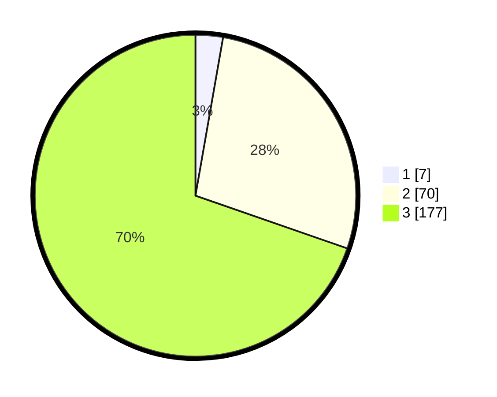

# Hasil

## Grafik

## Tabel

| No. | Nama Paslon    | Suara | Suara (raw) | Persentase |
|:--- |:-------------- | -----:| -----------:| ----------:|
| 1   | ANIES MUHAIMIN | 7     | [7][p-1]    | 2,76       |
| 2   | PRABOWO GIBRAN | 70    | [70][p-2]   | 27,56      |
| 3   | GANJAR MAHFUD  | 177   | [177][p-3]  | 69,69      |

[p-1]: https://github.com/gigit-pemilu/pemilu-2024/blob/main/pilpres/hitung-suara/sub/33-jawa-tengah/sub/09-boyolali/sub/16-andong/sub/2015-semawung/sub/004-tps/sub/paslon-1.txt
[p-2]: https://github.com/gigit-pemilu/pemilu-2024/blob/main/pilpres/hitung-suara/sub/33-jawa-tengah/sub/09-boyolali/sub/16-andong/sub/2015-semawung/sub/004-tps/sub/paslon-2.txt
[p-3]: https://github.com/gigit-pemilu/pemilu-2024/blob/main/pilpres/hitung-suara/sub/33-jawa-tengah/sub/09-boyolali/sub/16-andong/sub/2015-semawung/sub/004-tps/sub/paslon-3.txt

## Foto C Plano

https://sirekap-obj-formc.kpu.go.id/d097/pemilu/ppwp/33/09/16/20/15/3309162015004-20240215-012650--070e854d-a424-4b63-9c79-f9724759b1c0.jpg

https://sirekap-obj-formc.kpu.go.id/d097/pemilu/ppwp/33/09/16/20/15/3309162015004-20240214-235434--c68475f6-35ee-4727-9ab8-c8a45963d9ab.jpg

https://sirekap-obj-formc.kpu.go.id/d097/pemilu/ppwp/33/09/16/20/15/3309162015004-20240215-012652--c0bac26a-bf25-4a1c-a16b-86fbb17efc78.jpg

## Metadata

| Key        | Value               |
| ---------- | ------------------- |
| Time Stamp | 2024-02-15 16:30:25 |

