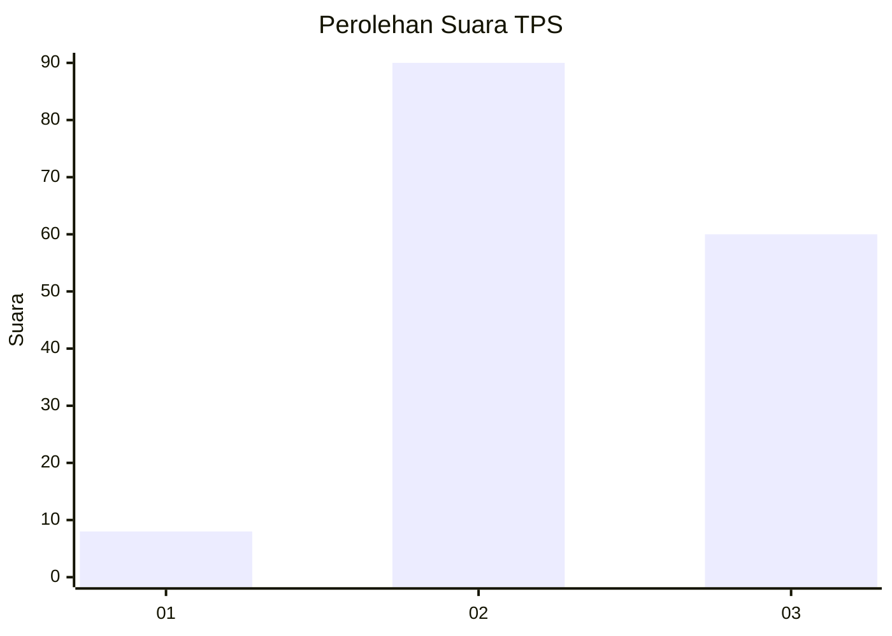
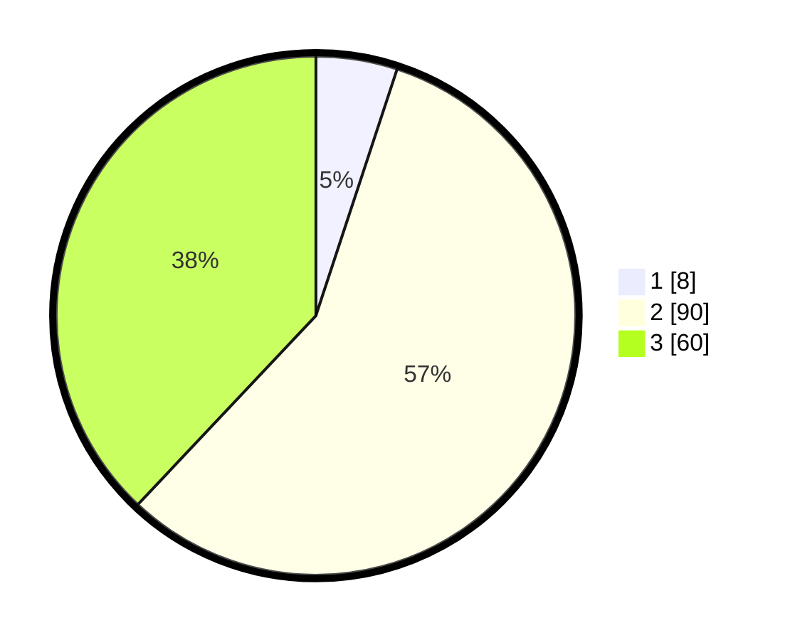

# Hasil

## Grafik

## Tabel

| No. | Nama Paslon    | Suara | Suara (raw) | Persentase |
|:--- |:-------------- | -----:| -----------:| ----------:|
| 1   | ANIES MUHAIMIN | 8     | [8][p-1]    | 5,06       |
| 2   | PRABOWO GIBRAN | 90    | [90][p-2]   | 56,96      |
| 3   | GANJAR MAHFUD  | 60    | [60][p-3]   | 37,97      |

[p-1]: https://github.com/gigit-pemilu/pemilu-2024-33-jawa-tengah/blob/main/pilpres/hitung-suara/sub/33-jawa-tengah/sub/09-boyolali/sub/16-andong/sub/2016-kadipaten/sub/001-tps/sub/paslon-1.txt
[p-2]: https://github.com/gigit-pemilu/pemilu-2024-33-jawa-tengah/blob/main/pilpres/hitung-suara/sub/33-jawa-tengah/sub/09-boyolali/sub/16-andong/sub/2016-kadipaten/sub/001-tps/sub/paslon-2.txt
[p-3]: https://github.com/gigit-pemilu/pemilu-2024-33-jawa-tengah/blob/main/pilpres/hitung-suara/sub/33-jawa-tengah/sub/09-boyolali/sub/16-andong/sub/2016-kadipaten/sub/001-tps/sub/paslon-3.txt

## Foto C Plano

https://sirekap-obj-formc.kpu.go.id/e2d1/pemilu/ppwp/33/09/16/20/16/3309162016001-20240214-232212--30aac224-36f4-414e-8d71-ca2141805f29.jpg

https://sirekap-obj-formc.kpu.go.id/e2d1/pemilu/ppwp/33/09/16/20/16/3309162016001-20240214-232601--5f75fd6f-b59f-4020-a69f-8e568070d4d1.jpg

https://sirekap-obj-formc.kpu.go.id/e2d1/pemilu/ppwp/33/09/16/20/16/3309162016001-20240214-234151--9eab6fb1-3ec4-4243-ad8f-24380ac190b6.jpg

## Metadata

| Key        | Value               |
| ---------- | ------------------- |
| Time Stamp | 2024-02-15 23:29:50 |

