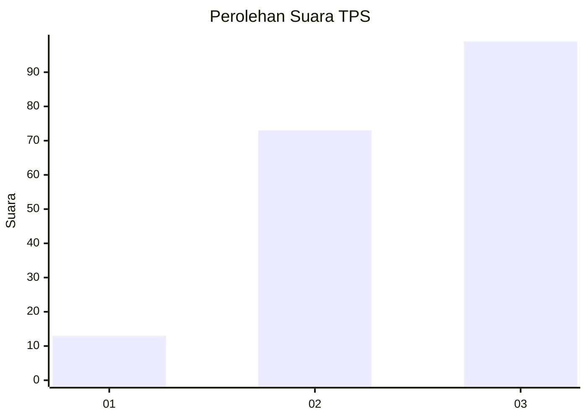
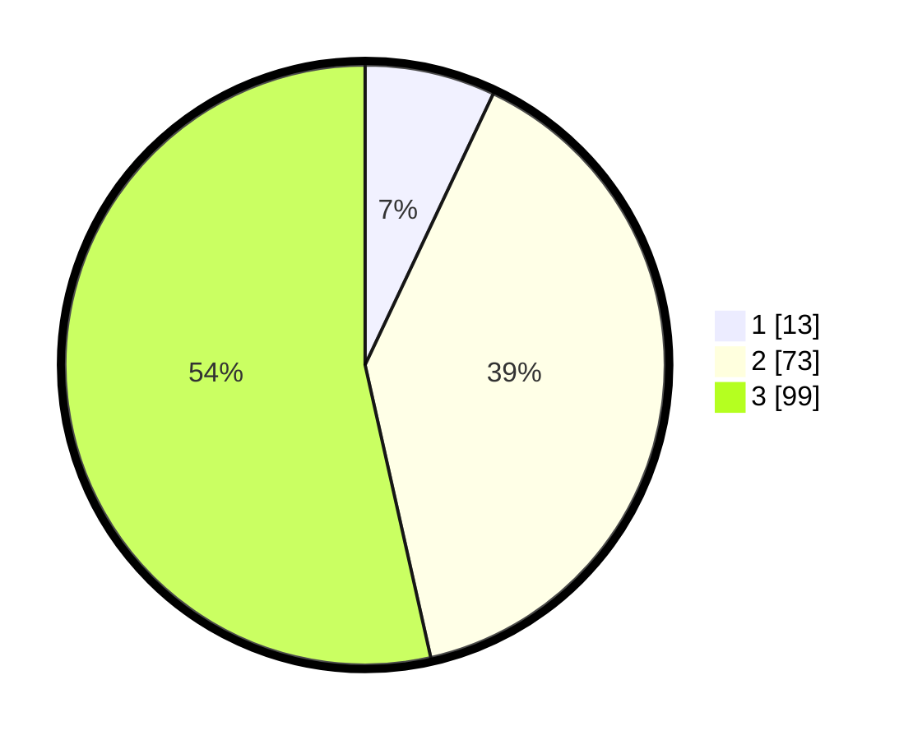

# Hasil

## Grafik

## Tabel

| No. | Nama Paslon    | Suara | Suara (raw) | Persentase |
|:--- |:-------------- | -----:| -----------:| ----------:|
| 1   | ANIES MUHAIMIN | 13    | [13][p-1]   | 7,03       |
| 2   | PRABOWO GIBRAN | 73    | [73][p-2]   | 39,46      |
| 3   | GANJAR MAHFUD  | 99    | [99][p-3]   | 53,51      |

[p-1]: https://github.com/gigit-pemilu/pemilu-2024-33-jawa-tengah/blob/main/pilpres/hitung-suara/sub/33-jawa-tengah/sub/09-boyolali/sub/17-kemusu/sub/2001-watugede/sub/001-tps/sub/paslon-1.txt
[p-2]: https://github.com/gigit-pemilu/pemilu-2024-33-jawa-tengah/blob/main/pilpres/hitung-suara/sub/33-jawa-tengah/sub/09-boyolali/sub/17-kemusu/sub/2001-watugede/sub/001-tps/sub/paslon-2.txt
[p-3]: https://github.com/gigit-pemilu/pemilu-2024-33-jawa-tengah/blob/main/pilpres/hitung-suara/sub/33-jawa-tengah/sub/09-boyolali/sub/17-kemusu/sub/2001-watugede/sub/001-tps/sub/paslon-3.txt

## Foto C Plano

https://sirekap-obj-formc.kpu.go.id/4e7c/pemilu/ppwp/33/09/17/20/01/3309172001001-20240214-224036--be70d12c-d174-4755-bd1a-5a0b3d5d8fed.jpg

https://sirekap-obj-formc.kpu.go.id/4e7c/pemilu/ppwp/33/09/17/20/01/3309172001001-20240214-224159--401087ab-42a6-4f10-baf2-e3d110a87b7d.jpg

https://sirekap-obj-formc.kpu.go.id/4e7c/pemilu/ppwp/33/09/17/20/01/3309172001001-20240214-224444--1f4c753d-184c-4f3a-8a99-26aa8361e56a.jpg

## Metadata

| Key        | Value               |
| ---------- | ------------------- |
| Time Stamp | 2024-02-15 21:01:18 |

