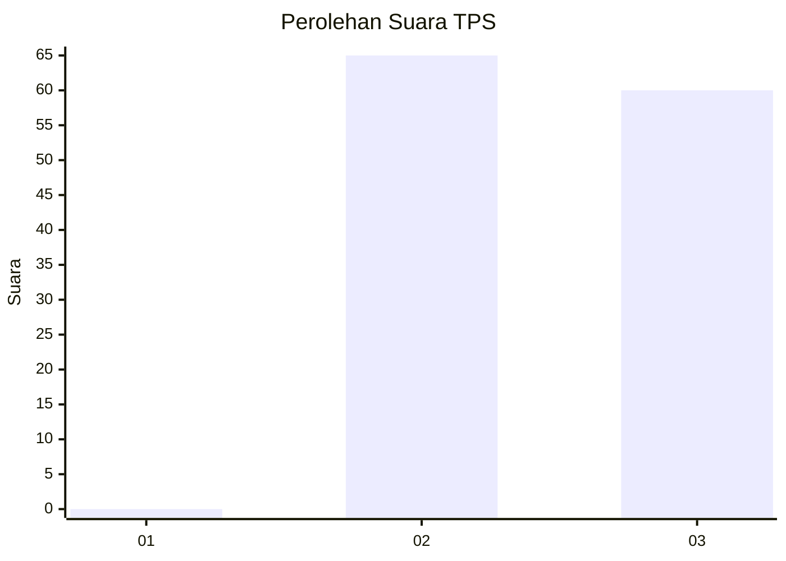
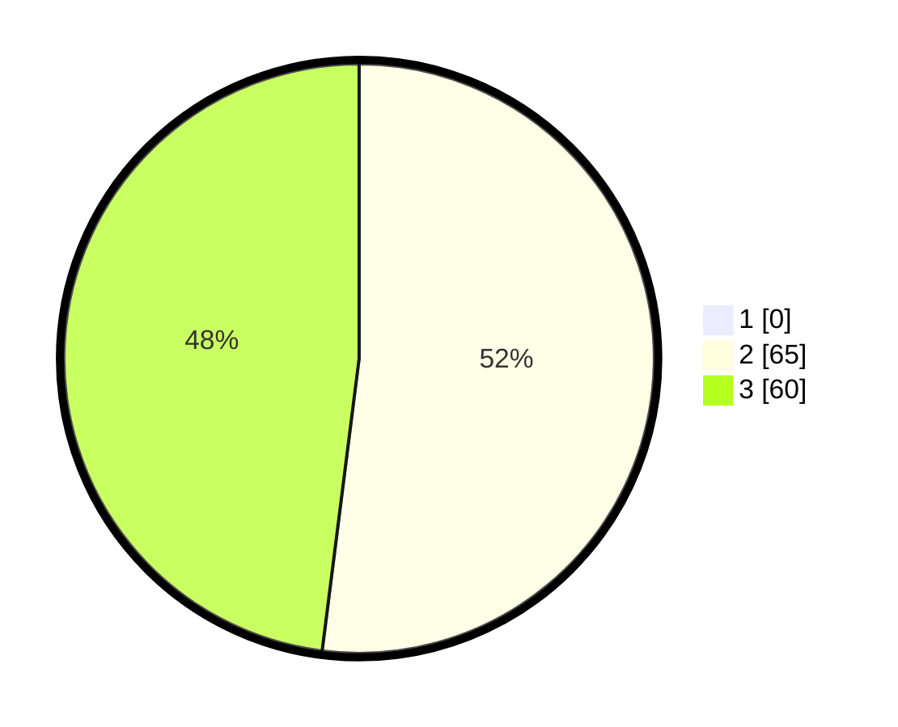

# Hasil

## Grafik

## Tabel

| No. | Nama Paslon    | Suara | Suara (raw) | Persentase |
|:--- |:-------------- | -----:| -----------:| ----------:|
| 1   | ANIES MUHAIMIN | 0     | [0][p-1]    | 0,00       |
| 2   | PRABOWO GIBRAN | 65    | [65][p-2]   | 52,00      |
| 3   | GANJAR MAHFUD  | 60    | [60][p-3]   | 48,00      |

[p-1]: https://github.com/gigit-pemilu/pemilu-2024-33-jawa-tengah/blob/main/pilpres/hitung-suara/sub/33-jawa-tengah/sub/09-boyolali/sub/17-kemusu/sub/2001-watugede/sub/004-tps/sub/paslon-1.txt
[p-2]: https://github.com/gigit-pemilu/pemilu-2024-33-jawa-tengah/blob/main/pilpres/hitung-suara/sub/33-jawa-tengah/sub/09-boyolali/sub/17-kemusu/sub/2001-watugede/sub/004-tps/sub/paslon-2.txt
[p-3]: https://github.com/gigit-pemilu/pemilu-2024-33-jawa-tengah/blob/main/pilpres/hitung-suara/sub/33-jawa-tengah/sub/09-boyolali/sub/17-kemusu/sub/2001-watugede/sub/004-tps/sub/paslon-3.txt

## Foto C Plano

https://sirekap-obj-formc.kpu.go.id/1aa0/pemilu/ppwp/33/09/17/20/01/3309172001004-20240215-065228--cc6c1fef-426d-44d4-8a5d-5a627abb07c7.jpg

https://sirekap-obj-formc.kpu.go.id/1aa0/pemilu/ppwp/33/09/17/20/01/3309172001004-20240215-065353--9bec64cf-4af2-49a8-be75-99647d4ccb43.jpg

https://sirekap-obj-formc.kpu.go.id/1aa0/pemilu/ppwp/33/09/17/20/01/3309172001004-20240215-065645--0d037ee4-543c-4d47-9672-6a4fb723f1b1.jpg

## Metadata

| Key        | Value               |
| ---------- | ------------------- |
| Time Stamp | 2024-02-15 21:01:18 |

