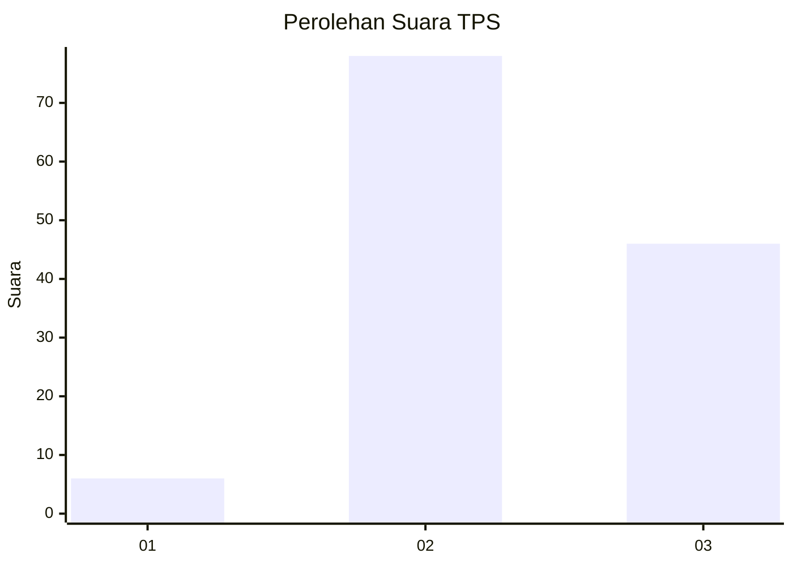
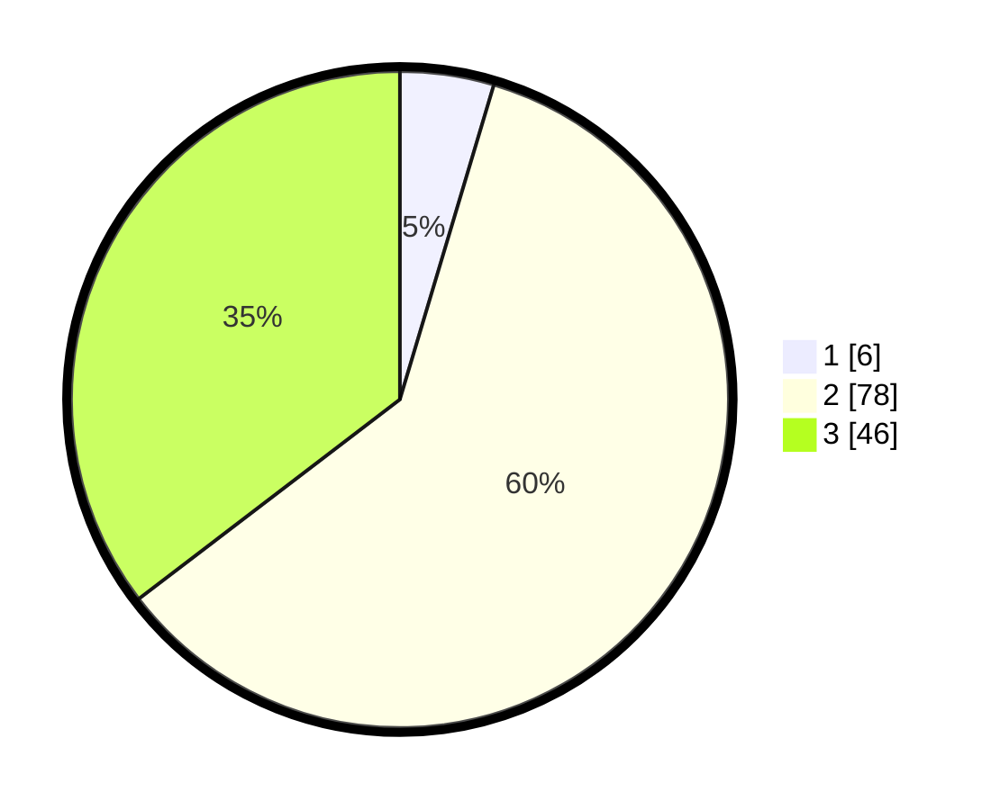

# Hasil

## Grafik

## Tabel

| No. | Nama Paslon    | Suara | Suara (raw) | Persentase |
|:--- |:-------------- | -----:| -----------:| ----------:|
| 1   | ANIES MUHAIMIN | 6     | [6][p-1]    | 4,62       |
| 2   | PRABOWO GIBRAN | 78    | [78][p-2]   | 60,00      |
| 3   | GANJAR MAHFUD  | 46    | [46][p-3]   | 35,38      |

[p-1]: https://github.com/gigit-pemilu/pemilu-2024/blob/main/pilpres/hitung-suara/sub/33-jawa-tengah/sub/09-boyolali/sub/17-kemusu/sub/2005-bawu/sub/004-tps/sub/paslon-1.txt
[p-2]: https://github.com/gigit-pemilu/pemilu-2024/blob/main/pilpres/hitung-suara/sub/33-jawa-tengah/sub/09-boyolali/sub/17-kemusu/sub/2005-bawu/sub/004-tps/sub/paslon-2.txt
[p-3]: https://github.com/gigit-pemilu/pemilu-2024/blob/main/pilpres/hitung-suara/sub/33-jawa-tengah/sub/09-boyolali/sub/17-kemusu/sub/2005-bawu/sub/004-tps/sub/paslon-3.txt

## Foto C Plano

https://sirekap-obj-formc.kpu.go.id/616a/pemilu/ppwp/33/09/17/20/05/3309172005004-20240214-223559--a414bce7-be42-40d5-aef9-9648dfac4c33.jpg

https://sirekap-obj-formc.kpu.go.id/616a/pemilu/ppwp/33/09/17/20/05/3309172005004-20240214-222456--a9b2b60d-4965-4b5d-bd91-4882552f7c5b.jpg

https://sirekap-obj-formc.kpu.go.id/616a/pemilu/ppwp/33/09/17/20/05/3309172005004-20240214-195637--8fd375ab-3b37-4139-b253-6127b9ae5825.jpg

## Metadata

| Key        | Value               |
| ---------- | ------------------- |
| Time Stamp | 2024-02-15 21:30:27 |

