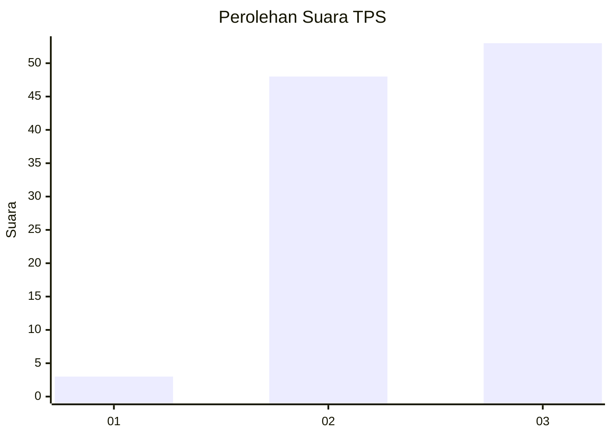
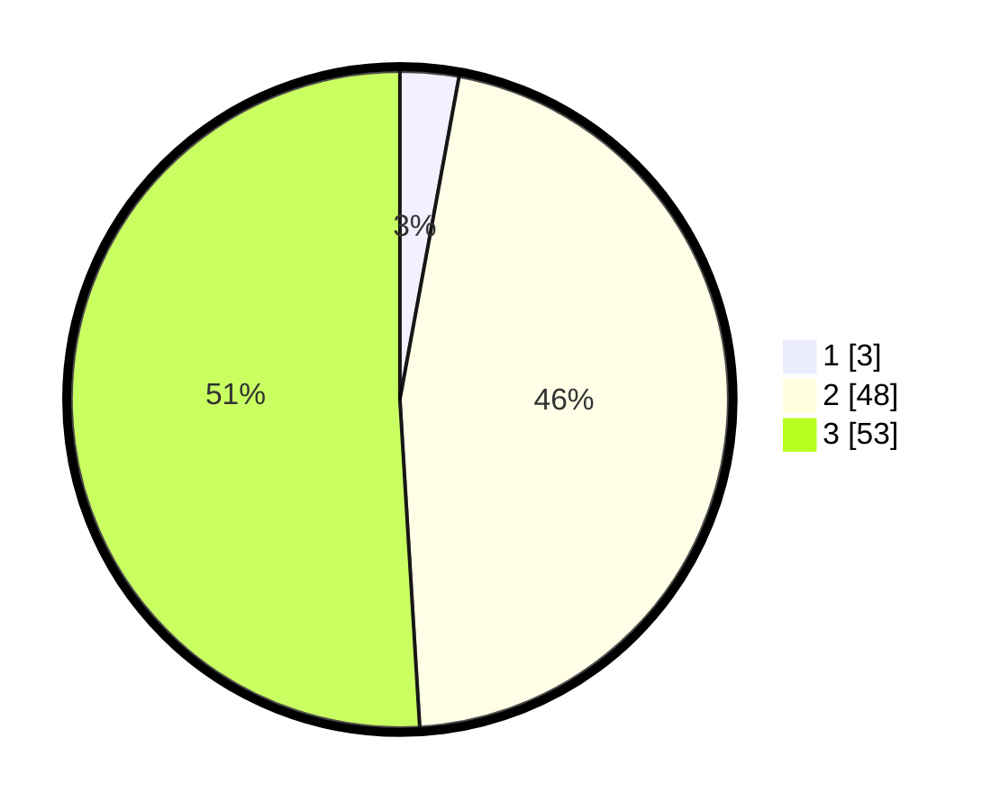

# Hasil

## Grafik

## Tabel

| No. | Nama Paslon    | Suara | Suara (raw) | Persentase |
|:--- |:-------------- | -----:| -----------:| ----------:|
| 1   | ANIES MUHAIMIN | 3     | [3][p-1]    | 2,88       |
| 2   | PRABOWO GIBRAN | 48    | [48][p-2]   | 46,15      |
| 3   | GANJAR MAHFUD  | 53    | [53][p-3]   | 50,96      |

[p-1]: https://github.com/gigit-pemilu/pemilu-2024-33-jawa-tengah/blob/main/pilpres/hitung-suara/sub/33-jawa-tengah/sub/09-boyolali/sub/17-kemusu/sub/2005-bawu/sub/009-tps/sub/paslon-1.txt
[p-2]: https://github.com/gigit-pemilu/pemilu-2024-33-jawa-tengah/blob/main/pilpres/hitung-suara/sub/33-jawa-tengah/sub/09-boyolali/sub/17-kemusu/sub/2005-bawu/sub/009-tps/sub/paslon-2.txt
[p-3]: https://github.com/gigit-pemilu/pemilu-2024-33-jawa-tengah/blob/main/pilpres/hitung-suara/sub/33-jawa-tengah/sub/09-boyolali/sub/17-kemusu/sub/2005-bawu/sub/009-tps/sub/paslon-3.txt

## Foto C Plano

https://sirekap-obj-formc.kpu.go.id/1d7d/pemilu/ppwp/33/09/17/20/05/3309172005009-20240215-133255--a9b44f7e-7e60-4af7-b435-1191388bee38.jpg

https://sirekap-obj-formc.kpu.go.id/1d7d/pemilu/ppwp/33/09/17/20/05/3309172005009-20240215-161648--a8de2083-a591-43ee-a5c2-b85ead7c4f3b.jpg

https://sirekap-obj-formc.kpu.go.id/1d7d/pemilu/ppwp/33/09/17/20/05/3309172005009-20240214-225711--03618c24-1587-43e0-8794-e8e623118475.jpg

## Metadata

| Key        | Value               |
| ---------- | ------------------- |
| Time Stamp | 2024-02-15 21:30:27 |

