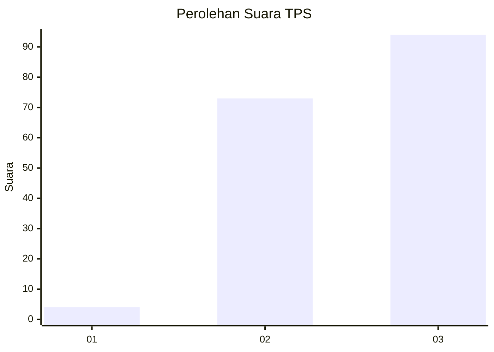
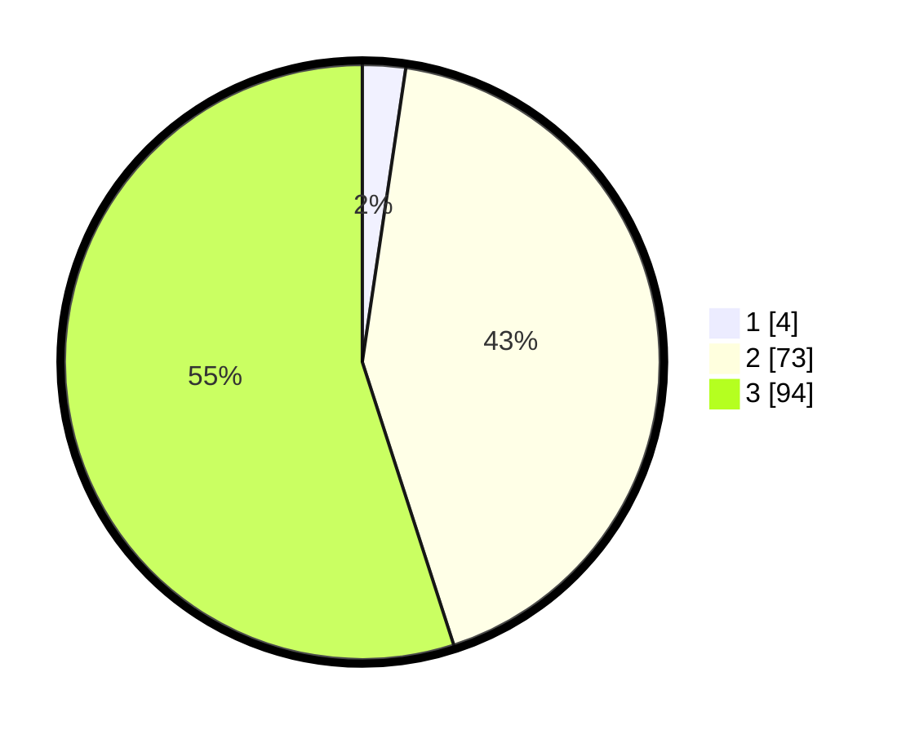

# Hasil

## Grafik

## Tabel

| No. | Nama Paslon    | Suara | Suara (raw) | Persentase |
|:--- |:-------------- | -----:| -----------:| ----------:|
| 1   | ANIES MUHAIMIN | 4     | [4][p-1]    | 2,34       |
| 2   | PRABOWO GIBRAN | 73    | [73][p-2]   | 42,69      |
| 3   | GANJAR MAHFUD  | 94    | [94][p-3]   | 54,97      |

[p-1]: https://github.com/gigit-pemilu/pemilu-2024/blob/main/pilpres/hitung-suara/sub/33-jawa-tengah/sub/09-boyolali/sub/17-kemusu/sub/2005-bawu/sub/012-tps/sub/paslon-1.txt
[p-2]: https://github.com/gigit-pemilu/pemilu-2024/blob/main/pilpres/hitung-suara/sub/33-jawa-tengah/sub/09-boyolali/sub/17-kemusu/sub/2005-bawu/sub/012-tps/sub/paslon-2.txt
[p-3]: https://github.com/gigit-pemilu/pemilu-2024/blob/main/pilpres/hitung-suara/sub/33-jawa-tengah/sub/09-boyolali/sub/17-kemusu/sub/2005-bawu/sub/012-tps/sub/paslon-3.txt

## Foto C Plano

https://sirekap-obj-formc.kpu.go.id/cc55/pemilu/ppwp/33/09/17/20/05/3309172005012-20240215-022016--bd008a7d-c498-4e27-9f92-b256e2a9b1ac.jpg

https://sirekap-obj-formc.kpu.go.id/cc55/pemilu/ppwp/33/09/17/20/05/3309172005012-20240215-145643--a29694a0-a91f-4f2a-b952-26fef75463fc.jpg

https://sirekap-obj-formc.kpu.go.id/cc55/pemilu/ppwp/33/09/17/20/05/3309172005012-20240215-150307--05999ada-14b7-4876-aa87-eed1d418f7f7.jpg

## Metadata

| Key        | Value               |
| ---------- | ------------------- |
| Time Stamp | 2024-02-15 16:30:25 |

