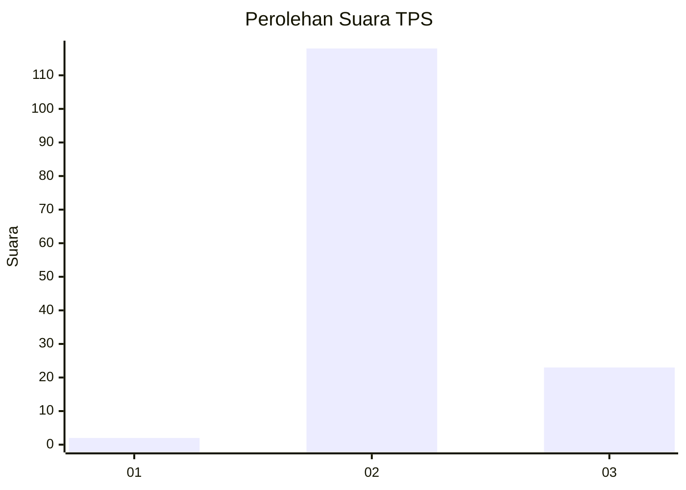
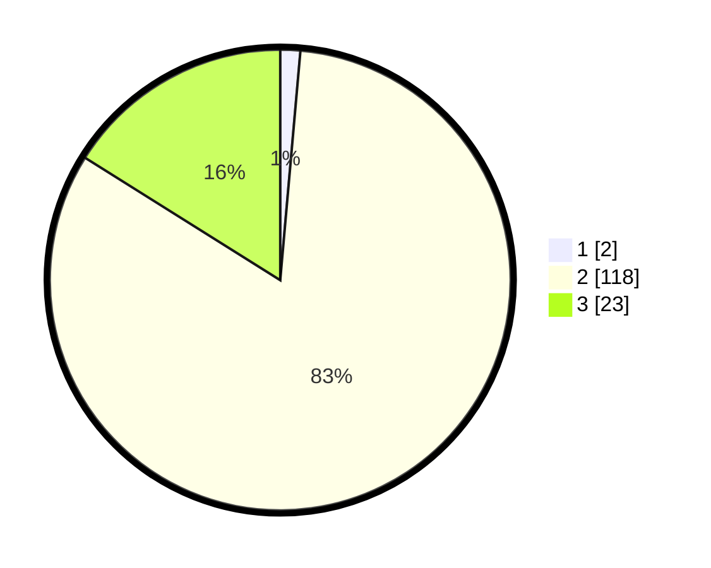

# Hasil

## Grafik

## Tabel

| No. | Nama Paslon    | Suara | Suara (raw) | Persentase |
|:--- |:-------------- | -----:| -----------:| ----------:|
| 1   | ANIES MUHAIMIN | 2     | [2][p-1]    | 1,40       |
| 2   | PRABOWO GIBRAN | 118   | [118][p-2]  | 82,52      |
| 3   | GANJAR MAHFUD  | 23    | [23][p-3]   | 16,08      |

[p-1]: https://github.com/gigit-pemilu/pemilu-2024/blob/main/pilpres/hitung-suara/sub/33-jawa-tengah/sub/09-boyolali/sub/17-kemusu/sub/2005-bawu/sub/014-tps/sub/paslon-1.txt
[p-2]: https://github.com/gigit-pemilu/pemilu-2024/blob/main/pilpres/hitung-suara/sub/33-jawa-tengah/sub/09-boyolali/sub/17-kemusu/sub/2005-bawu/sub/014-tps/sub/paslon-2.txt
[p-3]: https://github.com/gigit-pemilu/pemilu-2024/blob/main/pilpres/hitung-suara/sub/33-jawa-tengah/sub/09-boyolali/sub/17-kemusu/sub/2005-bawu/sub/014-tps/sub/paslon-3.txt

## Foto C Plano

https://sirekap-obj-formc.kpu.go.id/c54f/pemilu/ppwp/33/09/17/20/05/3309172005014-20240215-080401--8cace7da-7bfb-4b15-a7d2-7172ee12df7c.jpg

https://sirekap-obj-formc.kpu.go.id/c54f/pemilu/ppwp/33/09/17/20/05/3309172005014-20240215-144106--58316fdd-ec49-4d95-90e4-d8696d2f0e2b.jpg

https://sirekap-obj-formc.kpu.go.id/c54f/pemilu/ppwp/33/09/17/20/05/3309172005014-20240215-143804--d6eec4e7-b3dc-4c39-9fa9-09c94f3b0d44.jpg

## Metadata

| Key        | Value               |
| ---------- | ------------------- |
| Time Stamp | 2024-02-15 21:30:27 |

