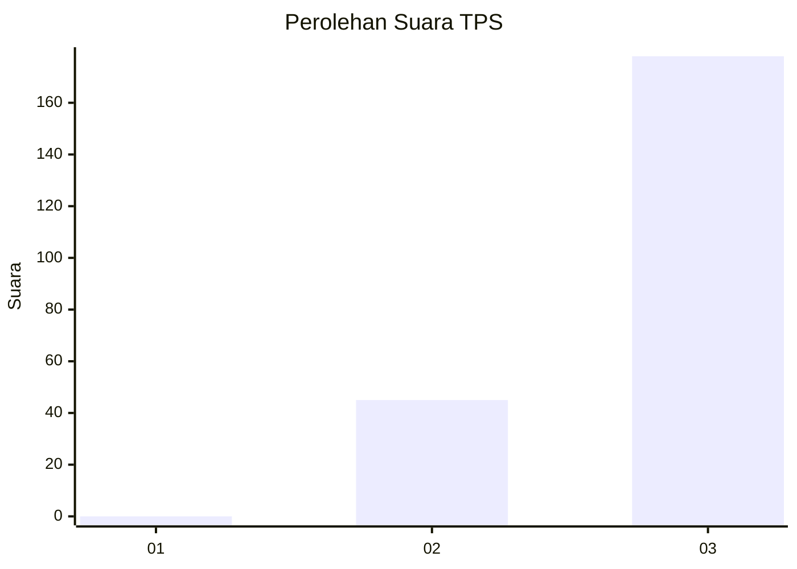
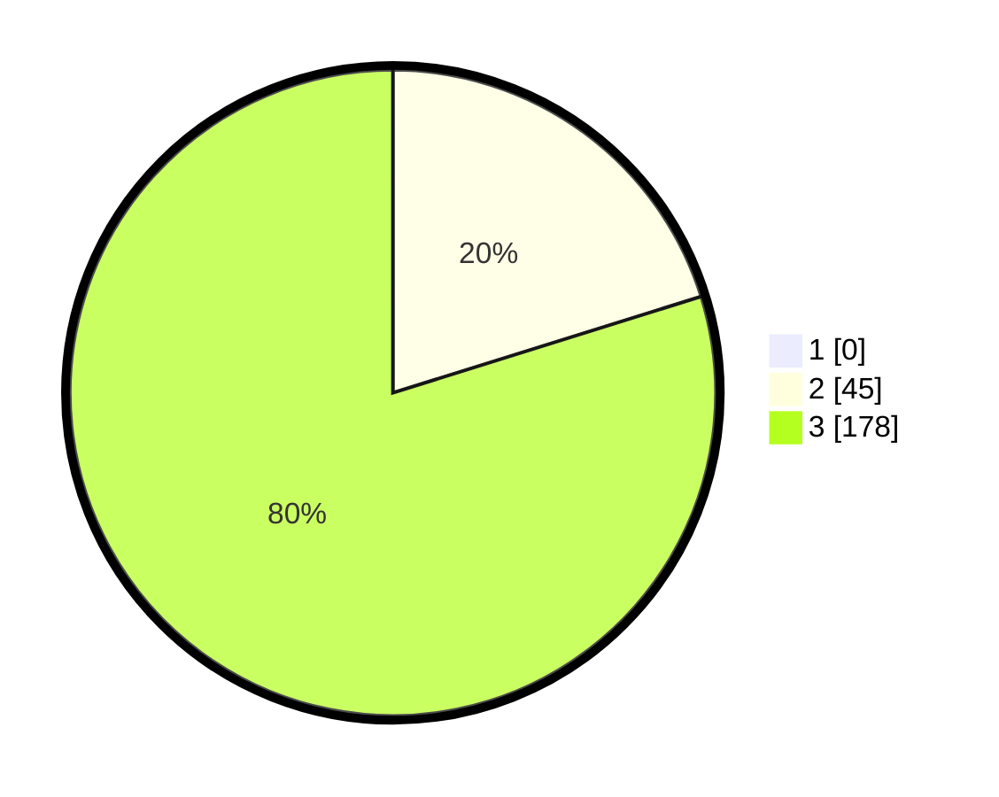

# Hasil

## Grafik

## Tabel

| No. | Nama Paslon    | Suara | Suara (raw) | Persentase |
|:--- |:-------------- | -----:| -----------:| ----------:|
| 1   | ANIES MUHAIMIN | 0     | [0][p-1]    | 0,00       |
| 2   | PRABOWO GIBRAN | 45    | [45][p-2]   | 20,18      |
| 3   | GANJAR MAHFUD  | 178   | [178][p-3]  | 79,82      |

[p-1]: https://github.com/gigit-pemilu/pemilu-2024-33-jawa-tengah/blob/main/pilpres/hitung-suara/sub/33-jawa-tengah/sub/09-boyolali/sub/17-kemusu/sub/2010-kemusu/sub/013-tps/sub/paslon-1.txt
[p-2]: https://github.com/gigit-pemilu/pemilu-2024-33-jawa-tengah/blob/main/pilpres/hitung-suara/sub/33-jawa-tengah/sub/09-boyolali/sub/17-kemusu/sub/2010-kemusu/sub/013-tps/sub/paslon-2.txt
[p-3]: https://github.com/gigit-pemilu/pemilu-2024-33-jawa-tengah/blob/main/pilpres/hitung-suara/sub/33-jawa-tengah/sub/09-boyolali/sub/17-kemusu/sub/2010-kemusu/sub/013-tps/sub/paslon-3.txt

## Foto C Plano

https://sirekap-obj-formc.kpu.go.id/68d5/pemilu/ppwp/33/09/17/20/10/3309172010013-20240218-124046--5428a12c-48e6-450a-9826-82af2995b743.jpg

https://sirekap-obj-formc.kpu.go.id/68d5/pemilu/ppwp/33/09/17/20/10/3309172010013-20240214-141943--0c417860-0d49-4783-a1fc-23590701aa49.jpg

https://sirekap-obj-formc.kpu.go.id/68d5/pemilu/ppwp/33/09/17/20/10/3309172010013-20240214-141805--9fc694b8-b83e-4cb0-8406-412f6030e09a.jpg

## Metadata

| Key        | Value               |
| ---------- | ------------------- |
| Time Stamp | 2024-02-19 06:16:00 |

