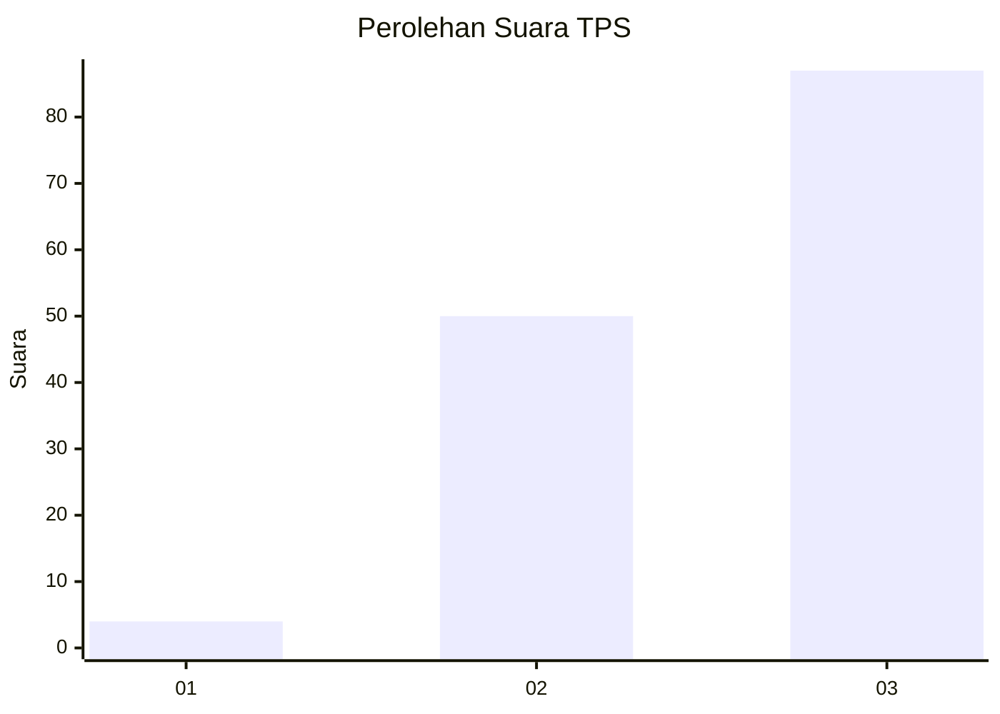
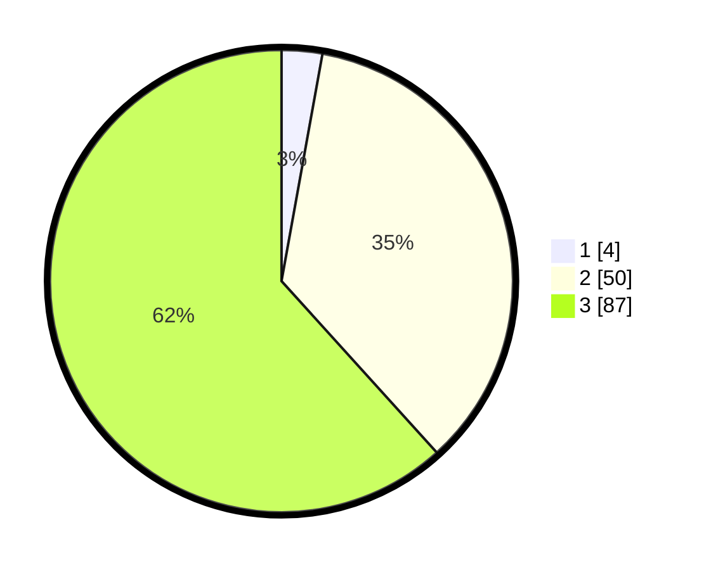

# Hasil

## Grafik

## Tabel

| No. | Nama Paslon    | Suara | Suara (raw) | Persentase |
|:--- |:-------------- | -----:| -----------:| ----------:|
| 1   | ANIES MUHAIMIN | 4     | [4][p-1]    | 2,84       |
| 2   | PRABOWO GIBRAN | 50    | [50][p-2]   | 35,46      |
| 3   | GANJAR MAHFUD  | 87    | [87][p-3]   | 61,70      |

[p-1]: https://github.com/gigit-pemilu/pemilu-2024/blob/main/pilpres/hitung-suara/sub/33-jawa-tengah/sub/09-boyolali/sub/17-kemusu/sub/2011-genengsari/sub/008-tps/sub/paslon-1.txt
[p-2]: https://github.com/gigit-pemilu/pemilu-2024/blob/main/pilpres/hitung-suara/sub/33-jawa-tengah/sub/09-boyolali/sub/17-kemusu/sub/2011-genengsari/sub/008-tps/sub/paslon-2.txt
[p-3]: https://github.com/gigit-pemilu/pemilu-2024/blob/main/pilpres/hitung-suara/sub/33-jawa-tengah/sub/09-boyolali/sub/17-kemusu/sub/2011-genengsari/sub/008-tps/sub/paslon-3.txt

## Foto C Plano

https://sirekap-obj-formc.kpu.go.id/505f/pemilu/ppwp/33/09/17/20/11/3309172011008-20240214-204441--806a646b-f998-442f-a5bb-de2e52a0b29d.jpg

https://sirekap-obj-formc.kpu.go.id/505f/pemilu/ppwp/33/09/17/20/11/3309172011008-20240214-194258--dde2b67f-98e0-4701-bf79-612ccffd3c48.jpg

https://sirekap-obj-formc.kpu.go.id/505f/pemilu/ppwp/33/09/17/20/11/3309172011008-20240214-192852--a2bac093-df14-43cd-8c05-afc1c9817be6.jpg

## Metadata

| Key        | Value               |
| ---------- | ------------------- |
| Time Stamp | 2024-02-15 00:41:44 |

